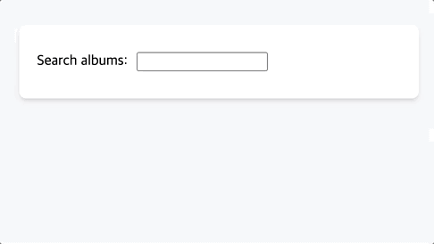
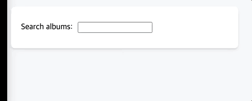
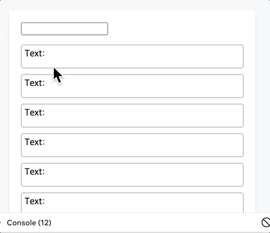

#📌 useDeferredValue
`useTransition`은 함수 실행의 우선순위를 지정하는 반면, `useDeferredValue`는 값의 업데이트 우선순위를 지정합니다. 우선순위가 높은 작업을 실행하는 동안 `useMemo`와 유사하게 이전 값을 계속 들고 있으면서 업데이트를 지연시킨다.

###목차

### 사용법

- Suspense의 fallback을 대체하기

```JSX
export default function App() {
  const [query, setQuery] = useState('');
  return (
    <>
      <label>
        Search albums:
        <input value={query} onChange={e => setQuery(e.target.value)} />
      </label>
      <Suspense fallback={<h2>Loading...</h2>}>
        <SearchResults query={query} />
      </Suspense>
    </>
  );
}
```



위의 코드를 기반으로 검색을 한다고 하면 검색을 할 때마다 fallback이 보이게 되고, 검색리스트가 보이게 됩니다. 하지만 useDeferredValue를 사용하게 된다면?

```JSX
export default function App() {
  const [query, setQuery] = useState('');
  const deferredQuery = useDeferredValue(query);
  return (
    <>
      <label>
        Search albums:
        <input value={query} onChange={e => setQuery(e.target.value)} />
      </label>
      <Suspense fallback={<h2>Loading...</h2>}>
        <SearchResults query={deferredQuery} />
      </Suspense>
    </>
  );
}
```



이제 새 결과가 로드될 때까지 일시 중단 폴백 대신 오래된 결과 목록이 표시되는 것을 확인할 수 있습니다.

- memo를 활용해 최적화하기

```JSX
import SlowList from './SlowList.js';

export default function App() {
  const [text, setText] = useState('');
  const deferredText = useDeferredValue(text);
  return (
    <>
      <input value={text} onChange={e => setText(e.target.value)} />
      <SlowList text={deferredText} />
    </>
  );
}
```

```JSX
import { memo } from 'react';

const SlowList = memo(function SlowList({ text }) {
  // 한번만 이 콘솔이 찍히게 됩니다, 느리게하는 로직은 SlowItem 내부에 있어요.
  console.log('[ARTIFICIALLY SLOW] Rendering 250 <SlowItem />');

  let items = [];
  for (let i = 0; i < 250; i++) {
    items.push(<SlowItem key={i} text={text} />);
  }
  return (
    <ul className="items">
      {items}
    </ul>
  );
});

function SlowItem({ text }) {
  let startTime = performance.now();
  while (performance.now() - startTime < 1) {
    // 하나의 아이템마다 1ms 마다 느려지게 만들기
  }

  return (
    <li className="item">
      Text: {text}
    </li>
  )
}
export default SlowList;
```


