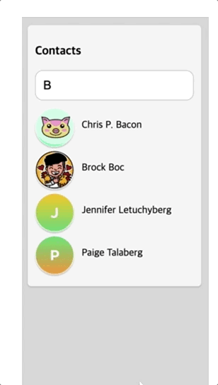

#📌 useTransition
`useTransition`은 UI를 차단하지 않고 state를 업데이트할 수 있는 React 훅입니다.

###목차

1. [리액트에 도입된 fiber 엔진](#리액트에-도입된-fiber-엔진)
2. [참조](#reference-참조)
3. [사용법](#usage-사용법)
4. [주의할점](#주의할점)

### 리액트에 도입된 fiber 엔진

- 리액트 18버전은 fiber라는 엔진을 개선하여 자체적인 스케쥴러를 갖게 되었습니다.
- 작업의 우선순위를 정하고, 우선순위 높은 작업이 들어오면 먼저 처리하는 기능이 구현되었습니다.
- 무겁고 유저 경험에 중요하지 않은 작업은 우선순위를 낮춰 프레임률을 유지할 수 있습니다.
  <br>

### Reference 참조

상태 변화의 우선순위를 지정하기 위해 useTransition 훅이 새로 도입되었습니다. useTransition은 `isPending`, `startTransition` 을 반환하는데, `isPending` 은 작업이 지연되고 있음을 알리는 boolean 이며, `startTransition`은 낮은 우선순위로 실행할 함수를 인자로 받는다. 다음과 같이 사용할 수 있습니다.

```JSX
function App() {
  const [isPending, startTransition] = useTransition();
  const [count, setCount] = useState(0);

  function handleClick() {
    startTransition(() => {
      setCount(c => c + 1);
    })
  }


  return (
    <div>
      {isPending && <Spinner />}
      <button onClick={handleClick}>{count}</button>
    </div>
  );
}
```

- 클릭할 때마다 일어나는 count 에 대한 상태 업데이트를 낮은 우선순위로 실행합니다.
- 그래서 더 중요한 이벤트가 있는 경우 count의 업데이트를 지연시키고 대신 이전의 값을 보여줍니다.
- isPending을 이용하여 업데이트가 지연된 동안 스피너를 보여줄 수도 있습니다.

```TSX
export default function Home() {
  const [text, setText] = useState("");
  const [value, setValue] = useState("");
  const [isPending, startTransition] = useTransition();

  const onChange = (e: React.ChangeEvent<HTMLInputElement>) => {
    startTransition(() => {
      setText(e.target.value);
    });
    setValue(e.target.value);
  };

  console.log({ text, isPending });
  console.log({ value });

  return <input type="text" onChange={onChange} />;
}
```

- onChange 함수가 실행되면 setText와 setValue가 실행되면서 상태가 변하게 됩니다.
- 하지만 setText는 startTransition 함수로 래핑 되어있습니다.
- 이렇게 래핑 되면 상태변화의 우선순위가 낮아지고, 다른 상태변화가 전부 일어난 후 setText가 실행되어 text 상태가 변하게 됩니다.

<br>

### Usage 사용법

- 검색 입력완료시, 결과 보여주기

```JSX
function App() {
  const [isPending, startTransition] = useTransition();
  const [filterTerm, setFilterTerm] = useState('');

  const filteredProducts = filterProducts(filterTerm);

  function updateFilterHandler(event) {
    startTransition(() => {
      setFilterTerm(event.target.value);
    });
  }

  return (
    <div id="app">
      <input type="text" onChange={updateFilterHandler} />
      {isPending && <p>Updating List...</p>}
      {!isPending && <ProductList products={filteredProducts} />}
    </div>
  );
}
```

<br>

- 로딩이 길어지는 탭 버튼 클릭시, state 변경가능

```JSX
export default function TabContainer() {
  const [isPending, startTransition] = useTransition();
  const [tab, setTab] = useState('about');

  function selectTab(nextTab) {
    startTransition(() => {
      setTab(nextTab);
    });
  }

  return (
    <>
      <TabButton
        isActive={tab === 'about'}
        onClick={() => selectTab('about')}
      >
        About
      </TabButton>
      <TabButton
        isActive={tab === 'posts'}
        onClick={() => selectTab('posts')}
      >
        Posts (slow)
      </TabButton>
      <TabButton
        isActive={tab === 'contact'}
        onClick={() => selectTab('contact')}
      >
        Contact
      </TabButton>
      <hr />
      {tab === 'about' && <AboutTab />}
      {tab === 'posts' && <PostsTab />}
      {tab === 'contact' && <ContactTab />}
    </>
  );
}
```

<br>

- Suspense가 도입된 라우터 구축하기

```JSX
function Router() {
  const [page, setPage] = useState('/');
  const [isPending, startTransition] = useTransition();

  function navigate(url) {
    startTransition(() => {
      setPage(url);
    });
  }
  // ...
```

공식문서에서는 페이지 네비게이션을 트랜지션으로 표시하는것이 좋다고 이야기하고 있습니다.

> 트랜지션은 중단 가능하므로, 사용자는 다시 렌더링이 완료될 때까지 기다리지 않고 바로 클릭할 수 있기때문에..

<br>

```JSX
export default function App() {
  return (
    <Suspense fallback={<BigSpinner />}>
      <Router />
    </Suspense>
  );
}

function Router() {
  const [page, setPage] = useState('/');
  const [isPending, startTransition] = useTransition();

  function navigate(url) {
    startTransition(() => {
      setPage(url);
    });
  }

  let content;
  if (page === '/') {
    content = (
      <IndexPage navigate={navigate} />
    );
  } else if (page === '/the-beatles') {
    content = (
      <ArtistPage
        artist={{
          id: 'the-beatles',
          name: 'The Beatles',
        }}
      />
    );
  }
  return (
    <Layout isPending={isPending}>
      {content}
    </Layout>
  );
}

function BigSpinner() {
  return <h2>🌀 Loading...</h2>;
}
```

Suspense가 도입된 라우터는 기본적으로 네비게이션 업데이트를 트랜지션으로 감싸고 있을 것이라고 간주한다고 합니다.
즉, 위와 같은 방식으로 라우터를 구현할 경우, `useTransition`을 꼭 써서 구현하라고 권장하고 있습니다.
<br>

### 추가적으로 찾아본 사용법 (Suspense의 대체)

Suspense의 문제점과 이를 해결할 수 있는 `useTransition`

위와 같이, Suspense의 fallback을 사용했을 때 입력해서 데이터를 받아오는 경우 데이터를 받아올 때마다 fallback이 UI를 대체하고 있는 것을 볼 수 있습니다.

따라서 이를 대체할 수 있는 것이 `useTransition`입니다 `useTransition`의 `isPending`을 사용해서 원래 UI를 유지하면서 활용할 수 있습니다.

<br>

### 주의할점

- input에 transition 사용하지 않기

```JSX
const [text, setText] = useState('');
// ...
function handleChange(e) {
  // ❌ Can't use transitions for controlled input state
  startTransition(() => {
    setText(e.target.value);
  });
}
// ...
return <input value={text} onChange={handleChange} />;
```

논블로킹 방식으로 useTransition이 작동하긴 하지만, 예제의 경우 동기적으로 바뀌는 걸 보여줘야하기 때문에 사용하는 것이 적절하지 않다고 합니다.
<br>

- `startTransition` 내부에 전달하는 함수는 동기식이어야한다.

```JSX
startTransition(() => {
  // 안좋은 예시
  setTimeout(() => {
    setPage('/about');
  }, 1000);
});

// 대체 방법
setTimeout(() => {
  startTransition(() => {
    // ✅ Setting state *during* startTransition call
    setPage('/about');
  });
}, 1000);
```

<br>

- `startTransition`에 전달한 함수는 즉시 실행됩니다.
  > setTimeout과 처럼 나중에 콜백을 실행하지 않습니다.
