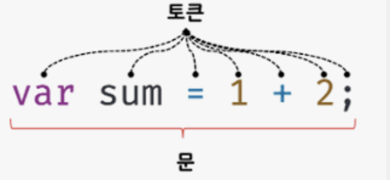
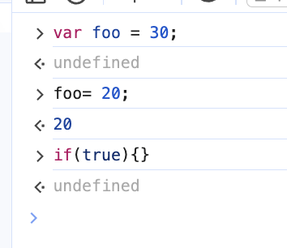

# 모던 자바스크립트 Deep Dive를 다시 읽고 1

용어의 의미를 다시 되돌아보며 정확히 파악하고 스스로의 언어로 이해하는 시간을 가집니다. 중심 내용이 아닌 새롭게 알게된 내용만 정리하며 용어의 의미를 질문했을 때 쉽게 답하지 못했던 용어 위주로 정리했습니다.

프로그래밍? 요구사항의 집합을 분석하며, 적절한 자료구조와 함수의 집합으로 변환한 후 그 흐름을 제어하는 것.

렌더링? HTML, CSS, JS로 작성된 문서를 해석해서 브라우저에서 시각적으로 출력하는 것. 또는 서버에서 데이터를 HTML로 변환해서 브라우저에게 전달하는 과정.

AJAX? JS를 이용해 서버와 브라우저가 비동기 방식으로 데이터를 교환할 수 있는 통신 기능.

자바스크립트? 자바스크립트는 프로그래밍 언어로서 기본 뼈대를 이루는 ECMAScript와 브라우저가 별도로 지원하는 클라이언트 사이드 Web API(DOM, BOM, Canvas, XMLHttpRequest, fetch, requestAnimationFrame, SVG, Web Storage, Web Component, Web Worker)등을 아우르는 개념.

## 4장 변수

메모리? 데이터를 저장할 수 있는 메모리 셀의 집합체

변수? 하나의 값을 저장하기 위해 확보한 메모리 공간 자체 또는 그 메모리 공간을 식별하기 위해 붙인 이름.

할당, 대입, 저장? 변수의 값을 저장.

참조? 변수에 저장된 값을 읽어 들이는 것.

식별자? 어떤 값을 구별해서 식별할 수 있는 고유한 이름.

- 값이 아닌 메모리 주소를 기억한다.
- 모든 식별자는 실행 컨텍스트에 등록된다.

실행 컨텍스트? JS 엔진이 소스코드를 평가하고 실행하기 위해 필요한 환경을 제공하고, 코드의 실행 결과를 실제로 관리

키워드? JS 엔진이 수행할 동작을 규정한 명령어

변수선언

- 1. 선언 단계 : 변수 이름을 등록해서 JS 엔진에 변수의 존재를 알린다.
- 2. 초기화 단계 : 값을 저장하기 위해, 메모리 공간을 확보하고 암묵적으로 undefined를 할당해 초기화한다.

```js
const score; // 변수 선언
score= 80;  // 값의 할당

const name = "lee";  // 변수 선언과 값의 할당
```

변수 선언과 할당문을 한 줄로 단축 표현해도 각각 나누어 실행되며, 변수 선언은 평가 과정에서, 할당은 런타임 시점에서 실행된다.

변수의 값은 할당할때는 이전 undefined가 저장된 메모리 공간을 지우고, 그 메모리 공간에 새롭게 값을 저장하는 게 아니라 새로운 메모리 공간을 확보하고 그곳에 할당 값을 저장한다는 점에 주의하자.

가비지 콜렉터? 애플리케이션이 할당한 메모리 공간을 주기적으로 검사하여 더이상 사용되지 않은 메모리를 해제하는 기능

## 5장 표현식과 문

문과 표현식을 구별하고 해석할 수 있다면, JS 엔진의 입장에서 코드를 읽을 수 있고, 실행 결과를 예측하는 데 도움이 된다.이는 버그를 줄이고 코드의 품질을 높여주기때문에 문과 표현식을 확실히 이해할 필요가 있다.

값? 식(표현식)이 평가되어 생성한 결과

리터럴? 사람이 이해할 수 있는 문자 또는 약속된 기호를 사용해 값을 생성하는 표기법

표현식? 값으로 평가될 수 있는 문

- 리터럴도 표현식이다.
- 표현식이 평가되면 새로운 값을 생성하거나 기존값을 참조

```js
const score = 50 + 50;
score; // 식별자 참조도 표현식이다.

// 리터럴이자 리터럴 표현식이다.
10;
hi;

//식별자 표현식(이미 선언되어있다고 가정)
sum;
score;
person.age;
arr[0];

//연산자  표현식
10 + 200;
sum = 10;
sum !== 10;

//함수/메서드 호출 표현식 (이미 선언했다 가정)
sum();
person.getName();
```

문? 프로그램을 구성하는 기본 단위, 최소 실행 단위.

토큰? 문법적으로 더이상 나눌 수 없는 코드의 기본요소



```js
var count; // 변수 선언문이나, 값으로 표현할수없어 표현식은 아니다.

count = 10; //할당문은 표현식인 문이다.
```

완료값? 표현식이 아닌 문을 실행하면 언제나 undefined를 출력한다. 이를 완료값이라한다. 완료 값은 표현식의 평가 결과가 아니므로 다른 값과 같이 변수에 할당,참조할 수 없다.


* 변수선언문과 할당이 같이 있어서 undefined가 된듯하다.
