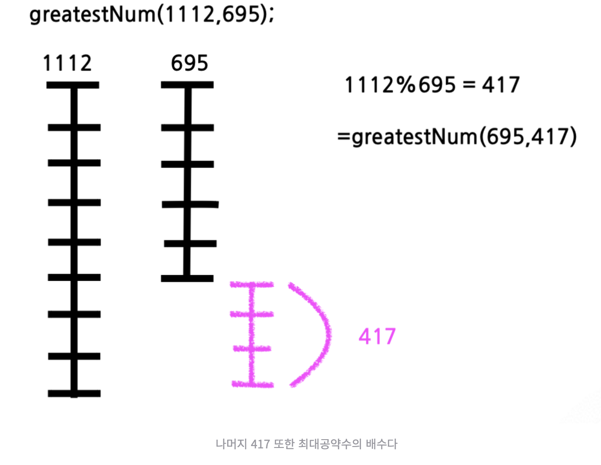
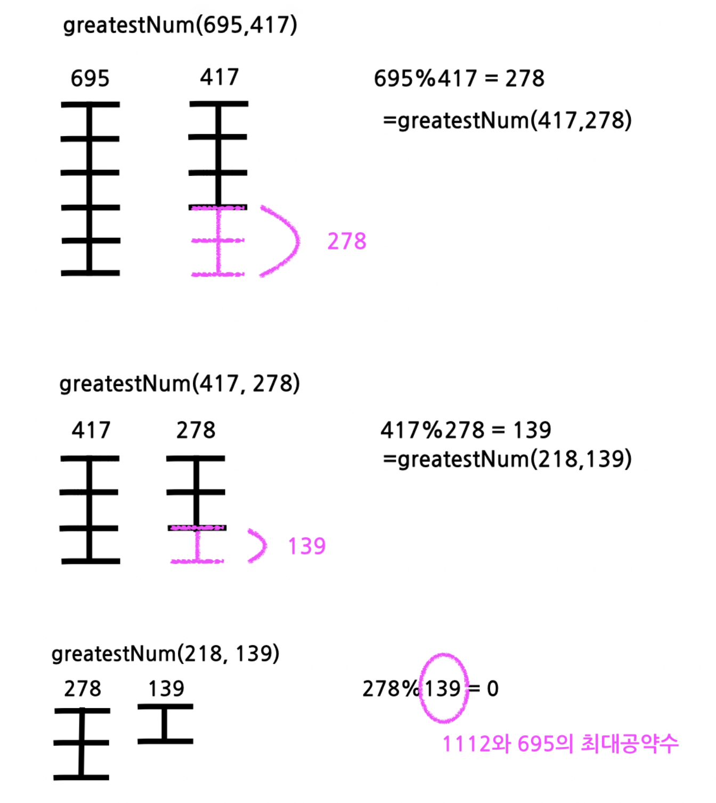

# 유클리드 호제법?

두 수의 최대공약수를 구하는 알고리즘.
이 두 수는 어떤 수에 의해 나누어 떨어지는 수 즉 최대공약수 N의 배수라는 점을 이용한 개념입니다. 방식으로 두 값을 나눈 나머지를 계속 구해 나머지가 0이 되었을 때 마지막 계산에서 나누는 수를 최대공약수로 구합니다. 여기서 두 값을 나눈 나머지를 구하는 연산을 MOD 연산이라 하며, MOD 연산을 반복해 나머지가 0이 됐을 때 마지막 계산에서 나누는 수가 두 수의 최대 공약수로 구하게 되는 방식입니다.

- 유클리드 호제법이란 MOD 연산을 반복해 나머지가 0이 됐을 때 마지막 계산에서 나누는 수로 최대 공약수를 구하는 방식이다.
- MOD 연산은 두 값을 나눈 나머지를 구하는 연산을 말한다.

이렇게만 말하면 이해 가질 않죠. 1112와 695의 최대공약수를 예시로 풀어봅시다. 이해를 돕기 위해 1112와 695는 최대공약수 139의 배수라는 점을 이미 안 상태에서 살펴봅시다. 1112는 사실 139의 8 배수이며 695는 139의 5 배수입니다. 그래서 1112에서 695를 나눈 **나머지 417 또한 결국 최대공약수 139라는 값의 배수**입니다. 그래서 점차 나누는 두 수의 값들을 줄이면서 최대공약수를 유추할 수 있고 마지막 나머지가 떨어질 시점에 최대공약수를 구할 수 있습니다. ( 최대공약수 139의 어떤 배수A와 139의 어떤 배수 B를 나누면 나머지 C 또한 139의 어떤 배수이기 때문에 그 나머지 C와 작은 수(B)의 나머지도 작아진 139의 어떤 배수(D)이고 점차 작아지다 결국 최대 공약수 139로 두 수가 나누어 떨어지게 되는 것이죠.)




```js
function greatestNum(a, b) {
  return b ? greatestNum(b, a % b) : a;
}
greatestNum(1112, 695);
```

## 최소공배수는?

```js
function leastCommonMultipleOfTwo(a, b) {
  return (a * b) / greatestNum(a, b);
}
```

연습

[프로그래머스 : 최대공약수와 최소공배수](https://school.programmers.co.kr/learn/courses/30/lessons/12940)
