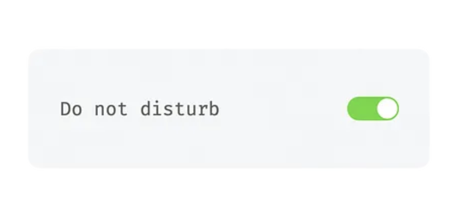
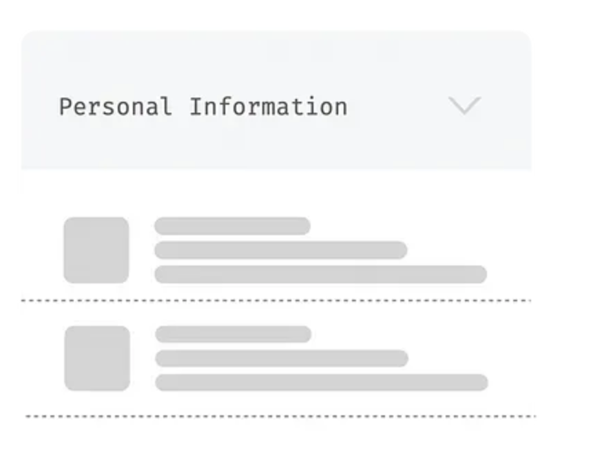

# 헤드리스 컴포넌트를 사용한 클린 코드 접근법

## 즉 두 개의 유사한 컴포넌트에서 ‘useToggle’ 훅을 추출하여 코드 중복을 줄이는 방법
여기 토글 컴포넌트와 드롭다운 컴포넌트가 있습니다. 두가지 컴포넌트의 코드를 살펴보고 ‘useToggle’ 훅을 추출해봅시다. 하단 두개의 사진에서 보이는 것처럼 토글 컴포넌트와 드롭다운 컴포넌트의 UI는 다릅니다. 하지만 코드 로직에는 명백한 유사성이 있습니다. ToggleButton의 ‘on’ 과 ‘off’ 상태는 Dropdown의 ‘펼치기(expand)’ 와 ‘접기(collapse)’ 작업과 유사합니다. 따라서 각각의 UI와 공통이되는 로직을 분리하여 커스텀 훅을 다음과 같이 작성할 수 있습니다. 
<br/>
**토글 컴포넌트**
<br/>

<br/>
**드롭다운 컴포넌트**
<br/>


토글 컴포넌트 코드입니다. 
```jsx
const ToggleButton = () => {
  const [isToggled, setIsToggled] = useState(false);

  const toggle = useCallback(() => {
    setIsToggled((prevState) => !prevState);
  }, []);

  return (
    <div className="toggleContainer">
      <p>Do not disturb</p>
      <button onClick={toggle} className={isToggled ? "on" : "off"}>
        {isToggled ? "ON" : "OFF"}
      </button>
    </div>
  );
};
```
하단 코드는 드롭다운 컴포넌트 코드 입니다. 
```jsx
const Dropdown = ({ title, children }: DropdownType) => {
  const [isOpen, setIsOpen] = useState(false);

  const toggleOpen = useCallback(() => {
    setIsOpen((prevState) => !prevState);
  }, []);

  return (
    <div>
      <h2 onClick={toggleOpen}>{title}</h2>
      {isOpen && <div>{children}</div>}
    </div>
  );
};
```
공통이되는 로직을 분리하여 만든 useToggle 커스텀 훅
```jsx
const useToggle = (init = false) => {
  const [state, setState] = useState(init);

  const toggle = useCallback(() => {
    setState((prevState) => !prevState);
  }, []);

  return [state, toggle];
};
```
# Downshift 
헤드리스 컴포넌트 패턴을 사용하여 동작(또는 상태 관리)과 표현을 분리한 대표적인 라이브러리입니다. 


이 패턴이 정확히 무엇인지, 
왜 유용한지,
인터페이스 디자인에 대한 접근 방식을 어떻게 혁신할 수 있는지

장점
-  유연성, 재사용 가능성, 코드베이스의 구성과 깔끔함 향상

### 출처
(번역) React에서 UI와 로직 분리하기:헤드리스 컴포넌트를 사용한 클린 코드 접근법
https://soobing.github.io/react/decoupling-ui-and-logic-in-react-a-clean-code-approach-with-headless-components/
