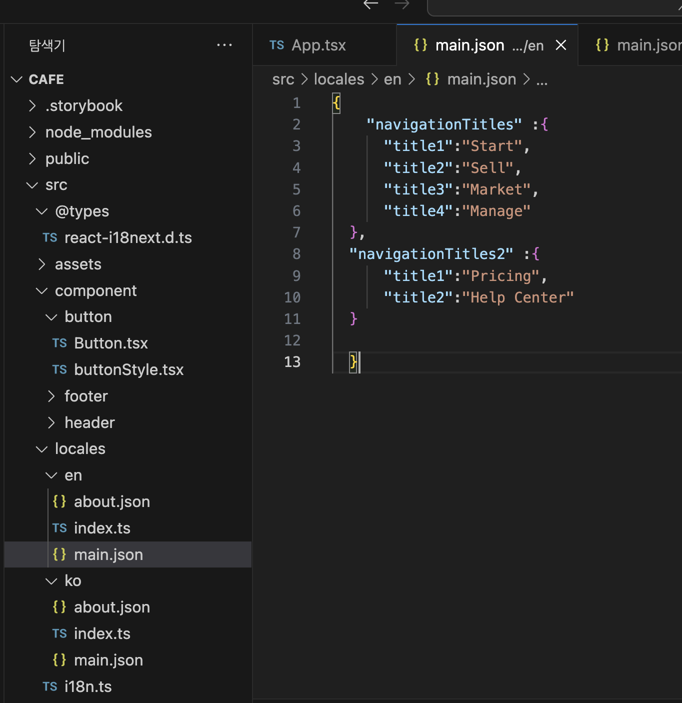
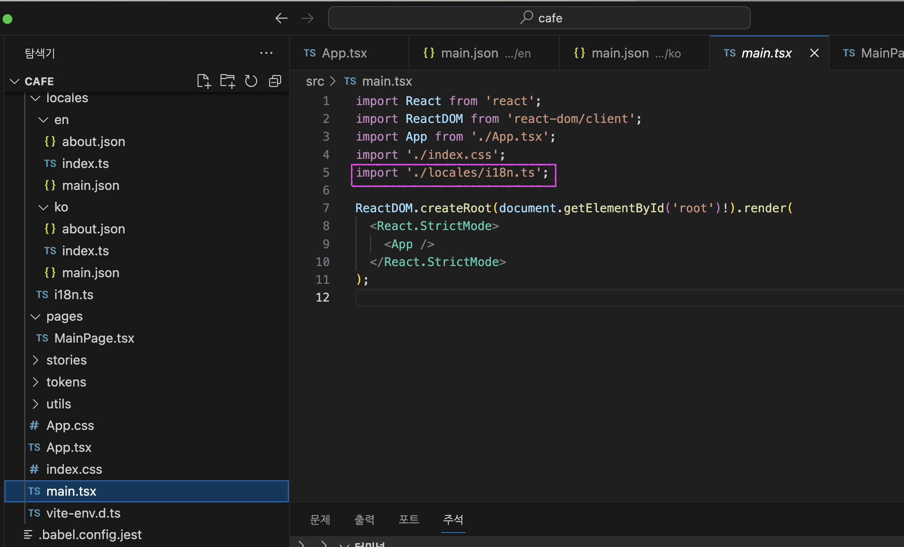

> 2023.12.28 발표

웹사이트에 다국어를 지원하는 국제화 라이브러리 i18n에 대해 설명, 리액트 실습 그리고 자동화에 대해 발표합니다.


## i18n?

국제화internationalization(i와 n 사이의 18글자)의 줄임말.
문자모음(유니코드), 측정 단위(통화, km/miles 등 등 ),시간 및 날짜 형식, 키보드 레이아웃, 텍스트방향 등의 지원이 필요
라이브러리는 [i18next](https://www.i18next.com/), [FormatJS](https://formatjs.io/docs/getting-started/installation), Polyglot,[gettext](https://www.lesstif.com/software-architect/gettext-i18n-l10n-sw-100206265.html) 등 다양하다.

  <!-- \*컴퓨터 분야 이상으로 범용적으로 사용되는 단어.(그러니 알아두면 좋겠죠) -->

<!-- > 국제화(Internationalization)? 문화, 지역, 언어가 다양한 대상 고객을 위해 쉽게 현지화할 수 있는 제품, 애플리케이션 또는 문서 콘텐츠를 설계하고 개발하는 것. - W3C -->

<!-- 그중에서도 웹분야에서 많이 사용되는 js라이브러리 i18next, 정확히는 리액트로 적용가능한 react-i19next를 프로젝트에 적용하는 시간을 가졌습니다. -->

### i18next, react-i18next

[i18next](https://www.i18next.com/) ? JS 라이브러리
[react-i18next](https://react.i18next.com/) ? i18next 기반의 React / React Native의 국제화 프레임워크.

각 나라별 번역본은 json 파일 형식을 취하며 react-i18next에 제공하는 t 함수에 ‘key’를 입력받아 번역된 문자열을 리턴하는 방식.

```jsx
// json 형태의 한글 번역본.json
{
    "websiteTitle": "카페 24",
    "category" :["커피","디져트","티"]
  }
// json 형태의 영어 번역본.json
  {
    "websiteTitle": "cafe 24",
    "category" :["coffee","dessert","tea",]
  }

//... 연결 후 적용
import { useTranslation } from "react-i18next";

const Component = () => {
  const { t } = useTranslation();
    // t함수를 제공하는 방법은 4가지로 다양한데 그중에서 hook, useTranslation를 사용한 방법이다.

    // t 함수에 websiteTitle라는 key를 입력받아 번역된 문자열 "카페 24""(현재 한글일 경우)를 리턴받는다.
  return (
    <div>
      <h1>웹사이트제목 {t("websiteTitle")}</h1>
    </div>
  );
};

```

#### flow

```
--/src
   ㄴㅡ/locals
       ㄴㅡ/ko
       |  ㄴㅡmain.json       // 한글 번역본.json
       ㄴㅡ/en
       |  ㄴㅡmain.json      // 영어 번역본.json
       ㄴㅡi18n.ts
```

1. locales 폴더 생성, 각 나라별 번역 json 파일들 생성.
2. i18n.ts 파일 생성, i18n 세팅(json파일들을 연결 및 default 언어 설정 등)을 한다.
3. i18n.ts를 프로젝트 루트 파일에 import한다.
4. t 함수에 번역문자열에 대한 key를 매개변수를 받아 UI로직에 적용한다.
5. 언어를 변경하고자 한다면 i18next.changeLanguage()메서드를 통해 변경한다.

#### 설치

(리액트 + 타입스크립트 환경)

```
$ npm i react-i18next i18next i18next-browser-languagedetector
```

\*i18next-browser-languagedetector? 브라우저에서 사용자 언어를 감지하는 데 사용하는 i18next 언어 감지 플러그인

#### 번역본 정리



#### i18n.ts 생성

<!-- 한글 번역중에서도 컴포넌트별로 나누어진 번역파일들을 하나의 네임스페이스로 묶는 등   -->

[Configuration Options](https://www.i18next.com/overview/configuration-options)

```ts
import i18n, { Resource } from 'i18next';
import { initReactI18next } from 'react-i18next';
import LanguageDetector from 'i18next-browser-languagedetector';

import * as en from './en/index.ts';
import * as ko from './ko/index.ts';

const resources: Resource = {
  'en-US': {
    ...en,
  },
  'ko-KR': {
    ...ko,
  },
} as const;

i18n
  .use(LanguageDetector)
  .use(initReactI18next)
  .init({
    resources, //초기화할 리소스
    lng: 'ko-KR', // 초기 설정 언어
    fallbackLng: {
      // 사용자언어로된 번역을 사용할 수 없는 경우 대체언어 'de-CH': ['fr', 'it'], 스위스는 프랑스와 이탈리아어도 사용합니다.
      'en-US': ['en-US'],
      default: ['ko-KR'], // 디폴트는 한국말
    },
    debug: true,
    keySeparator: '.',
    interpolation: {
      escapeValue: false,
    },
    react: {
      useSuspense: false,
    },
  });

export default i18n;
```

#### type 확장을 통한 마크업 타입추론

```json
//tsconfig
//src/@types 안  \*.d.ts 파일을 읽어올 수 있도록 설정.
{
  "compilerOptions": {
    // ...
    "typeRoots": ["./node_modules/@types/", "./src/@types/"]
  }
}
```

/@types > react-i18next.d.ts

```ts
import 'react-i18next';
import * as ko from '../locales/ko'; // 언어별로 네임스페이스와 키 값은 동일하므로 디폴트 번역본만 import

declare module 'react-i18next' {
  //react-i18next버전 11.11.0 이상만

  interface CustomTypeOptions {
    resources: {
      main: typeof ko.main;
      about: typeof ko.about; //네임스페이스 등록 후 해당 모듈에 어떤 키값들이 있는지 typeof 를 통해 등록
      //   about: typeof ko
    };
  }
}
```

근데 왜 안돼

#### 루트 파일에 import



#### 적용

```tsx
import { useTranslation } from 'react-i18next';

const GlobalNavigationBar = () => {
  const { t } = useTranslation('main');
  const navTitles = Object.values(
    t('navigationTitles', { returnObjects: true })
  );
  const navTitles2 = Object.values(
    t('navigationTitles2', { returnObjects: true })
  );

  return (
    <SNav>
      <SUl>
        {navTitles.map((title, idx) => (
          <Sli key={`${title}-${idx}`}>{title}</Sli>
        ))}
        {navTitles2.map((title, idx) => (
          <Sli key={`${title}-${idx}`}>{title}</Sli>
        ))}
      </SUl>
    </SNav>
  );
};
```

#### 언어 변경

```tsx
const Header = () => {
  const { i18n } = useTranslation('main');

  const toggleLocales = useCallback(
    (locale: string) => {
      i18n.changeLanguage(locale);
    },
    [i18n]
  );
  return (
    <SHeader>
      <Logo />
      <GlobalNavigationBar />
      <SSideMenuContainer>
        <button onClick={() => toggleLocales('en-US')} title="영어로 변환">
          en
        </button>
        <button onClick={() => toggleLocales('ko-KR')} title="한글로 바꾸기">
          ko
        </button>
      </SSideMenuContainer>
    </SHeader>
  );
};
```

### 하지만 실제 개발을 하다보면

1. 먼저 개발자가 번역파일없이 네임스테이스를 지정하고 key를 만들며 웹사이트를 개발합니다.
2. 소스 코드에서 t()와 같은 지정된 패턴의 함수를 찾아 key 를 추출해 텅빈 언어별 json파일을 생성합니다.
3. json 파일의 key 형식과 동일한 엑셀 틀을 만듭니다.
4. 번역가에게 해당 엑셀 파일을 메일로 전달하여 번역을 요청합니다.
5. 번역된 엑셀 파일을 메일로 전달 받아 번역된 문자열을 Copy & Paste하여 en-US.json과 같은 json 번역 파일로 일일이 업데이트 합니다.
6. 5번 과정을 언어의 갯수만큼 반복합니다.
7. 번역가에게 받은 번역 엑셀파일에서 번역이 잘못되거나,빠지는 등 수정이 필요하다면 4,5,6 과정을 반복합니다.

이러한 눙물의 노가다와 json 번역 파일의 버전관리의 어려움을 방지하기 위해 자동화 시스템을 구축한다고 해요.

### 자동화를 위한 google-spreadsheet와 i18next-scanner

i18next-scanner를 사용하면 소스코드에서 특정함수를 찾아 자동으로 json 파일을 생성할 수 있고, (2번과정 자동화)
google-spreadsheet를 사용하면 따로 메일을 주고 받지 않아도, 스프레드 시트를 업데이트하고 다운로드할 수 있다 합니다. (4,5번 자동화)

#### 설치

```
$ npm install -D i18next-scanner  google-spreadsheet
```

1. 전체 파일설정 i18next-scanner.config.js 등
2. package.json에 스크립트 추가
3. 구글 스프레드 시트 권한 설정 및 시트 추가
4. 서비스 계정으로 봇(bot) 사용자를 추가하고 다운로드 받은 json 인증서(creds) -> 여기서 막힘
5. npm run upload:i18n 명령어로 번역 파일 자동 동기화

### 소감

복수형(plural), 인터폴레이션(interpolation), 문맥(context) 기능 i18next에서 제공하는 다양한 기능들은 작은 프로젝트의 한계로 아직 적용해보지 못했는 데 나중 실제 서비스에서 더 다양한 기능들을 적용해보면서 더 깊이 이해해보고 싶다.

### 출처

- [국제화(i18n) 자동화 가이드](https://ui.toast.com/weekly-pick/ko_20210303)
- [react.i18next](https://react.i18next.com/)
- [Type-Safe Translations with i18next for your TypeScript project](https://www.youtube.com/watch?v=GLIas4DH3Ww)
