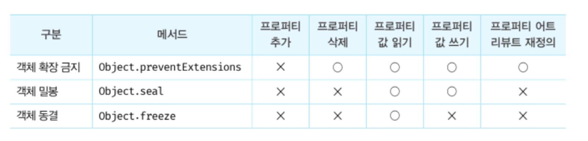

# 15장 let, const, 키워드와 블록 레벨 스코프

## var 키워드의 문제점

1. 변수 중복 선언 허용
   : 변수 중복 선언시 두번째로 선언하는 문에 초기화문 유무에 따라 다르게 동작함이 인상깊었습니다.
   - 초기화문 0 : var 키워드가 없는 것처럼 동작해 재할당됨.
   - 초기화문 x : 무시됨.

```js
var x = 1;
var y = 1;

var x = 100; // 초기화문 0
var y; //초기화문 x

console.log(x); //100
console.log(y); //1
```

2. 함수 레벨 스코프
3. 변수 호이스팅

## let 키워드

1. 변수 중복선언 금지
2. 블록 레벨 스코프
3. 변수 호이스팅 : 변수 호이스팅이 발생하나 발생하지 않는 것처럼 동작하며 에러를 발생시킨다.
   let 키워드로 선언한 변수는 "선언 단계"와 "초기화 단계"가 분리되어 진행된다. let 키워드는 선언단계 - 일시적 사각지대 TDZ - 초기화 단계 - 할당 단계 로 일어난다.

```js
console.log(foo); // 에러
let foo;

console.log(foo); //undefined
foo = 1;
console.log(foo); //1
```

4. 전역 객체와 let
   : 1. var 키워드로 선언한 전역 변수 2. 전역 함수 3. 선언하지 않는 변수에 값을 할당한 암묵적 전역 => 전역 객체 window의 프로퍼티가 됨.

   하지만 let 키워드로 선언한 전역 변수는 전역 객체의 프로퍼티가 아닙니다. window.foo 와 같이 접근 불가합니다. let 전역 변수는 보이지 않는 개념적인 블록(전역 렉시컬 환경의 선언적 환경 레코드)내에 존재하기 때문입니다.

## const 키워드

1. 선언와 초기화 동시에
2. 재할당 금지
3. 상수는 스네이크 케이스로 표현
4. const 키워드로 선언된 변수에 객체를 할당할 경우 값을 변경할 수 있다. 이는 재할당을 금지할 뿐 "불변"을 의미하는 것은 아니다.

# 16장 프로퍼티 어트리뷰트

내부 슬롯 과 내부 메서드
:자바스크립트 엔진의 구현 알고리즘을 설명하기 위해 ECMAScript 사양에서 사용하는 의사 프로퍼티와 의사 메서드

자바스크립트는 일부 내부 슬롯과 내부 메서드에 한하여 간접적으로 접근할 수 있도록 했다.

모든 객체는 [[prototype]]이라는 내부 슬롯을 갖는다. 이 내부 슬롯은 직접 접근할 수 없지만 .\_ _ proto _ \_ 로 접근가능하다.

프로퍼티 어트리뷰트 : 프로퍼티의 상태를 나타내는 내부 슬롯

- [[value]]: 프로퍼티의 값
- [[writable]]: 값의 갱신 가능 여부
- [[enumberable]]: 열거 가능 여부 -> false 인 경우 for ...in 문 , Object.keys 메서드 등으로 열거 x
- [[configurable]]: 재정의 가능 여부 -> **프러포티 삭제 불가, 프로퍼티 어트리뷰트 값 변경 금지**

## writable 과 configurable 의 차이

writable은 우리가 알고 있듯이 할당연산자 = 로 속성값을 변경하는 일을 합니다. 하지만 configurable 은 속성 Attribute의 재정의가 가능한지 여부를 판단하는 일 맡는 다는 것에 차이가 있습니다. Attribute 값 중 속성값을 변경하는 value 가 있어 configurable 개념이 writable 보다 깊은 개념이지만 **configurable:false 이고 writable : true 일때는 값 변경과 writable 프로퍼티 어트리뷰트 값 변경이 가능한 걸 보아 우선순위는 writable로 높다는 것을 알 수 있습니다.**

주의해야할 것은 **프로퍼티의 프로퍼티 어트리뷰트 값, writable를 false 처리 했다면 이후 수정시 에러가 나지 않고 수정이 되지 않는 다는 것입니다.(configurable:false 처리때 삭제시도시 무시) 다만 strict mode일경우 에러를 반환합니다. 근데 [[configurable]]이 false 인 해당 프로퍼티 재정의 시도시 에러가 발생합니다.**
또한 단순히 프로퍼티를 추가했다면(점표기법등) 프로퍼티 어트리뷰트의 값은 전부 true 처리 되지만 프로퍼티 어트리뷰트 재정의시 특정 프로퍼티 어트리뷰트값을 작성하지 않는다면,즉 디스크립터객체의 프로퍼티를 누락시키면 undefined, false (기본값)처리 됩니다.

```js
const person = {
  name: 'Lee',
};
console.log(Object.getOwnPropertyDescriptor(person, 'name'));
// 단순히 프로퍼티를 추가했다면(점표기법등) 프로퍼티 어트리뷰트의 값은 전부 true 처리
//{value "Lee" ,writable:true,enumerable:true,configurable:true}
```

```js
const object1 = { property1: 11 };
Object.defineProperty(object1, 'property2', {
  value: 22, //   property2라는 속성의 value값을 정의할 수 있습니다.
  writable: false, //할당연산자로 속성값 변경 불가
  configurable: false, // 속성 변경 or 삭제 불가
});

object1.property2 = 22; //수정이 되지 않지 않지만  에러가 나지 않습니다.
//strict mode일경우 에러를 반환합니다.

delete object1.property2; //삭제가 되지 않지만 에러가 나지 않는다.

console.log(object1); //property2가 보이지 않는다 왜일까?  프로퍼티 재정의시 enumarable 설정하지 않으면 기본값 false 처리하여 보이지 않게 된다.
console.log(object1.property2); //22
```

## 접근자 프로퍼티

접근자 프로퍼티는 자체적으로 값(프로퍼티 어트리뷰트 [[value]])를 가지지 않으며 다만 데이터 프로퍼티의 값을 읽거나 저장할 때 관여한다.
접근자 프로퍼티의 프로퍼티 어트리뷰트 :[[Get]],[[Set]],[[Enumerable]],[[Configurable]]

### 만약 접근자 프로퍼티 "fullName" 가 프로퍼티 값에 접근한다면

1. [[Get]]내부 메서드가 호출
2. 프로퍼티 키"fullName"가 유효한지 확인 : 심벌또는 문자열인지
3. 프로토타입 체인에서 프로퍼티 검색
4. 검색한 프로퍼티 fullName이 데이터 프로퍼티인지, 접근자 프로퍼티인지 확인
5. 접근자 프로퍼티 fullName의 프로퍼티 어트리뷰트 [[Get]]의 값 즉 getter 함수를 호출 -> 결과 반환

## 객체 변경 금지



확장가능한 객체인지 : Object.isExtensible()
읽기 쓰기만 가능한 밀봉된 객체인지 : Object.isSealed()
읽기만 가능한 동결된 객체인지 :Object.isFrozen()

Object.freeze 메서드로 객체를 동결해도 중첩 객체까지 동결시킬수 없다.
따라서 중첩 객체까지 동결하기 위해서는 재귀적으로 객체를 동결시켜야 한다.

# 17장 생성자 함수에 의한 객체 생성

하나의 객체를 생성시-> 객체 리터럴
동일한 프로퍼티 구조의 여러개 객체 생성시 -> 생성자 함수

생성자함수는 일반 함수와 동일한 방법으로 생성자 함수를 정의하고 new 연산자와 함께 호출하면 해당 함수는 생성자 함수로 동작한다.

**this 바인딩 : 함수 호출 방식에 따라 동적으로 결정된다.**

## 생성자 함수의 인스턴스 생성 과정

1. 인스턴스 생성과 this 바인딩
   암묵적으로 빈 객체 생성 및 this에 바인딩(식별자와 값을 연결함)
   -> 함수 몸체의 코드가 한 줄씩 실행되는 런타임 이전에 실행됨.

2. 인스턴스 초기화
3. 인스턴스 반환 : 완성된 인스턴스가 바인딩된 this 를 암묵적으로 반환

- 다른 객체를 명시적으로 반환시 그 객체가 반환되며 원시값 반환시 원시값 무시, this 가 반환됨

함수는 일반 객체가 가지고 있는 내부 슬롯과 내부 메서드+ [[Environments]],[[FormalParameters]]등의 내부 슬롯과 [[Call]] ,[[Construct]] 를 가진다.

### 함수 종류

callable 이자 non-constructor : 일반함수로서만 호출할 수 있는 함수 객체 -> [[Call]] 만 있음
callable 이자 constructor : 생성자 함수로서 호출할 수 있는 함수 객체 -> [[Call]],[[Construct]] 가지고 있음

함수 구분은 함수 정의 방식에 따라 구분합니다.
non-constructor : 메서드(es6축약표현), 화살표함수
constructor : 함수 선언문. 함수 표현식. 클래스

**생성자 함수를 일반적인 함수로서 호출하면 함수 내부의 this는 전역 객체 window를 가리킨다.**

## new.target 와 스코프 세이프 생성자 패턴

생성자 함수가 new 연산자없이 호출되는 것을 방지하는 메타 프로퍼티

**new 연산자와 함께 생성자 함수로서 호출되면 함수 내부의 new.target은 함수 자신을 가리킨다. new 연산자없이 일반함수로서 호출된 내부의 new.target은 undefined 다.**

```js
function Circle(radius) {
  if (!new.target) {
    return new Circle(radius);
  }
  this.radius = radius;
  this.getDiameter = function () {
    return 2 * this.radius;
  };
}

const circle = Circle(5); // new 없이 호출해도 생성자함수로 호출됨
```

스코프 세이프 생성자 패턴

```js
function Circle(radius) {
  if (!(this instanceof Circle)) {
    // new 연산자와 함께 호출되지 않았다면 this는 window 를 가리키고 circle 과 연결되지 않는다.
    return new Circle(radius);
  }
  this.radius = radius;
  this.getDiameter = function () {
    return 2 * this.radius;
  };
}

const circle = Circle(5); // new 없이 호출해도 생성자함수로 호출됨
```
