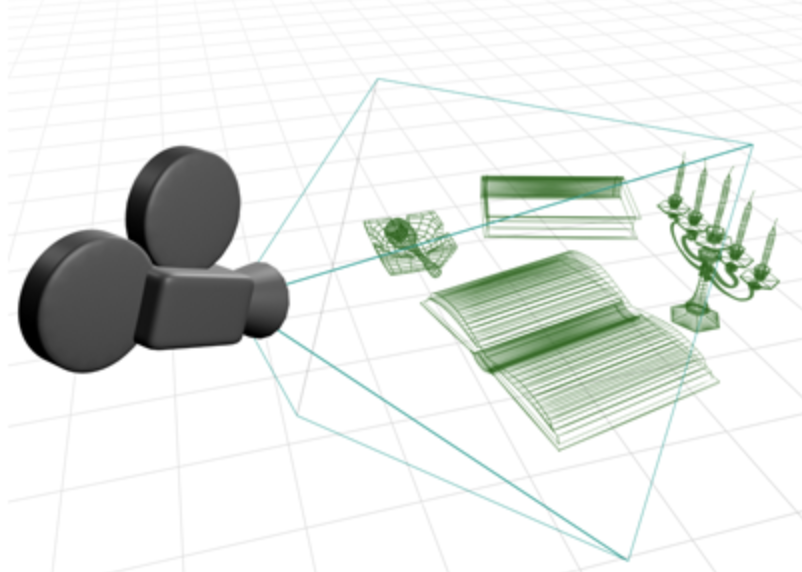
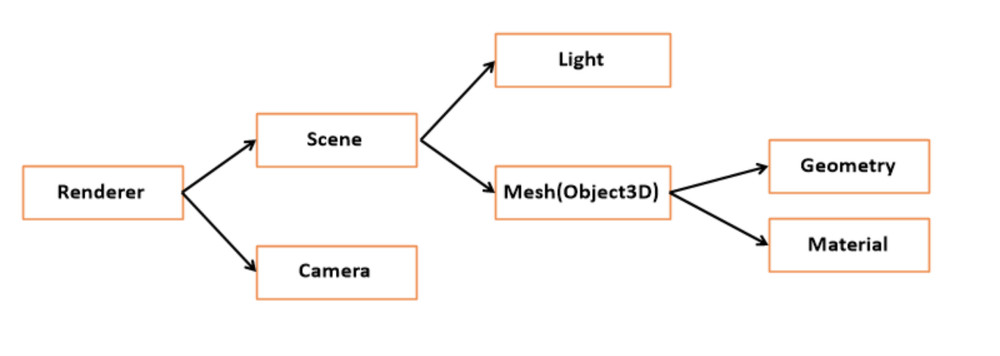

# three.js 정의와 기본구조 👷‍♀️
## Three.js
Three.js란 웹에 3D객체를 쉽게 렌더링하도록 도와주는 <span style="color:red">자바스크립트 3D 라이브러리</span> 입니다.  WebGL과 비교한다면 WebGL은 2D/3D객체를 렌더링하는 일을 하고, Three.js은 어려운 WebGL을  3D 그래픽에 관련된 수학 지식들이 없이 직관적인 코드를 짤 수 있도록 도와주는 3D 라이브러리라고 할 수 있겠습니당 홍홍

* SVG와 CSS를 통해 3D를 만들 수 있지만 매우 제한적이고 어렵습니다.

||종류|하는 일|언어|
|------|---|---|---|
|WebGL|레스터화 엔진|웹에서 2차원 그래픽과 인터랙티브 3차원 그래픽을 렌더링|js|
|Three.js|3D 라이브러리	|수학지식없이  WebGL을 사용하도록 도와주는 라이브러리|자바스크립트|

OpenGL 과 WebGL

OpenGL은 Open Graphics Library이며, WebGL의 원조라고 알아둡시다. C언어가 기반인 OpenGL을 웹상에서도 사용할 수 있도록 나온 것이 WebGL입니다.

## Three.js의 기본 구조.
Three.js 에서 가장 기본이 되는 것은 3 가지.<span style="color:blue"> `Renderer`, `Scene`, `Camera` </span> 입니다. (당연하게도 3ds MAX 와 기본 개념이 비슷하네요.)

1. Scene이라는 **3D 공간**을 꾸미고,
2. 그 공간을 Camera라는 **시점**에서 바라보는 것.
3.  그 시점을 Renderer를 통해 HTML Canvas안에 **렌더링**하여 보여주는 것. 
이게 전부입니다. 
<br/>

<br/>
기본구조
 <br/>


## 1. Renderer 
`Renderer`는 `Scene`과 `Camera` 객체를 넘겨 받아 3D장면의 카메라가 바라보는 부분을 2D로 렌더링하는 일을 합니다.(3D 객체를 보는 거지만 결국 모니터라는 2D 환경에서 보니까요.)  기본적으로 WebGL을 사용합니다.

## 2. Scene 
Scene은 크게 빛 Light와 3D객체인 Mesh 로 구성됩니다.  상단에 위치한  "Three.js 간략한 구조"라는 사진에는 자세히 안나와 있지만 Scene 하단에는 빛 Light와 Mesh 말고도  배경색,  안개 등 다양한 요소들이 트리형태로 묶여 있습니다.  이 트리를 통칭해 Scene graph라고 말합니다.

### 2.1 Light(광원)
다양한 광원을 제공합니다. - 주변광AmbientLight, 집중광SpotLight 등

### 2.2 Mesh(Object3D)
Mesh는 3D객체를 표현하며,  `Geometry`(모양)와 `Material`(표면 속성)로 나눌 수 있습니다. 예를 들어 "초록색이고 투명도50%인 원뿔모양의 3D 객체를 만든다" 가정한다면, 초록색, 투명도50%라는 Material 과+ 원뿔이라는 형상 정의Geometry를 조합해 = 3D 객체인 Mesh가  만들어 지는 것입니다. 큰 특징으로  Material, GeoMetry는 재사용이 가능하여 여러개의 Mesh(3D객체)가 하나의 Material(표면 속성) 또는 GeoMetry(형상)를 동시에 참조할 수 있습니다. 

   2.2.1 Geometry (모양 )
   
   구, 정육면체, 등등 형상을 정의하는 기하학 객체의 정점 데이터입니다. 기본적으로 `Three.js` 내에서 제공하는 내장 객체(구, 정육면체 등)를 통해 만들수도 있고, 파일을 통해 외부에서 가져와 만들 수 있습니다. 
   
   2.2.2 Material (표면 속성)

   색상, 투명도, 질감등 기하학 객체를 그리는 데 사용하는 표면 속성을 의미합니다.

## 3. Camera :
영화의 장면, 장면은 사실 카메라로 촬영하는 시점이죠. 카메라의 3D 공간상 위치와 기타 설정값들을 조절할 수 있습니다.  여기서 주의할 점은 위 사진에 나와 있는 것처럼 Camera 는 Scene에 포함되지 않습니다. (근데 scene에 포함되기도 합니다.)

# 예제
예제 코드를 통해 Three.js의 기본 구조를 파악해 봅시다. 크게 네 가지 순서로 작성합니다.

## 1. Scene(장면) 생성. 
scene(3D 공간)을 생성합니다.
```js
const scene = new THREE.Scene()
```
## 2. Objects(정육면체) 생성.
사실 Object는  *`particles`(입자), `lights`(조명)과 같이 다양하게 포함된 개념이지만, 지금은  `3D Object(Mesh)`인 정육면체로 예시를 들겠습니다.  Mesh(3D Object)는  `geometry`(모양)와 `material`(색상, 질감등의 표면속성)를 합쳐 만듭니다.  `Objects` (정육면체)를 만드는 순서입니다.

1. `geometry`(정육면체 모양)와 `material`(색상,질감) 각각 생성.
2. Mesh의 인자로 `geometry`와 `material`를 넣어 3D Object를 완성.
3. 완성된 Mesh(3D Object)를 scene안에 추가.

```js
const geometry = new THREE.BoxGeometry() //Three.js 에 내장된 객체 정육면체 모양 geometry을 가져옴
const material = new THREE.MeshBasicMaterial({
    color: 0x00ff00, //색상은 초록
    wireframe: true, // 뼈대만 보이게 하기 
})

const cube = new THREE.Mesh(geometry, material) //Mesh=geometry+material
scene.add(cube) //정육면체를 3D공간(scene)에 추가한다.
```
## 3. Camera 생성
카메라 종류는 5가지가 있는 데 지금은 `perspectiveCamera` 원근 카메라로 카메라를 생성합니다. 그리고 카메라 또한 3D 공간에 (0,0,0)에 위치에 있으면 3D Object(정육면체이며, 기본위치값 0,0,0에 위치에 있다.)를 촬영할 수 없기 때문에 카메라 위치를 position으로  조정합니다. (물론 position 말고도 rotation회전 등 다양하게 이동할 수 있습니다.)
```js
const camera = new THREE.PerspectiveCamera( //원근 카메라 PerspectiveCamera 사용
    75,// 시야각Field of view (필수)
   1,  //종횡비(필수)
   0.1, //3번째 인자 Near and far
    10
)

camera.position.z = 2
```
perspectiveCamera(원근카메라)는 몇 가지 파라미터를 넘겨줘야 합니다.  첫 번째(시야각)와 두 번째 인자(종횡비)는 필수인자입니다. 

perspectiveCamera(원근카메라)의 인자
### 1번째 인자: 시야각 the field of view.
- 숫자가 클수록 넓은 공간을 볼 수 있지만, 왜곡이 생긴다. (어안 효과)
- 숫자가 작으면 망원렌즈처럼 사물이 확대된 거처럼 보인다.
- 적정시야는 45~ 75 사이

### 2번째 인자: 종횡비 Aspect ratio
- 종횡비=== 이미지의 가로 세로 비례 관계
- 정사각형 비율 === 1
- 보통 width/ height 로 표현

### 3번째과 4번째 인자: 근평면과 원평면. Near and far
카메라가  얼마나 멀리까지 볼 수 있는지, 그리고 얼마나 가까이에 있는 물체까지 볼 수 있는지를 결정해 주는 인자들입니다. 근평면값과 원평면 값사이에 3D Object 위치값이 존재해야 카메라 시야에 잡혀 렌더링되므로 주의해야 합니다.  (물체가 근평면과 원평면 안에 들어가는 지 어케아냐? 다 방법이 있지만 메서드 까먹어서 못 알려줌) 해당 인자들은 z-fighting 버그를 방지를 위한 인자들이라 하네요.

- 3번째 인자 근평면 Near : 카메라와 수직하며 제일 가까운 곳의 시야 범위를 나타내는 평면
- 4번째 인자 원평면 Far : 카메라와 수직하며 제일 먼 곳의 시야 범위를 나타내는 평면
- 4번째 인자 원평면 Far 의 기본값은 2000.

```js
const camera = new THREE.PerspectiveCamera( //원근 카메라PerspectiveCamera: 원근깊이가 있는 카메라입니다. Frustum 형태가 잘린 피라미드처럼 보입니다.
    75,//1번째 인자= 시야각Field of view
   1,//window.innerWidth/ window.innerHeight, //캠퍼스 크기를 바꾸려면 횡종비 업데이트와 카메라도 일치시키기위해여기도 조정이 필요함
   //2번째 인자= 종횡비
   0.1, //3번째 인자 Near:  얼마나 가까이에 있는 물체까지 볼 수 있는지를 결정해주는 인자
    10 //4번째 인자  far: 카메라가 얼마나 멀리까지 볼 수 있는지,
)

camera.position.z = 2

```
## 4. Renderer 생성후 Scene과 Camera 연결하기
3D 공간(scene)에 정육면체(mesh 인 3D Object)를 넣고 camera 를 세팅했으니 camera의 시선을 화면에 렌더링 해야 합니다. 이를 위해 Renderer를 생성하고  renderer 내장 render 메소드에 scene과 camera를 인자로 넘겨줍니다.  그전에 three.js는 camera의 시점에서 보이는 모습을 canvas 태그 위에서 그려내죠. canvas를 html에 따로 작성하지 않아도 자동으로 만들어주기도 하지만 지금(공부하는 애송이)은 renderer가 그림을 그릴  html에 canvas를 만들고 canvas를 연결해봅시다.

1.  html 파일에 canvas를 구성합니다. 

2. Renderer를 생성하며 canvas 엘리먼트를 인자로 받습니다. 

3. setSize 메서드를 통해 canvas의 크기를 조정합니다. 

4. renderer 내장 render 메서드에 scene과 camera를 인자로 넘겨주면 이제 진짜 완성입니다!
```html
  <body>
        <canvas id="c1" class="c"></canvas> //canvas안에서 3D가 렌더링됩니다.
        <script type="module" src="bundle.js"></script>
    </body>
```
   ```js
  
const canvas1 = document.getElementById("c1") as HTMLCanvasElement //html 폴더에 있는 아이디가 c1 인 캠퍼스를 변수에 저장합니다.

const renderer1 = new THREE.WebGLRenderer({canvas:canvas1}) //인자를 안받으면 자동으로 캠퍼스를 생성합니다.
renderer1.setSize(200, 200)

renderer1.render(scene, camera)
```

## 요약
1. scene(3d 공간)을 만든다. 

2. 3d Object를 만들어 scene에 추가한다.

3. 카메라를 설치한다.

4. renderer 를 생성하고  3d Object가 담긴 scene과 카메라를 담는다.


## 출처

https://www.educba.com/webgl-vs-opengl/

https://zeroco.tistory.com/122
