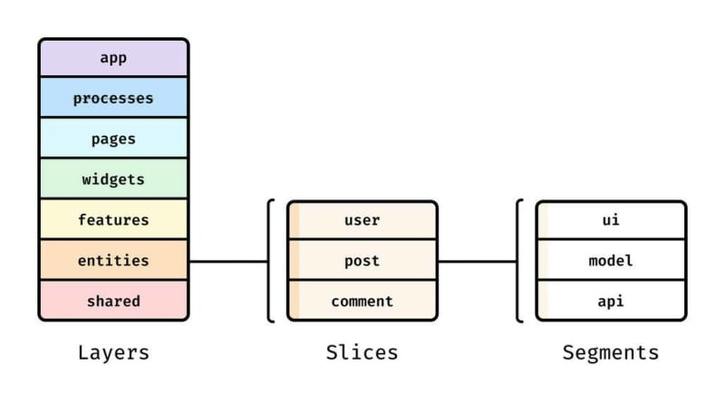

# feature sliced design

Feature Sliced Design이란?

프론트엔드 애플리케이션을 스캐폴딩하기 위한 아키텍처 방법론입니다.

다르게 이야기하면 코드의 구조에 대한 규칙 / 규칙 모음집인데요

제대로 알아보기 전에 몇가지 알아두고 가면 좋은 점이 있으니 그것부터 짚어봅시다.

1. FSD는 프론트엔드에만 적용됩니다.

2. FSD는 라이브러리 설계 / UI 킷 / 디자인 시스템 설계 에는 적용되지 않습니다.

3. 간단한 앱은 FSD가 필요 없습니다.

4. FSD는 언어, 프레임워크, 상태라이브러리를 강제하지 않습니다.

다음은 FSD의 프로젝트 구성입니다. 하나하나 설명드리면 다음과 같습니다.

shared : 프로젝트 / 비즈니스의 세부사항과 분리되어있는 재사용 가능한 기능입니다.

entities : 우리의 순수한 도메인 로직들이 들어갑니다.

features : 사용자와의 상호 작용 / 사용자에게 entities의 가치를 제공하는 작업을 합니다(장바구니 담기 , 유저 검색 등)

widget : 엔티티와 기능을 의미 있는 블록으로 결합하는 구성 레이어입니다.

pages : 페이지임

app : 스타일 / provider / 전체 config가 들어갑니다.

# 이거 하면 뭐가 좋음?

프로젝트가 유지보수되면서 기능은 추가되고 점점 코드베이스가 커지게됩니다.

이렇게 코드베이스가 커지고 나면 많은 기능들이 한데 섞여서 거대한 레거시가 되기 쉬운데요

거대한 레거시는 다른 기술로 전환하거나 기능을 추가하는 것이 매우 고통스럽습니다.

FSD는 클린아키텍처와 비슷하게 코드들을 특정 기준을 가지고 분리하며

각 코드들이 의존할 수 있는 대상을 정의하고 의존성의 흐름을 한방향으로 제한합니다.

아키텍처 수준에서의 이러한 제약을 통하여 쉽게 변하는 가치와 쉽게 변하지 않는 가치를 분리하고

쉽게 변하는 가치들은 좀 더 원활하게 갈아 끼울 수 있는 코드베이스를 만들 수 있는 방법론이라고 할 수 있어요

따라서 거대한 프로젝트를 만들어 나갈 때에 발생하는 기존 방식의 문제를 해결하는 아키텍처라고 할 수 있습니다.
# 마치며

재밌죠? 한번 해보시면 더 재밌습니다.

# 레퍼런스

https://feature-sliced.design/
