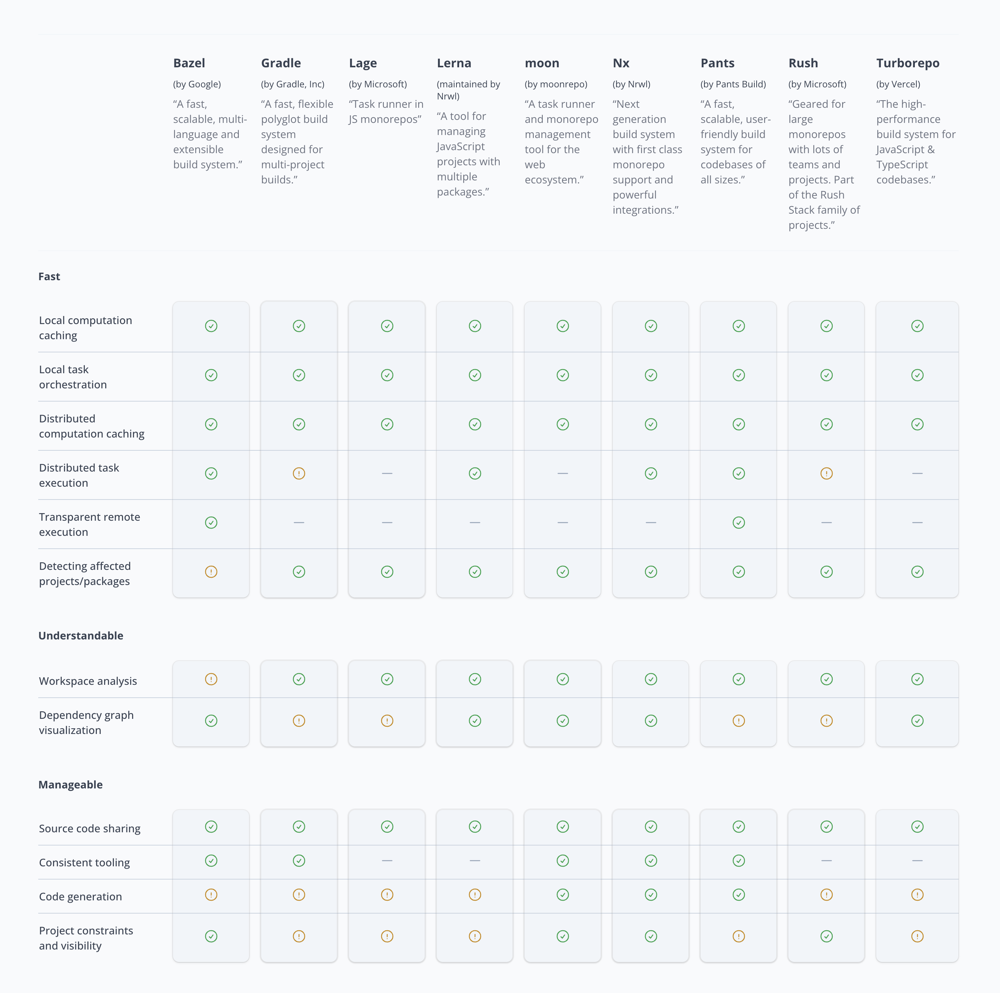

# 모노레포

프론트엔드 생태계는 빠른 발전을 거듭하며 수많은 기술들이 나오고 deprecated 되고를 반복하고 있습니다.

그럼에도 불구하고 어느정도 생태계의 지지를 받으며 큰 방향 자체는 달라지지 않고 있는 것이 모노레포 전략인 것 같아요

monorepo와 multirepo 둘 모두 장단점이 있지만 monorepo의 단점을 잘 메워줄 수 있는 형태로 기술이 발전하는 것 같습니다.

제가 생각하는 monorepo의 장점은 크게 다음과 같아요

1. 중복 코드 최소화 및 공통 컨벤션 공유

2. 새 프로젝트 시작 비용 절감

3. 간편한 internal package 관리

4. 종속성, 버전관리 용이

위 장점들에 힘입어 여러 서비스를 운영하거나 시작해야하는 경우 또 유지보수하는 경우 매우 유용하게 사용할 수 있습니다.

공통으로 사용할 수 있는 것들은 사용하면서 각각 별개로 운영할 수 있다는 점이 대규모 프로젝트에서 유리한 면이 많습니다.


# 모노레포 구축에서 고려해야하는 사항들

## 어떤 패키지 매니저를 사용할 것인가?

모노레포는 단순히 생각하면 폴더 안의 폴더를 두는 것이라고도 생각할 수 있습니다.

그럼에도 불구하고 모노레포 구축을 위한 도구들이 많이 나와있는 것은 단순히 폴더 안의 폴더를 두는 것으로는

여러가지 불편함과 비효율이 발생하기 때문이에요


그래서 패키지매니저들은 workspace라는 기능을 제공해줍니다.

대표적으로 떠올릴 수 있는 패키지매니저들은 거의 모두 workspace 기능을 지원한다고해도 과언이 아닌데요

npm , pnpm, yarn1 , yarn 2+ 등 다양한 패키지 매니저가 workspace 기능을 지원하고 있으며

이 workspace 기능만을 통하여서 모노레포 프로젝트를 구축하는 것도 충분히 가능합니다.

workspace의 경우 주로 package.json을 통하여 사용을 정의하는데요 예를 들어 npm의 workspace는 다음과 같은 형태로 사용합니다.

```
// apps/wooeunhe/package.json
{
    "name":"wooeunhe"
}
```

```
// root / package.json
{
    "workspaces":["wooeunhe"]
}
```

이렇듯 workspace 기능만을 이용하여서도 모노레포 프로젝트를 구축할 수 있지만

처음 모노레포에 입문하는 경우 여러가지 문제들을 많이 마주하게 됩니다.

현재는 어느정도 솔루션이 정립되어 있는 상태이지만 처음부터 만들다보면 의존성, 캐싱, parallel execution, 순환참조, 버저닝, 스크립팅 등의 문제를 마주하기 쉽습니다.

그렇다보니 모노레포를 구축하다보면 마주하게되는 여러가지 문제들을 도구 차원에서 풀어내어 사용자가 편리하게 쓸 수 있도록 래핑된 도구들을 많이 사용하는 것 같아요 

대표적으로는 lerna, turborepo 등의 도구를 떠올릴 수 있습니다.


## 시중의 monorepo 도구들은 대부분 workspace 기능을 래핑한것이다.

우리가 해야하는 것은 많은 도구 중 자신에게 적절한 도구를 고르는 것입니다.

또한 모노레포가 해결해주는 문제의 큰 부분 중 하나가 의존성이다보니 패키지 매니저에 대한 이해가 뒷받침 되면 모노레포를 디버깅하기도 편해집니다.

npm, pnpm , yarn2 등 어떤 패키지 매니저를 채택했느냐에 따라 발생하는 문제도 달라지곤 하거든용

# 대표적인 모노레포 도구들의 비교


1. yarn workspace 2

yarn은 모노레포가 장점이 더 많은가?라는 논쟁이 있던 시절에도 workspace 기능을 제공하였으며

workspace 기능을 기본 제공한 최초의 패키지 매니저입니다. 

그만큼 패키지 매니저 차원에서 바라보면 workspace 기능에 대한 개선도 많이 진행되었고 레퍼런스를 찾기도 상대적으로 쉬운 편입니다.

모노레포에 대한 아티클들을 거슬러 올라가다보면 yarn 1 - lerna 조합의 모노레포 프로젝트를 아주 많이 발견할 수 있을 만큼이요

특히 yarn 2 , yarn berry 등으로 불리는 새로운 버전의 yarn 에서는 pnp , zero install 등

다른 패키지 매니저들은 제공하지 않는 기능과 더불어 매우 strict 한 의존성 관리 전략을 제공하며

패키지 매니저 차원에서 Parallel execution을 제공하는 등의 편의성으로 인하여

yarn workspace 만으로 모노레포를 구축하는 경우도 심심찮게 찾아볼 수 있습니다.


2. Nx

Nx는 DX, CI 성능 최적화에 집중하는 모노레포 도구입니다.

로컬, 원격 캐싱을 도구 차원에서 지원하고

version 14 부터 Nx 도구 차원에서 Module Federation을 지원한다는 점이 흥미롭습니다.

Module Federation의 구현 자체는 Webpack을 사용하며 이를 좀 더 쓰기 쉬운 형태로 래핑한 api를 제공하는 형태입니다.


3. turborepo

turborepo는 vercel에서 지원하는 모노레포 도구입니다.

로컬 및 원격 캐싱을 도구 차원에서 지원하고 대부분의 configuration이 이미 완성된 형태로 제공한다는 특징이 있습니다.

다만 추상화가 많이 입혀져 캐싱 동작을 디버깅하는 게 쉽지 않으며 모든 기능을 다 사용하기 위해선 vercel에 종속되기도 합니다.

패키지 매니저에 대한 지원은 조금 아쉬운 면이 있는데요

yarnberry의 pnp 기능이 지원되지 않는 상태이며 모든 패키지매니저를 지원하긴 하지만 pnpm을 가장 권장하는 형태입니다.


4. rush

rush는 microsoft에서 유지관리하는 모노레포 도구입니다.

변경된 패키지만 다시 빌드할 수 있도록 하는 incremental builds를 지원하는 점이 특징인데요

rush는 모노레포 도구인 rush 뿐만아니라 같은 생태계내에서 rushstack이라고 불리는 여러가지 도구들을 통하여

생태계의 도움을 받을 수 있습니다.



# 마치며

도구가 너무 많아요 흑흑


# 레퍼런스

https://medium.com/mildang/rush%EB%A1%9C-%ED%94%84%EB%A1%A0%ED%8A%B8%EC%97%94%EB%93%9C-%EB%AA%A8%EB%85%B8%EB%A0%88%ED%8F%AC-%EB%8F%84%EC%9E%85%EA%B8%B0-5da0c5bc9b30

https://monorepo.tools/