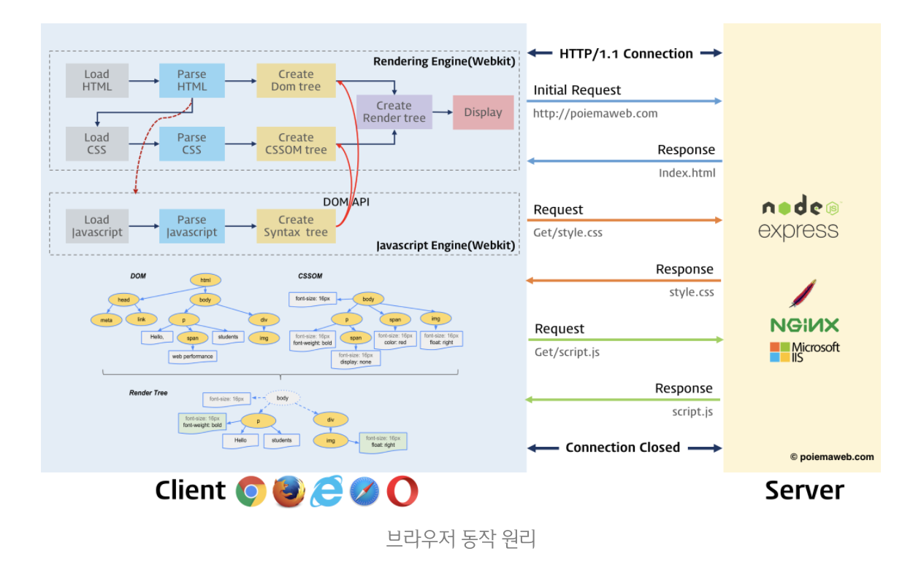
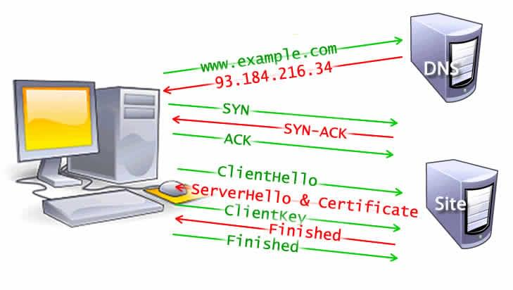
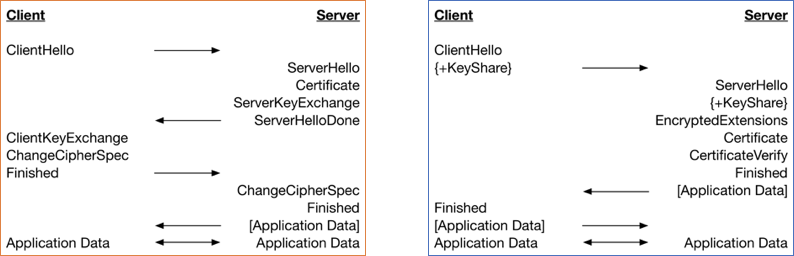
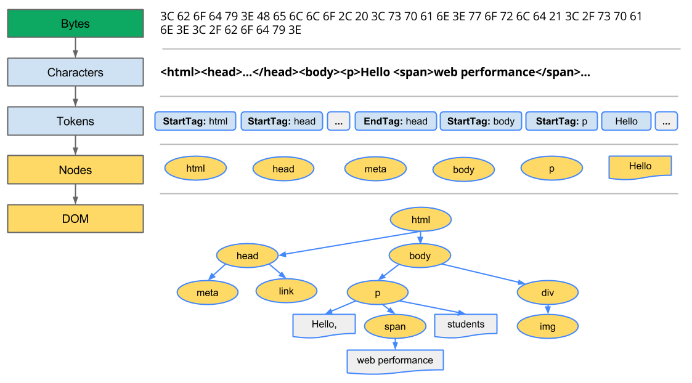

# 요약

1. 브라우저에서 서버에 필요한 자원을 요청합니다.
2. 브라우저의 렌더링 엔진이 `DOM 트리`와 `CSSOM`를 생성합니다.
3. 생성된 `DOM 트리`와 `CSSOM`를 합쳐서 렌더 트리를 생성합니다.
4. JS 코드가 있다면 자바스크립트 엔진으로 파싱하여 AST를 생성한 뒤 인터프리터에 전달하여 `DOM` 또는 `CSSOM`을 변경합니다. 변경된 트리를 `렌더 트리`에 반영하여 변경시킵니다. → `Reflow`, `Repaint`
5. `렌더 트리`를 기반으로 HTML 요소의 레이아웃을 계산하여 `페인팅`합니다.

 
 

# 탐색 (Navgation)

웹페이지를 로딩하는 첫 단계입니다.

주소창에 URL을 입력하거나 링크를 클릭하거나 Form을 제출하는 것처럼 사용자가 요청을 보낼 때마다 발생합니다.

- 탐색 과정의 시간을 최소화하는 것이 웹 최적화의 목표 중 하나

## DNS 조회

> [www.example.com](http://www.example.com) →
> ← 93.184.216.34 응답

탐색 과정의 첫 단계입니다.

브라우저가 `DNS 조회`를 요청하면 DNS 서버에서 처리되어 IP 주소가 응답됩니다.

최초로 요청되면 IP는 일정 기간동안 `캐시`됩니다. 다음 요청 시에 캐시에 저장된 IP 주소를 검색해서 DNS 서버에 요청하지 않아 요청 속도를 높힐 수 있습니다.

DNS 조회는 보통 호스트 이름 하나에 한 번만 수행되기 때문에 요청된 페이지 안에 있는 글꼴, 이미지, 스크립트, 광고 같은 여러 자원들에 대해서 각각 수행됩니다.

→ 모바일의 경우, DNS 조회는 폰 → 셀 타워 → DNS 서버 를 거치기 때문에 폰, 셀 타워, DNS 서버의 거리에 따라 지연 시간이 커질 수 있습니다.

 

## TCP Handshake

> SYN →
> ← SYN-ACK
> ACK →

DNS 조회를 통해 IP 주소를 알았다면 `TCP 3 way handshake`로 연결을 설정합니다.

 

## TLS handshake

왼쪽은 1.2, 오른쪽은 1.3

HTTPS 프로토콜로 웹을 탐색해서 브라우저가 해당 사이트의 오리진 서버를 쿼리하면 발생합니다.

3 way handshake로 TCP 연결이 열리면 `TLS handshake`가 발생합니다.

 

**ClientHello**

- 클라이언트가 프로토콜 버전, 클라이언트 랜덤, 암호 모음 목록이 포함된 ClientHello 메시지를 보냅니다.

**ServerHello & Certificate**

- ServerHello에는 서버의 인증서, 디지털 서명, 서버 랜덤, 선택한 암호 그룹이 포함됩니다. 서버는 이 시점에 이미 마스터 암호를 가지고 있으므로 Finished 메시지도 전송합니다.

**Finished**

- 클라이언트가 서명 및 인증서를 확인하고 마스터 암호를 생성한 뒤, Finished 메시지를 전송합니다.

> **TLS 1.3버전으로 오면서 개선된 사항** >   1. 핸드쉐이크 과정 최적화: 2라운드에서 1라운드로 간소화
>   2. 암호화 강화: 보안성이 더욱 강화된 새로운 암호화 알고리즈 적용
>   3. 중개자 역할 감소: 서버와 클라이언트 간 직접적인 통신을 강조
>   4. 무결성 보호 강화: 기존 MAC에 대한 취약점 보완, 새로운 무결성 보호 방식 적용
>   5. 기타 기능 추가: 세션 무효화 기능, 세현 추적 방지 기능 등 추가

 
 

# 응답 (Response)

웹 서버와 연결이 성립되면 브라우저는 보통 HTML 파일을 요청합니다. 서버가 요청을 받으면 관련된 응답 헤더와 HTML을 응답합니다.

이 첫 요청에 대한 응답은 수신된 첫 바이트 데이터를 포함하는데, 이 데이터는 보통 **`14KB`** 크기입니다.

 

## 왜 14KB?

네트워크 통신의 속도를 조절하는 **`TCP Slow Start`**에 정해진 크기입니다.

TCP 패킷의 최대 크기는 **`1500bytes`**입니다. 각 TCP 패킷은 헤더에서 `40bytes`( IP에서 16, TCP에서 24 )를 사용합니다. 그러면 TCP 패킷은 1500 - 40 = 1460bytes만큼 남게 되는데, TCP 패킷은 10개를 보내므로 10 \* 1460 = 14600bytes = 약 14KB가 됩니다.

따라서 데이터의 크기를 14KB로 맞추면 서버에게 요청을 한 번 아낄 수 있기 때문에 시간 절약이 가능합니다.

 

## TCP Slow Start

서버에서 한 번에 패킷을 얼마나 송신할 수 있는지 확인하는데 사용하는 알고리즘입니다.

서버에서는 데이터를 얼마나 처리할 수 있을지 모르기 때문에, 보통 10개 정도의 패킷을 송신해서 프로세스를 시작합니다. 이 패킷이 성공적으로 클라이언트에 도달하면, 클라이언트는 패킷을 수신했다는 응답 패킷(ACK)을 보냅니다.

ACK를 받은 서버는 패킷의 양을 두 배로 늘려서 데이터를 보냅니다.

이러한 과정이 패킷이 손실되고 서버가 ACK 응답을 받지 않을 때까지 반복됩니다.

 
 

# 구문 분석 (Parsing)

브라우저가 첫 데이터를 받으면 파싱을 시작합니다. 이 파싱은 받은 데이터를 `DOM`과 `CSSOM`로 바꾸는 것입니다.

첫 데이터의 크기가 14KB보다 커도 파싱을 시작합니다. 그래서 렌더링하기 위해서 필요한 전부, 혹은 첫 렌더링이 제대로 나오기 위한 HTML, CSS 파일이 첫 14KB에 포함되어야 합니다. 그래야 웹 성능이 좋아질 것입니다.

 

## DOM 트리 구축

1. 브라우저는 서버에서 응답받은 HTML 데이터를 meta 태그에서 지정한 인코딩 방식으로 변환합니다.
2. 변환된 데이터를 토큰으로 분해합니다.
3. 토큰들로 객체로 변환해서 노드를 생성합니다.
4. body 태그안에 div 태그를 넣고, 이 div 태그안에 p 태그를 넣듯이, 노드들도 중첩되어 트리 자료구조로 구성됩니다. 이 트리 자료구조를 DOM 트리 라고 합니다.

- 먄약 파싱을 진행하다가
  - 이미지 같은 논 블로킹 자원을 만나면 요청해두고 분석을 진행합니다.
  - style 태그를 만나면 CSSOM 트리를 생성합니다.
  - async나 defer 설정이 되어 있지 않은 script 태그를 만나면 렌더링과 파싱을 중지하고 script를 분석합니다.

### 프리로드 스캐너

브라우저가 `DOM 트리`를 만드는 과정은 `메인 스레드`를 사용합니다. 따라서 `프리로드 스캐너`는 css, js, 웹 폰트 같은 우선순위가 높은 자원을 미리 요청합니다.

- 프리로드 스캐너는 블로킹을 줄여주는 역할을 합니다.

❗️css를 다운로드하는 것은 html 파싱이나 다운로드를 막지 않지만, JS의 실행을 막습니다.

 

## CSSOM 구축

브라우저는 파싱을 진행하며 `DOM`을 생성하다가 css를 로드하는 link 또는 style 태그를 만났을 때 중단하고 HTML 파싱과정과 동일하게 css 파일을 해석해 `CSSOM`을 생성합니다. 생성이 완료되면 다시 HTML을 파싱합니다.

❗️CSSOM을 만드는 데 걸리는 시간은 DNS 조회를 한 번 하는 시간보다 빨라서 성능 향상에 큰 영향이 없습니다.

 

## JavaScript 컴파일

CSSOM이 생성되는 동안에 JavaScript 파일도 다운로드됩니다. 이 때 렌더링 엔진에서 자바스크립트 엔진으로 제어권이 넘어갑니다. 자바스크립트 파싱과 실행이 종료되면 다시 렌더링 엔진으로 제어권이 넘어가서 HTML 파싱이 중단된 시점부터 다시 시작합니다.

자바스크립트 코드 파싱은 토큰으로 분해된 뒤, AST(추상 구문 트리)로 생성되어 인터프리터에게 전달됩니다. 그 결과 메인 스레드에서 실행되는 바이트코드가 생성됩니다.

만약 자바스크립트 코드에 `DOM` 또는 `CSSOM`을 변경하는 코드가 있다면 `DOM` 또는 `CSSOM`도 변경이 됩니다.

변경된 `DOM`과 `CSSOM`이 `렌더 트리`에 합쳐지며 다시 렌더링되는데 이것을 **`Reflow`와 `Repaint`**라고 합니다.

 

## 접근성 트리 구축

브라우저는 접근성 트리를 만듭니다. 보조 장치는 이 트리를 이용해 내용을 분석하고 해석합니다.

접근성 객체 모델(AOM)은 DOM의 의미 버전입니다. DOM이 업데이트 되면 접근성 트리도 업데이트 됩니다.

AOM이 만들어지기 전까지, 화면 리더기는 컨텐츠에 접근할 수 없습니다.

 
 

# 렌더 (Render)

`DOM 트리`와 `CSSOM` 가 합쳐져서 렌더 트리가 만들어집니다.

`display: none` 과 같은 스타일 요소는 화면에 나타나지 않으므로 `렌더 트리`에 포함되지 않습니다.

하지만 `visibility: hidden`과 같은 요소는 자리를 차지하고 있는 요소이기 때문에 `렌더 트리`에 포함됩니다.

### Style

렌더 트리는 DOM 트리의 루트부터 시작하여 눈에 보이는 노드를 순회하며 만들어집니다.

`display: none` 과 같은 화면에 나타나지 않는 스타일 요소는 렌더 트리에 포함되지 않습니다.

`visibility: hidden`과 같은 요소는 자리를 차지하고 있는 요소이기 때문에 렌더 트리에 포함됩니다.

보이는 각각의 노드는 적용된 CSSOM 규칙이 있습니다. 렌더 트리가 보이는 모든 노드의 내용과 계산된 스타일을 가지고 있습니다. DOM 트리에서 보이는 모든 노드에 관련된 스타일을 모두 맞춰보고, [CSS 캐스케이드](https://developer.mozilla.org/en-US/docs/Web/CSS/Cascade) 방식에 따라서 각 노드의 계산된 스타일이 무엇일지 결정합니다.

### Layout

레이아웃 과정은 렌더 트리에 있는 모든 노드의 너비, 높이, 위치를 결정하고 페이지에서 각 객체의 크기와 위치를 계산합니다.

렌더 트리가 한 번 만들어지고 나면, 레이아웃이 시작됩니다. 렌더 트리는 계산된 스타일과 함께 어떤 노드가 화면에 표시될 지 식별합니다. 하지만 각 노드의 위치나 좌표를 알지 못하기 때문에, 렌더 트리의 루트부터 순회화여 각 객체의 정확한 크키와 위치를 식별합니다.

처음 노드의 사이즈와 위치가 결정되는 것을 레이아웃이라고 부르고, 이후 노드의 크기와 위치를 다시 계산하는 것을 리플로우라고 합니다.

### Paint

계산된 값들을 기반으로 화면에 필요한 요소들을 실제로 그리는 작업을 실행합니다. 레이아웃 단계에서 계산된 모든 위치, 크기를 실제 픽셀로 변환하여 화면에 출력합니다.

페인팅에서는 텍스트, 색, 경계, 그림자 및 버튼, 이미지 같은 모든 요소의 시각적인 부분을 화면에 그리는 작업이 포함됩니다.

페인팅은 레이아웃 트리의 요소를 레이어로 분리할 수 있습니다. 컨텐츠를 CPU의 메인 쓰레드에서 GPU 레이어로 격상하는 것은 페인트 및 리페인트 성능을 높입니다. 레이어를 가동시키는 구체적인 속성과 요소가 있습니다.

- 요소: `video` , `canvas` 등
- 속성: `opacity`, `3D transform`, `will-change` 등

자손 노드가 위의 이유 중 하나(혹은 여러 개)로 자신만의 레이어를 필요로 하는 것이 아니라면, 이 노드는 그들의 레이어에서 그들의 자손과 함께 그려집니다.

레이어는 성능을 향상시키지만 메모리 관리 측면에서는 비용이 비쌉니다. 따라서 과하게 쓰면 웹 성능 측면에서 좋지 않습니다.

### Compositing

레이아웃과 페인트를 수행하지 않고 레이어의 합성만 실행시키는 단계입니다.

문서의 각 섹션이 다른 레이어에서 그려질 때, 섹션을 겹쳐놓으면서 그것들이 올바른 순서로 화면에 그려지는 것과 정확한 렌더링을 보장하기 위해 합성이 필요합니다.

페이지가 계속해서 자원을 로드하면, 리플로우가 일어날 수 있습니다. 리플로우는 리페인트와 재합성을 일으킬 수 있습니다.

 
 

# 참고

https://developer.mozilla.org/ko/docs/Web/Performance/How_browsers_work

https://www.cloudflare.com/ko-kr/learning/ssl/what-happens-in-a-tls-handshake/

https://digitalbourgeois.tistory.com/91

[https://velog.io/@sejinkim/웹사이트의-크기가-14KB-미만이어야-하는-이유](https://velog.io/@sejinkim/%EC%9B%B9%EC%82%AC%EC%9D%B4%ED%8A%B8%EC%9D%98-%ED%81%AC%EA%B8%B0%EA%B0%80-14KB-%EB%AF%B8%EB%A7%8C%EC%9D%B4%EC%96%B4%EC%95%BC-%ED%95%98%EB%8A%94-%EC%9D%B4%EC%9C%A0)

[https://oliviakim.tistory.com/80#브라우저 렌더링 과정(원리)을 알아야 하는 이유-1](<https://oliviakim.tistory.com/80#%EB%B8%8C%EB%9D%BC%EC%9A%B0%EC%A0%80%20%EB%A0%8C%EB%8D%94%EB%A7%81%20%EA%B3%BC%EC%A0%95(%EC%9B%90%EB%A6%AC)%EC%9D%84%20%EC%95%8C%EC%95%84%EC%95%BC%20%ED%95%98%EB%8A%94%20%EC%9D%B4%EC%9C%A0-1>)
