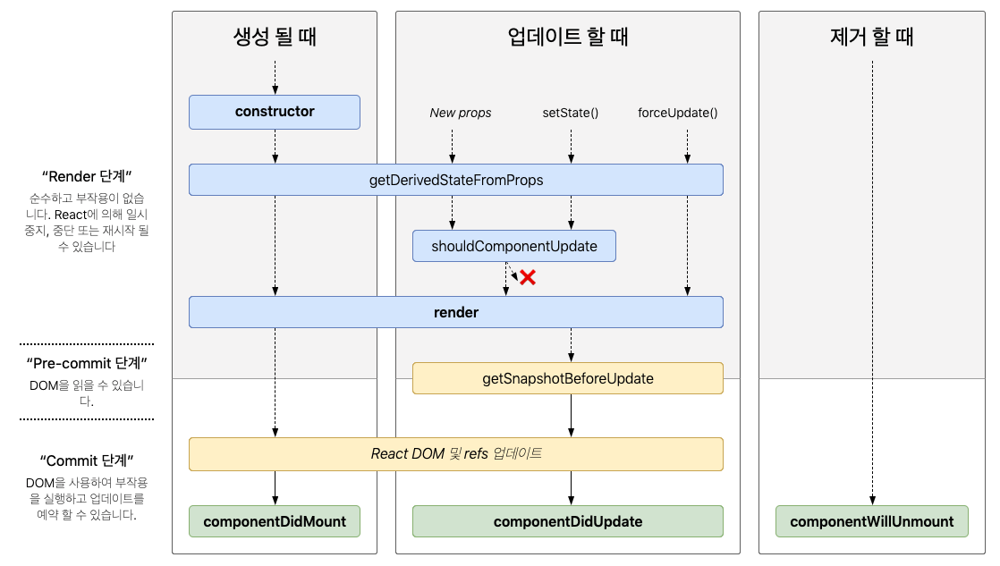
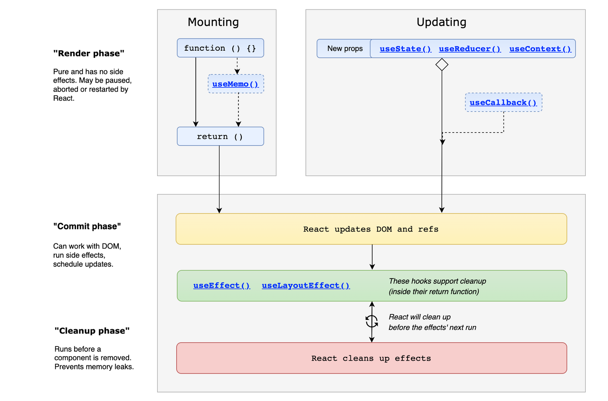

# 요약

- 모든 React 컴포넌트는 기본적으로 동일한 생명주기를 거칩니다.
    - 컴포넌트가 화면에 추가될 때 `마운트` 됩니다.
    - 새로운 `props`나 `state` 를 받거나 변경되면 `업데이트` 됩니다.
    - 화면에서 제거되면 컴포넌트가 `마운트 해제`됩니다.
- 함수형 컴포넌트는 useEffect를 사용하여 클래스형 컴포넌트의 생명주기와 비슷하게 동작시킬 수 있습니다.
- 생명 주기를 생각하지 않고 구현할 경우 성능에 문제가 생길 수 있습니다.

<br>
<br>

# ♼ 클래스형 컴포넌트에서의 생명 주기



http://projects.wojtekmaj.pl/react-lifecycle-methods-diagram/

### 요약

1. 가장 먼저 `constructor`가 실행됩니다.
2. `getDerivedStateFromProps`를 정의했다면 `render`가 호출되기 전에 props와 state를 판단하여 업데이트를 할지 말지 결정합니다. (마운트, 업데이트)
3. `render`를 호출하여 첫 렌더링을 합니다.
4. 첫 렌더링이 끝났다면 `componentDidMount`를 호출합니다.
5. 만약 컴포넌트 내에서 변화가 감지되었다면 `componentDidUpdate`를 호출합니다.
6. 컴포넌트를 제거한다면 `componentWillUnmount`를 호출합니다.
7. `shouldComponentUpdate`를 이용하여 리렌더링을 건너뛰어 성능 최적화를 할 수 있습니다.

<br>

## 🔍 생성(mount)

컴포넌트가 생성되어 DOM에 삽입될 때 발생합니다.

### 📌 constructor(props)

```tsx
constructor(props) {
	super(props);
  console.log("hi");
}
```

`constructor`는 클래스 컴포넌트가 마운트되기 전에 실행됩니다. 가장 먼저 실행되는 메서드입니다.

state를 선언할 수 있고, 클래스 메서드를 클래스 인스턴스에 바인딩할 수 있습니다.

`constructor` 내부에서 super(props) 구문을 제일 먼저 호출해야합니다. 그렇지 않으면 this.props가 undefined가 되어 버그가 생길 수 있습니다.

<br>

### 📌 ****static getDerivedStateFromProps(props, state)****

```tsx
class Form extends Component {
  state = {
    email: this.props.defaultEmail,
    prevUserID: this.props.userID
  };

  static getDerivedStateFromProps(props, state) {
    if (props.userID !== state.prevUserID) {
      return {
        prevUserID: props.userID,
        email: props.defaultEmail
      };
    }
    return null;
  }
}
```

`getDerivedStateFromProps` 메서드를 정의하면 마운트와 업데이트에서 render를 호출하기 전에 이 메서드를 호출합니다. state를 업데이트하려면 객체를 반환하고 아니라면 null을 반환해야합니다.

클래스 컴포넌트에서 `getDerivedStateFromProps` 메서드는 함수형 컴포넌트에서 렌더링 중 useState의 set 함수를 호출하는 것과 같습니다. → props가 변경될 때 state를 변경

static이 붙는 이유?

- 렌더링 단계에서 부작용을 방지하기 위해서 (내부 데이터를 건드리지 않아야 함)

<br>

### 📌 render()

클래스형 컴포넌트에서 필수인 메서드이며, 화면을 그려주는 메서드입니다.

<br>

### 📌 componentDidMount

컴포넌트의 첫 렌더링이 완료되면 호출되는 메서드입니다.

fetch, axios같은 데이터 요청이나 DOM 조작같은 작업을 진행합니다.

<br>

## 🔍 업데이트(update)

컴포넌트의 props 혹은 state가 변경이 되어 다시 렌더링될 때 발생합니다.

<br>

### 📌 ****static getDerivedStateFromProps(props, state)****

마운트에서 다뤘으니 생략

<br>

### 📌 shouldComponentUpdate(nextProps, nextState, nextContext)

`shouldComponentUpdate`는 리렌더링을 할지 말지 결정합니다.

```tsx
class Rectangle extends Component {
  state = {
    isHovered: false
  };

  shouldComponentUpdate(nextProps, nextState) {
    if (
      nextProps.position.x === this.props.position.x &&
      nextProps.position.y === this.props.position.y &&
      nextProps.size.width === this.props.size.width &&
      nextProps.size.height === this.props.size.height &&
      nextState.isHovered === this.state.isHovered
    ) {
      return false;
    }
    return true;
  }
}
```

this.props와 nextProps, this.state와 nextState를 비교해서 false를 반환하게 되면 리렌더링을 건너뜁니다.

- 이 메서드는 성능 최적화만을 위해 사용합니다.
- 메서드 내부에서 JSON.stringify를 사용하지 않아야 합니다.
  - JSON.stringify는 비용이 많이 드는 작업인데 shouldComponentUpdate에 사용한다면 리렌더링이 될 때마다 실행됩니다. 따라서 성능에 좋지 못합니다.
  - 원했던 것보다 더 최적화될 수 있습니다.
- false를 반환해도 state가 변경된다면 자식 컴포넌트의 리렌더링을 막지 못합니다.
- 함수형 컴포넌트의 memo로 최적화하는 것과 유사합니다.

<br>

### 📌 render()

마운트에서 다뤘으니 생략

<br>

### 📌 getSnapshotBeforeUpdate(prevProps, prevState)

`getSnapshotBeforeUpdate`는 React가 DOM을 업데이트하기 바로 전에 호출합니다.

컴포넌트가 변경되기 전에 DOM에서 정보를 캡처할 수 있습니다. (ex: 스크롤 위치)

호출된 후 반환된 값을 `componentDidUpdate`의 매개변수로 전달됩니다.

<br>

### 📌 componentDidUpdate(prevProps, prevState, snapshot?)

컴포넌트가 업데이트된 props나 state로 다시 렌더링된 직후, `componentDidUpdate`를 호출합니다. 첫 렌더링에는 호출되지 않습니다.

업데이트 후에 DOM을 조작하는데 사용하거나 현재 props와 이전 props를 비교하는 네트워크 요청을 수행할 수 있습니다.

보통 `componentDidMount`와 `componentWillUnmount`와 함께 사용합니다.

예시

```tsx
class ScrollingList extends React.Component {
  constructor(props) {
    super(props);
    this.listRef = React.createRef();
  }

  getSnapshotBeforeUpdate(prevProps, prevState) {
    if (prevProps.list.length < this.props.list.length) {
      const list = this.listRef.current;
      return list.scrollHeight - list.scrollTop;
    }
    return null;
  }

  componentDidUpdate(prevProps, prevState, snapshot) {
    if (snapshot !== null) { // snapshot : getSnapshotBeforeUpdate에서 반환된 값
      const list = this.listRef.current;
      list.scrollTop = list.scrollHeight - snapshot;
    }
  }

  render() {
    return (
      <div ref={this.listRef}>{/* ...contents... */}</div>
    );
  }
}
```

`getSnapshotBeforeUpdate`에서 스크롤 위치가  반환되었다면 `componentDidUpdate`의 snapshot이 null이 아니므로 스크롤이 조정됩니다.

- 만약 `shouldComponentUpdate`가 정의되어 있고 false를 반환했다면, `getSnapshotBeforeUpdate`는 호출되지 않습니다.

<br>

## 🔍 제거(unmount)

컴포넌트가 DOM에서 제거될 때 발생합니다.

<br>

### 📌 ****componentWillUnmount()****

`componentWillUnmount`는 컴포넌트가 화면에서 제거되기 직전에 호출됩니다.

보통 데이터 요청을 취소하거나 DOM 이벤트 제거, 타이머 제거 등을 수행합니다.

`componentWillUnmount` 내부 로직은 `componentDidMount` 내부 로직을 미러링해야합니다.

예를 들어 `componentDidMount`에서 타이머를 시작했다면 `componentWillUnmount`에서 타이머를 제거해줘야합니다.

<br>

# ♼ 함수형 컴포넌트에서의 생명주기



https://wavez.github.io/react-hooks-lifecycle/

### 요약

1. 함수형 컴포넌트가 호출됩니다.
2. 컴포넌트 내부에 선언되어 있는 로직들이 실행됩니다.  ( `constructor` )
3. return문에 있는 jsx 구문이 렌더링됩니다. ( `render` )
4. `useEffect`가 있다면 마지막으로 실행됩니다. 
    
     `componentDidMount` - 비어 있는 종속성 배열을 가진 `useEffect`
    
    `componentDidUpdate` - `useEffect`의 의존성 배열의 변화가 감지될 때마다
    
    `componentWillUnmount`  - `useEffect`의 cleanup 함수
5. 만약 클래스형 컴포넌트의 `shouldComponentUpdate` 메서드 처럼 리렌더링 최적화를 원한다면 `useMemo`나 `useCallback` 같은 메모이제이션 기법을 활용할 수 있습니다.

함수형 컴포넌트에서는 클래스형 컴포넌트의 생명 주기 메서드들을 사용하지 않기 때문에 `useEffect`를 사용하여 유사하게 처리합니다.

<br>

# 수명 주기를 제대로 생각하지 않을 경우?

메모리 누수, 성능 문제, 예상치 못한 동작이 생길 수 있습니다.

<br>

## 참조

https://react-ko.dev/reference/react/Component\https://wavez.github.io/react-hooks-lifecycle/

https://react-ko.dev/learn/lifecycle-of-reactive-effects

https://adjh54.tistory.com/m/43

https://stackoverflow.com/questions/52886075/why-is-getderivedstatefromprops-is-a-static-method
