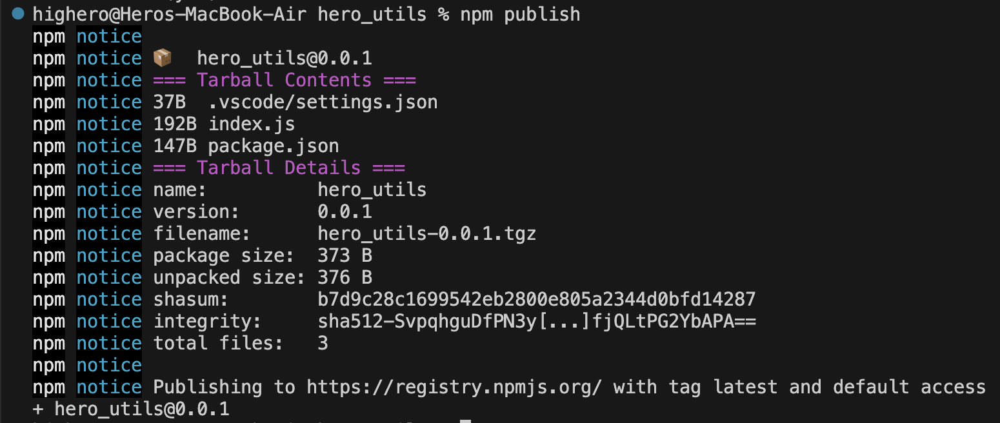
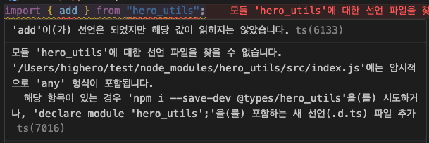
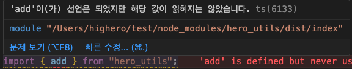

# NPM 라이브러리 배포해보기

저는 언젠가 나만의 라이브러리를 제작해서 배포해보고 싶다는 생각을 가지고 있습니다.

그래서 일단 간단한 라이브러리를 제작한 뒤 배포하는 과정을 맛만 보자! 라는 느낌으로 정보를 찾아보고 직접 실습해보았습니다.

<br>

## npm 가입

먼저 npm 사이트에 가서 계정을 만들어야 합니다.

터미널을 켜서 `npm login`, `npm whoami`로 로컬에 로그인이 되어 있는지 확인 가능합니다.

<br>

## package.json 설정

```jsx
// npm init -y
{
  "name": "hero_utils",
  "version": "0.0.1",
	"type": "module",
  "description": "library_test",
  "main": "index.js",
  "author": "highero",
  "license": "MIT"
}
```

`name`은 패키지의 이름입니다. 알아서 설정해주세요!

`version`은 major.minor.patch의 형태를 따릅니다.

간단히 설명하면 major는 이전 버전의 호환성을 깰 때 올려줍니다. minor는 이전 버전과 호환되는 기능을 추가했을 때, patch는 버그 픽스같은 것을 했을 때 올려줍니다. [[참고]](https://docs.npmjs.com/about-semantic-versioning)

`description`은 패키지에 대한 설명입니다.

`main`은 패키지의 진입점이 되는 모듈의 ID입니다. 패키지 root의 상대경로로 지정해야 합니다. 지정하지 않은 경우, root 폴더의 `index.js`로 기본값이 설정된다.

`author`는 배포자를 명시하는 필드입니다. 여러 사람일 경우 `contributors` 필드를 명시해야 합니다.

<br>

## index.js 생성

```jsx
// 모듈 배포를 위해 간단한 사칙연산 함수
const add = (a, b) => a + b;
const subtract = (a, b) => a - b;
const multiply = (a, b) => a * b;
const divide = (a, b) => a / b;

export { add, subtract, multiply, divide };
```

배포한 라이브러리에서 사용할 함수들을 index.js파일에 간단하게 만들었습니다.

<br>

## npm publish로 배포



`npm publish` 명령어를 터미널에 입력해줍니다.

간단하게 라이브러리가 배포되었습니다!

<br>

## CommonJS와 ES Module 모두 지원하기

모든 환경이 esm만 지원하면 좋겠지만… 그렇지 않고 commonjs만 지원하는 환경이 있을 수 있기 때문에 두 환경 모두 지원할 수 있도록 해봅시다.

### package.json의 exports 필드

```jsx
{
  "name": "hero_utils",
  "version": "0.0.4",
  "type": "module",
  "description": "library_test",
  "main": "index.js",
  "exports": {
    ".": {
      "import": "./src/index.js",
      "require": "./src/index.cjs",
      "default": "./src/index.js"
    }
  },
  "author": "highero",
  "license": "MIT"
}
```

exports 필드는 esm과 cjs 환경을 모두 지원할 수 있게 합니다.

`.`를 통해 상대경로로 작성합니다. 여기서 import는 esm인 js파일, require는 commonjs인 cjs 파일로 설정해줘야 합니다.

src 경로는 두 파일을 한 곳에 묶기 위해서 폴더를 따로 만들어 준 것입니다.

### index.cjs

```jsx
function add(a, b) {
  return a + b;
}
function subtract(a, b) {
  return a - b;
}
function multiply(a, b) {
  return a * b;
}
function divide(a, b) {
  return a / b;
}

module.export = { add, subtract, multiply, divide };
```

이제 다시 `npm publish` 명령어를 사용하여 재배포하면 됩니다!

<br>

## 타입스크립트 지원하기



현재 배포된 라이브러리는 타입스크립트를 지원하지 않기 때문에 타입스크립트를 사용하는 프로젝트에서 사용하게 되면 오류를 뱉게 됩니다.

타입스크립트를 지원하도록 수정해봅시다.

먼저 `npm install typescript @types/node -D` 로 타입스크립트를 설치합니다.

### tsconfig.json 생성

```jsx
{
  "compilerOptions": {
    "target": "ES5",
    "module": "ES2020",
    "lib": ["es5", "es6", "dom"],
    "moduleResolution": "node",
    "declaration": true,
    "outDir": "dist",
    "strict": true
  },
  "include": ["src/index.ts"]
}
```

`declaration`는 타입스크립트가 자동으로 타입정의 d.ts 파일을 생성할 지 여부를 정합니다.

`outDir`은 컴파일된 결과물을 어디에 저장할 지 정합니다.

### index.js를 index.ts로 수정

```jsx
function add(a: number, b: number) {
  return a + b;
}
function subtract(a: number, b: number) {
  return a - b;
}
function multiply(a: number, b: number) {
  return a * b;
}
function divide(a: number, b: number) {
  return a / b;
}

export { add, subtract, multiply, divide };
```

`npx tsc`로 build를 합니다.

### 결과

```jsx
// ./dist/index.js
function add(a, b) {
  return a + b;
}
function subtract(a, b) {
  return a - b;
}
function multiply(a, b) {
  return a * b;
}
function divide(a, b) {
  return a / b;
}
export { add, subtract, multiply, divide };
```

```jsx
// ./dist/index.d.ts
declare function add(a: number, b: number): number;
declare function subtract(a: number, b: number): number;
declare function multiply(a: number, b: number): number;
declare function divide(a: number, b: number): number;
export { add, subtract, multiply, divide };
```

`dist` 폴더가 생성되고 그 안에 `index.js`와 `index.d.ts`파일이 생성됩니다.

이 파일들을 이용해야 하므로 package.json에 있는 경로를 수정해야 합니다.

### package.json 수정

```jsx
{
  "name": "hero_utils",
  "version": "0.1.2", // 변경
  "type": "module",
  "description": "library_test",
  "main": "dist/index.js", // 변경
  "scripts": {
    "prepack": "npm run build", // 추가
    "build": "npx tsc" // 추가
  },
  "exports": {
    ".": {
      "types": "./dist/index.d.ts", // 변경
      "import": "./dist/index.js", // 변경
      "require": "./src/index.cjs"
    }
  },
  "author": "highero",
  "license": "MIT",
  "devDependencies": {
    "@types/node": "^20.8.7",
		"typescript": "^5.2.2"
  }
}
```

`scripts`필드에서 `prepack`과 `build`을 설정하여 빌드 될 때 `ts`로 빌드할 수 있게 합니다.

### 결과



성공입니다!

<br>

## 참고

https://toss.tech/article/commonjs-esm-exports-field

[https://junghyeonsu.com/posts/deploy-simple-util-npm-library/#typescript-지원하기](https://junghyeonsu.com/posts/deploy-simple-util-npm-library/#typescript-%EC%A7%80%EC%9B%90%ED%95%98%EA%B8%B0)

https://hoya-kim.github.io/2021/09/14/package-json/
