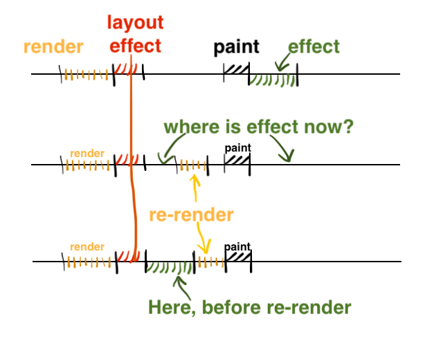
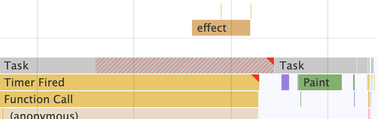

# useEffect sometimes fires before paint

이 글은 [useEffect sometimes fires before paint](https://blog.thoughtspile.tech/2021/11/15/unintentional-layout-effect/)라는 글을 읽고 번역 및 정리한 글입니다.

그대로 전체 번역한 것이 아니고 읽으면서 정리하고 요약한 글입니다. 원본 글을 보고 싶으시다면 링크로 가주시면 감사하겠습니다!

---

<br>

`useEffect`는 업데이트 차단을 방지하기 위해 페인트 후에 실행되어야 합니다. 하지만 실제로 페인트 후에 실행된다는 보장이 없다는 것을 알고 계셨나요? 

`useLayoutEffect`에서 상태를 업데이트하면 동일한 렌더링의 모든 `useEffect`가 페인트 전에 실행되어 효과적으로 레이아웃 효과로 전환됩니다. 

일반적인 리액트 업데이트
1. React 작업: 가상 DOM 렌더링, 이펙트 예약, 실제 DOM 업데이트
2. `useLayoutEffect` 호출
3. React가 제어를 해제하고 브라우저가 새 DOM을 페인팅
4. `useEffect` 호출

[React 문서](https://react.dev/reference/react/useEffect)에는 정확히 언제 useEffect가 실행되는지 나와 있지 않습니다. 인용하자면, 레이아웃과 페인트 후에, 지연된 이벤트 중에 발생합니다.

하지만 문서에 흥미로운 구절이 있습니다.
> useEffect는 브라우저가 페인팅할 때까지 지연되지만, 새로운 렌더링이 시작되기 전에 실행되도록 보장됩니다. <br> React는 항상 새 업데이트를 시작하기 전에 이전 렌더링의 이펙트를 플러시합니다. -> 현재 업데이트를 처리하기 전에 이전 업데이트에서 발생한 모든 이펙트(부작용)가 완료되도록 보장한다는 의미입니다. 

이것은 업데이트를 놓치지 않을 수 있지만, 이펙트가 페인트 전에 실행될 수 있음을 의미하기도 합니다. 

a) 새 업데이트가 시작되기 전에 이펙트가 플러시되고, 

b) 페인트 전에 업데이트가 시작될 수 있는 경우(예: `useLayoutEffect`에서 트리거되는 경우) 이펙트는 페인트 전인 해당 업데이트 전에 플러시되어야 합니다.

<br>



1. React update 1: 가상 DOM 렌더링, 이펙트 예약, 실제 DOM 업데이트
2. `useLayoutEffect` 호출
3. 상태 업데이트, 리렌더링 예약
4. `useEffect` 호출
5. React update 2
6. update 2에서 `useLayoutEffect` 호출
7. React가 제어를 해제하고 브라우조가 새로운 DOM을 페인팅
8. update 2에서 `useEffect` 호출

<br>

state를 업데이트하면 DOM이 업데이트되고 페인트 후에 업데이트하면 사용자에게 오래된 프레임이 하나 남게 되어 눈에 띄는 깜박임이 발생하기 때문에 `useEffect`에서 상태를 업데이트할 수 없는 경우가 매우 드문 상황은 아닙니다.

예를 들어, 입력이 300px보다 넓은 경우에만 지우기 버튼을 렌더링하는 반응형 입력을 빌드해 보겠습니다. 입력을 측정하려면 실제 DOM이 필요하므로 약간의 효과가 필요합니다. 또한 아이콘이 한 프레임 후에 나타나거나 사라지는 것을 원하지 않으므로 초기 측정값은 `useLayoutEffect`로 들어갑니다.

```jsx
const ResponsiveInput = ({ onClear, ...props }) => {
  const el = useRef();
  const [w, setW] = useState(0);
  const measure = () => setW(el.current.offsetWidth);
  useLayoutEffect(() => measure(), []);
  useEffect(() => {
    // 그냥 ResizeObserver라고 생각해주세요.
    window.addEventListener("resize", measure);
    return () => window.removeEventListener("resize", measure);
  }, []);
  return (
    <label>
      <input {...props} ref={el} />
      {w > 200 && <button onClick={onClear}>clear</button>}
    </label>
  );
};
```

`useEffect`로 페인트 후까지 추가 이벤트 리스너를 지연시키려고 했지만, `useLayoutEffect`의 상태 업데이트로 인해 페인트 전에 발생하도록 했습니다.([샌드박스 참조](https://codesandbox.io/s/infallible-wildflower-127lv?file=/src/App.js:294-408))



업데이트가 초기 이펙트 플러시를 강제하는 곳은 `useLayoutEffect` 뿐만이 아닙니다. 호스트 참조(`<div ref={HERE}>`), `requestAnimationFrame` 및 `useLayoutEffect`에서 예약된 마이크로태스크도 동일한 동작을 트리거합니다.

<br>

### 업데이트 후 useEffect에 의존하여 실행하지 마세요.

캐치를 알고 있더라도 일부 `useEffect`가 `useLayoutEffect` 상태 업데이트의 영향을 받지 않는지 확인하는 것은 매우 어렵습니다.

1. 내 컴포넌트가 `useLayoutEffect`를 사용하지 않습니다. 하지만 커스텀 훅이 사용 하지 않는 것이 확실합니까?
2. 내 컴포넌트는 내장된 React hooks만 사용합니다. 하지만 트리의 `useLayoutEffect` 상태 업데이트는 `useContext`나 부모 리렌더를 통해 누출될 수 있습니다.
3. 내 컴포넌트에는 `useEffect`와 `memo()`만 있습니다. 하지만 업데이트의 이펙트는 전역적으로 플러시되므로 다른 컴포넌트의 pre-paint 업데이트는 여전히 자식 이펙트를 플러시합니다.

가장 좋은 조언은 `useMemo`가 100% 안정적인 참조를 보장하지 않는 것처럼 페인트 후 `useEffect`에 의존하지 말라는 것입니다. 
사용자에게 한 프레임 동안 그려진 무언가를 보여주고 싶다면 `useEffect`가 아닌 `requestAnimationFrame`을 두 번 시도하거나 postMessage 트릭을 직접 사용하세요.

만약 `useEffect`에서 DOM을 업데이트했다고 가정했을 때, 깜빡임이 없을 수도 있습니다. 하지만 페인트하기 전의 상태 업데이트의 결과일 수 있습니다. 코드를 조금만 움직여도 깜빡거릴 것 입니다.

<br>

### 레이아웃 효과를 분할하는 데 시간을 낭비하지 마세요.

`useEffect` vs `useLayoutEffect` 가이드라인을 따르면, 하나의 논리적 사이드이펙트를 레이아웃 이펙트로 분할하여 DOM을 업데이트하는 이펙트와 "지연된" 이펙트로 나눌 수 있습니다.

```jsx
// DOM update = layout effect
useLayoutEffect(() => setWidth(el.current.offsetWidth), []);
// subscription = lazy logic
useEffect(() => {
  window.addEventListener('resize', measure);
  return () => window.removeEventListener('resize', measure);
}, []);
```

렌더링 전에 두 이펙트가 모두 플러시되기 때문에 아무 소용이 없습니다. 게다가 분리도 엉성합니다. 
페인트 후에 사용 효과가 발동한다고 가정하면 요소의 크기가 효과 사이에서 조정되지 않는다고 100% 확신할 수 있을까요? 그렇지 않습니다. 

아래 예제처럼 모든 크기 추적 로직을 단일 레이아웃에 남겨두는 것이 더 안전하고 깔끔하며, 사전 페인트 작업의 양이 동일하고, React가 관리해야 할 이펙트가 하나 줄어드는 등의 이점이 있기 때문에 아주 좋습니다.

```jsx
useLayoutEffect(() => {
  setWidth(el.current.offsetWidth);
  window.addEventListener('resize', measure);
  return () => window.removeEventListener('resize', measure);
}, []);
```

<br>

### useLayoutEffect에서 상태 업데이트 하지 않기

좋은 조언이지만 말처럼 쉽지는 않습니다. 깜박임은 UX가 좋지 않고 성능보다 UX가 더 중요하기 때문에 `useEffect`는 상태를 업데이트하기에 더 나쁜 곳입니다.

때때로 state를 useRef로 안전하게 대체할 수 있습니다. 참조를 업데이트해도 업데이트가 트리거되지 않고 의도한 대로 이펙트가 실행될 수 있습니다.

<br>

### 상태 업데이트 우회

특정 useLayoutEffect가 문제를 일으키는 경우, 상태 업데이트를 우회하고 DOM을 직접 변경하는 것을 고려해 보세요. 이렇게 하면 리액트가 업데이트를 예약하지 않고 이펙트를 열심히 플러시할 필요가 없습니다.

```jsx
const clearRef = useRef();
const measure = () => {
  clearRef.current.display = el.current.offsetWidth > 200 ? null : none;
};
useLayoutEffect(() => measure(), []);
useEffect(() => {
  window.addEventListener("resize", measure);
  return () => window.removeEventListener("resize", measure);
}, []);
return (
  <label>
    <input {...props} ref={el} />
    <button ref={clearRef} onClick={onClear}>clear</button>
  </label>
);
```

DOM 업데이트를 수동으로 관리하는 것은 복잡하고 오류가 발생하기 쉬우므로 이 기법은 성능이 매우 중요한 상황에만 사용하세요.

<br>

## 요약

오늘 우리는 때때로 `useEffct`가 페인트 전에 실행되는 것을 발견했습니다. 자주 발생하는 원인은 `useLayoutEffect`에서 상태를 업데이트할 때 페인트 전에 다시 렌더링을 요청하고, 이펙트가 다시 렌더링하기 전에 실행되어야 하기 때문입니다. RAF 또는 마이크로태스크에서 상태를 업데이트할 때도 이런 문제가 발생합니다.

1. `useLayoutEffect`에서 상태를 업데이트하는 것은 앱 성능에 좋지 않습니다. 하지만 대안이 없는 경우도 있습니다.
2. 페인트 후에 `useEffect`에 의존하지 마세요.
3. `useEffect`에서 DOM을 업데이트하면 레이아웃 효과 업데이트 상태 때문에 보이지 않는 깜박임이 발생할 수 있습니다.
4. 레이아웃 효과 부분에서 상태를 설정하는 경우 성능을 위해 useLayoutEffect의 일부를 useEffect로 추출하는 것은 의미가 없습니다.
5. 성능이 정말 중요한 경우, `useLayoutEffect`에서 DOM을 수동으로 변경해야 하는 방법도 있습니다.