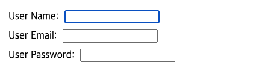

# useId

처음 useId라는 이름을 봤을 때 React에서 uuid를 대체하는 훅을 만들어준건가! 하는 생각으로 공부해보게 되었습니다.

하지만 공부해보니 uuid랑은 상관없고 다른 용도로 사용해야하는 훅 이었습니다.

useId에 대해서 알아봅시다.

<br>

```jsx
const id = useId();
```

매개변수
- 매개변수를 사용하지 않습니다.

반환값
- 특정 컴포넌트 안에서 특정 useId와 관련된 고유 ID 문자열을 반환합니다.

주의사항
- useId는 훅이기 때문에 컴포넌트 최상단이나 훅에서만 호출할 수 있습니다.
- **리스트의 key로 사용하면 안됩니다**. key는 데이터에서 생성되어야 합니다.

<br>


## useId 사용해보기

```jsx
import { useId } from 'react';

const Input = ({labelText}) => {
  return (
    <div>
      <label htmlFor='inputId'>{labelText}</label>
      <input id='inputId' type="text" />
    </div>
  )
}

export default function Form() {
  return (
    <form>
      <Input labelText={'User Name: '} />
      <Input labelText={'User Email: '} />
      <Input labelText={'User Password: '} />
    </form>
  );
}
```

Input 컴포넌트에서 label과 input을 연결시켜 사용하려고 id를 동일하게 설정했습니다.

하지만 Input 컴포넌트를 여러 개 사용하게 된다면, 한 컴포넌트 안에 동일한 id를 가진 컴포넌트가 여러 개가 되고, 아래 그림과 같이 다른 label를 눌러도 첫 번째 label과 연결된 input에만 focus가 잡힙니다.



<br>

```jsx
import { useId } from 'react';

const Input = ({labelText}) => {
  const id = useId();
  return (
    <div>
      <label htmlFor={id}>{labelText}</label>
      <input id={id} type="text" />
      {id}
    </div>
  )
}

export default function Form() {
  return (
    <form>
      <Input labelText={'User Name: '} />
      <Input labelText={'User Email: '} />
      <Input labelText={'User Password: '} />
    </form>
  );
}
```

문제를 해결하기 위해 `useId`를 사용해서 만들어진 고유한 id를 htmlFor와 id 속성에 넣었습니다.

이젠 다른 label를 눌러도 이어져 있는 옆 input에 정확히 focus가 잡힙니다.

input 옆에 나오는 문자열은 useId를 출력해본 것입니다.


<br>

## 증가 카운터보다 useId가 더 나은 이유

`useId`의 주요 이점은 React가 서버 렌더링과 함께 작동하도록 보장합니다. 서버 렌더링 중에 컴포넌트는 HTML 출력을 생성하면, 클라이언트에서 hydration이 붙여진 이벤트 핸들러를 생성된 HTML에 연결합니다. hydration이 작동하려면 클라이언트의 결과물이 서버의 HTML과 일치해야 합니다.

클라이언트 컴포넌트가 hydration 되는 순서가 서버 HTML이 생성된 순서와 일치하지 않을 수도 있어서 증가 카운터를 사용하면 에러를 일으킬 수 있습니다. `useId`를 호출하면 hydration이 작동하고, 서버와 클라이언트의 결과가 서로 일치하는지 확인할 수 있습니다.

React 내부에서 `useId`는 호출한 컴포넌트의 `부모 경로`에서 생성됩니다. 그렇기 때문에 클라이언트와 서버 트리가 동일하면 렌더링 순서와 상관 없이 `부모 경로`가 일치하므로 `useId`도 일치할 것입니다.

<br>

### 참고

- https://react.dev/reference/react/useId

- https://react-ko.dev/reference/react/useId