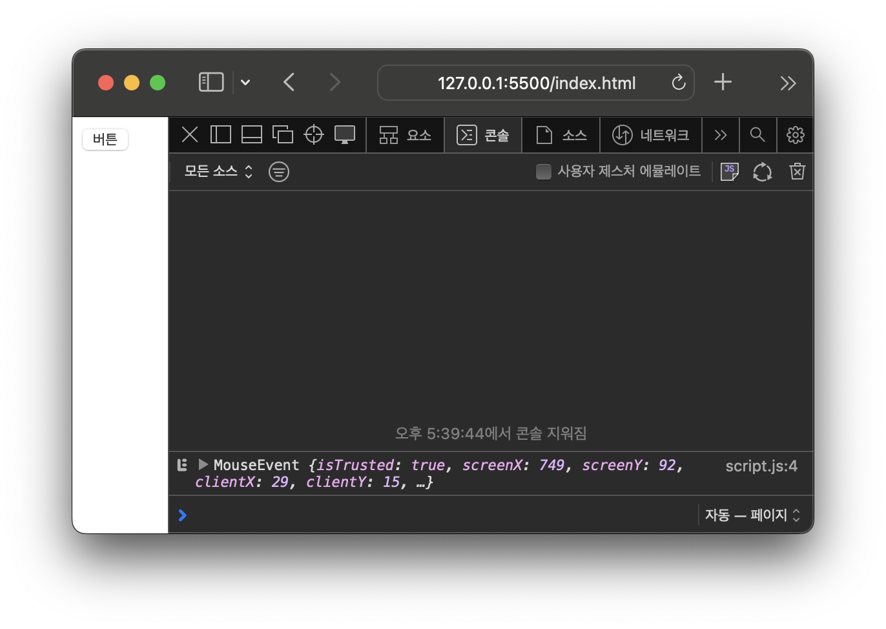
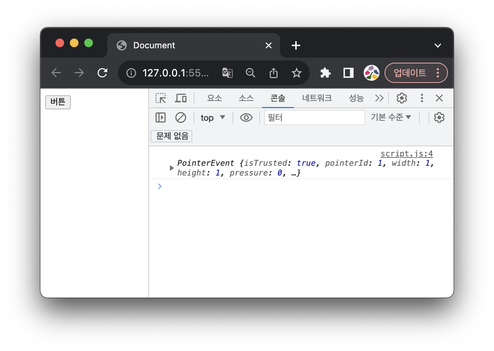
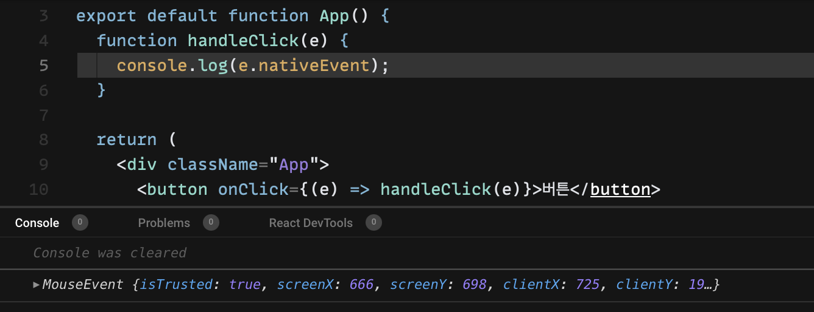
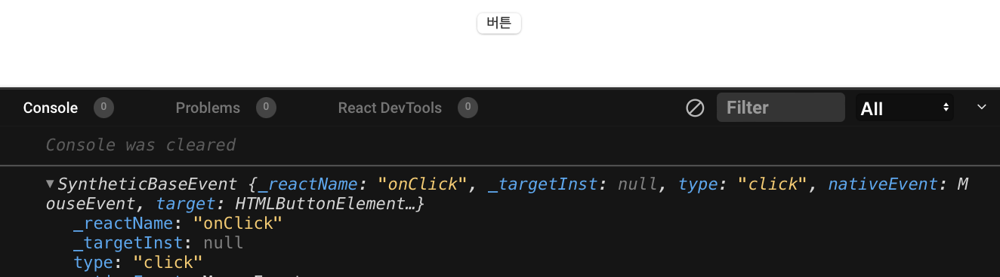

## 브라우저마다 다른 이벤트 객체

다음과 같이 `버튼`을 하나 만들고 버튼에 click 이벤트 리스너를 달아줬습니다.

```html
<!-- index.html -->
<!DOCTYPE html>
<html lang="en">
  <head>
    <title>Document</title>
  </head>
  <body>
    <button id="button">버튼</button>
    <script src="./script.js" />
  </body>
</html>
```

```jsx
// script.js
const button = document.querySelector('#button');

button.addEventListener('click', (e) => {
  console.log(e);
});
```

<br />

위 파일을 `사파리`와 `크롬`에서 실행시키고 `버튼`을 클릭했더니 서로 다른 이벤트 객체가 출력됐습니다.

- 사파리 : `MouseEvent`
  
- 크롬 : `PointerEvent`
  

이렇게 브라우저마다 다른 이벤트 객체들을 다루기 위해 리액트는 **합성 이벤트**라는 객체를 사용합니다.

## 합성 이벤트

리액트는 브라우저마다 다른 이벤트를 동일하게 처리하기 위해 native 이벤트를 **Synthetic 이벤트**로 warpping한 이벤트 객체를 사용하는데, 이를 **합성 이벤트**라고 합니다.

즉, 리액트는 이 합성 이벤트로 이벤트에 관한 크로스 브라우징을 구현하는 것이죠.

이 합성 이벤트 객체는 W3C 명세에 따라 정의됐기 때문에 바닐라 JS에서 사용하는 것과 동일하게 사용할 수 있습니다.

### 타입

리액트에서 사용하는 이벤트 객체는 `SyntheticEvent` 타입을 상속받고, 이 `SyntheticEvent` 타입은 `BaseSyntheticEvent` 타입을 상속 받습니다.

```jsx
interface SyntheticEvent<T = Element, E = Event>
  extends BaseSyntheticEvent<E, EventTarget & T, EventTarget> {}
```

`BaseSyntheticEvent` 타입은 다음과 같이 이루어져 있습니다.

```tsx
interface BaseSyntheticEvent<E = object, C = any, T = any> {
  nativeEvent: E;
  currentTarget: C;
  target: T;
  bubbles: boolean;
  cancelable: boolean;
  defaultPrevented: boolean;
  eventPhase: number;
  isTrusted: boolean;
  preventDefault(): void;
  isDefaultPrevented(): boolean;
  stopPropagation(): void;
  isPropagationStopped(): boolean;
  persist(): void;
  timeStamp: number;
  type: string;
}
```

<br />

모든 이벤트 객체는 이 `SyntheticEvent` 타입을 상속받게 되고

마우스에 관한 이벤트라면 `MouseEvent` 타입, 키보드에 관한 이벤트라면 `KeyboardEvent` 타입 등 이벤트에 해당하는 추가적인 타입을 상속받는 식으로 이루어집니다.

### 합성 이벤트 말고 원래 이벤트에 있는 걸 쓰고 싶은데…

> Some React events do not map directly to the browser’s native events. For example in `onMouseLeave`, `e.nativeEvent` will point to a `mouseout` event. The specific mapping is not part of the public API and may change in the future. If you need the underlying browser event for some reason, read it from `e.nativeEvent`.

간혹 합성 이벤트가 제공하는 속성 말고 원래 이벤트(native event)에 있는 속성을 사용해야 하는 경우가 있습니다. (저의 경우 KeyboardEvent의 isComposing 속성을 찾아 헤맨 적이 있습니다..)

그런데 이 합성 이벤트는 브라우저의 native 이벤트와 다르고 모두가 직접적으로 맵핑되어 있지도 않습니다.

<br />

이러한 경우를 대비하여 합성 이벤트는 `nativeEvent`라는 속성을 가집니다.

`nativeEvent`를 출력해 보면, 바닐라 JS로 작성했을 때 출력한 이벤트 객체와 동일한 속성을 갖는 객체가 출력됨을 알 수 있습니다.

(이 코드는 사파리에서 실행됐기 때문에 native 이벤트가 `MouseEvent` 입니다. 크롬에서 실행할 경우 `PointerEvent`가 출력됩니다.)



이제 `e.nativeEvent.속성명` 으로 원래 이벤트의 속성에 접근할 수 있습니다.

## 정리

이제 합성 이벤트라는 정체를 알았으니, 위 바닐라 JS 코드를 리액트로 옮겼을 때 콘솔창에 출력될 내용을 유추해볼 수 있겠죠.



이렇게 리액트는 브라우저의 native 이벤트를 래핑하여 합성 이벤트를 사용합니다!
