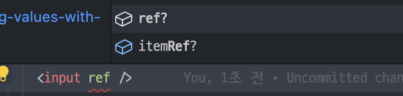
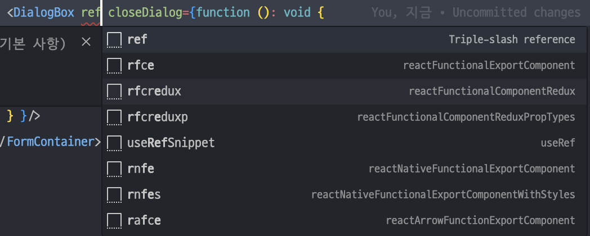

> `useImperativeHandle` is a React Hook that lets you customize the handle exposed as a ref.

`useImperativeHandle`은 ref로 노출되는 핸들을 사용자가 직접 정의할 수 있게 해주는 React 훅입니다.

자식 컴포넌트의 상태 변경을 부모 컴포넌트에서 하거나, 자식 컴포넌트의 핸들러를 부모 컴포넌트에서 호출할 때 사용합니다.

# React.forwardRef

함수형 컴포넌트에 ref를 props로 전달해 주기 위한 api입니다.

input 요소에 ref를 전달해주려면 다음과 같이 전달할 수 있고, IDE에서 ref를 제안해 주기도 합니다.



그러나 일반 함수형 컴포넌트에서는 ref를 전달할 수 없습니다.



이렇게 상위 컴포넌트에서 하위 컴포넌트로 ref를 전달하고자 한다면, 하위 컴포넌트를 `forwardRef`로 감싸면 됩니다. 이때 props와는 별개로, ref를 컴포넌트의 두 번째 파라미터로 넣어줘야 합니다.

> 이때 ref의 타입은 `Ref<요소>`로 작성하면 됩니다.

```tsx
const DialogBox = forwardRef(
  ({ closeDialog, closeAllOverlay }: Props, ref: Ref<HTMLDivElement>) => {
    return <Dialog ref={ref}>{/* 생략 */}</Dialog>;
  }
);
```

# useImperativeHandle

forwardRef로 감싼 컴포넌트는 부모 요소로부터 ref를 전달받을 수 있습니다.

그리고 부모 요소가 ref를 가지고 handle할 수 있는 상태나 함수를 useImperativeHandle을 통해 정의할 수 있습니다.

```tsx
import { forwardRef, useRef, useImperativeHandle } from 'react';

const MyInput = forwardRef(function MyInput(props, ref) {
  const inputRef = useRef(null);

  useImperativeHandle(
    ref,
    () => {
      return {
        focus() {
          // 부모에서 할 수 있는 일 1. focus 호출하기
          inputRef.current.focus();
        },
        scrollIntoView() {
          // 부모에서 할 수 있는 일 2. scrollIntoView 호출하기
          inputRef.current.scrollIntoView();
        },
      };
    },
    []
  );

  return <input {...props} ref={inputRef} />;
});

export default MyInput;
```

```tsx
import { useRef } from 'react';
import MyInput from './MyInput.js';

export default function Form() {
  const ref = useRef(null);

  function handleClick() {
    ref.current.focus(); // useImperativeHandle로 정의한 함수이므로 호출 가능
    ref.current.scrollIntoView(); // 마찬가지

    // ref.current.style.opacity = 0.5; -> 정의한 적 없는 행동이므로 에러 발생!
  }

  return (
    <form>
      <MyInput label="Enter your name:" ref={ref} />
      <button type="button" onClick={handleClick}>
        Edit
      </button>
    </form>
  );
}
```

### toss/slash - useOverlay 일부분

```tsx
export const OverlayController = forwardRef(function OverlayController(
  { overlayElement: OverlayElement, onExit }: Props,
  ref: Ref<OverlayControlRef>
) {
  const [isOpenOverlay, setIsOpenOverlay] = useState(false);

  // OverlayController의 상태를 업데이트하는 함수
  const handleOverlayClose = useCallback(() => setIsOpenOverlay(false), []);

  useImperativeHandle(
    ref,
    () => {
      return { close: handleOverlayClose }; // 부모 컴포넌트에서 ref.current.close() 호출하여 OverlayController의 상태를 업데이트할 수 있게 함
    },
    [handleOverlayClose]
  );

  useEffect(() => {
    requestAnimationFrame(() => {
      setIsOpenOverlay(true);
    });
  }, []);

  return <OverlayElement isOpen={isOpenOverlay} close={handleOverlayClose} exit={onExit} />;
});
```

```tsx
export function useOverlay({ exitOnUnmount = true }: Options = {}) {
  const context = useContext(OverlayContext);

  if (context == null) {
    throw new Error('useOverlay is only available within OverlayProvider.');
  }

  const { mount, unmount } = context;
  const [id] = useState(() => String(elementId++));

  const overlayRef = useRef<OverlayControlRef | null>(null);

  useEffect(() => {
    return () => {
      if (exitOnUnmount) {
        unmount(id);
      }
    };
  }, [exitOnUnmount, id, unmount]);

  return useMemo(
    () => ({
      open: (overlayElement: CreateOverlayElement) => {
        mount(
          id,
          <OverlayController
            // NOTE: state should be reset every time we open an overlay
            key={Date.now()}
            ref={overlayRef}
            overlayElement={overlayElement}
            onExit={() => {
              unmount(id);
            }}
          />
        );
      },
      close: () => {
        overlayRef.current?.close();
      },
      exit: () => {
        unmount(id);
      },
    }),
    [id, mount, unmount]
  );
}
```

# 결론

useImperative를 쓰면 자식 컴포넌트에게 ref를 내려준 부모에서 ref 가지고 할 수 있는 일을 정의함으로써 다른 DOM API 사용을 제한하게 됩니다.
