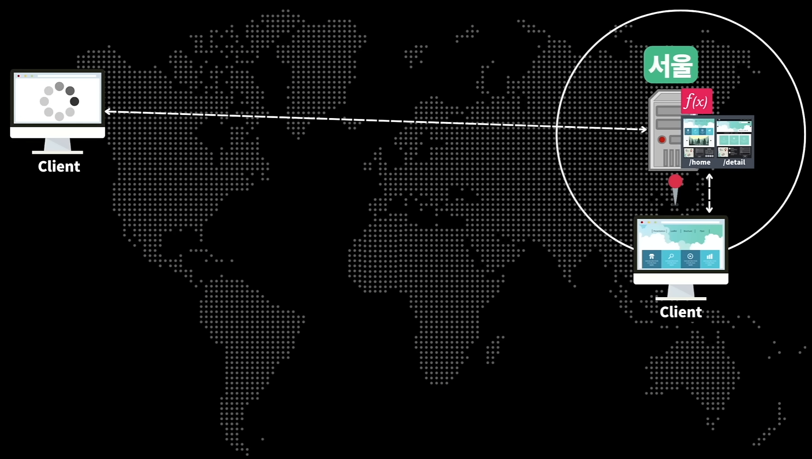
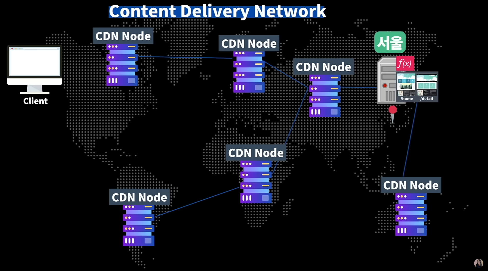
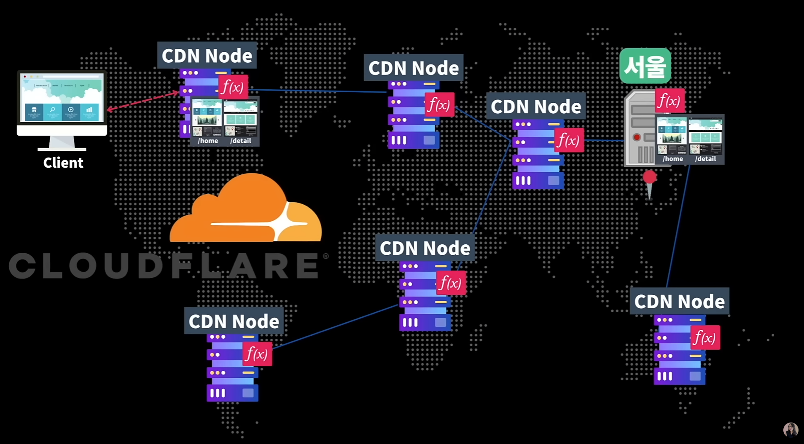

# Edge Computing

유튜버 드림코딩 엘리님의 웹개발, 서버사이드 렌더링의 미래? 😎 (필수 키워드 정리) 내용을 글로 정리

https://www.youtube.com/watch?v=RLJ6tPzXB5Q&t=193s

### Edge Computing

에지 컴퓨팅이란? 우선 여기서 에지(Edge)가 무엇인지 알아봅시다.

에지(Edge)란 쉽게 말해서 “가장 가까운” 것을 의미합니다. 네트워크에서 가장 사용자와 가까이에 있는 네트워크를 **Edge of the Networ**k라고 하고 사용자와 가장 가까이에 있는 서버를 **Edge Server**라고 하죠. 따라서 Edge Computing이란 네트워크의 “에지”에서 가까운 사용자에게 좋은 컴퓨팅 성능을 제공하는 것을 의미합니다.

실제 세계를 예를 들면 우리가 스타벅스의 커피를 주문하기 위해 미국의 워싱턴 주 시애틀에 위치해 있는 스타벅스 본사로 주문하지 않죠.

바로 우리와 가까이에 있는 지점에 가서 커피를 주문합니다. 바로 이 지점이 우리에게는 에지 지점이 되겠죠.

### 등장 배경

위의 그림처럼 우리의 웹 어플리케이션을 서울에 위치한 서버에 배포했다고 가정했을 때, 서버가 서울에 있기 때문에 국내 사용자들은 우리의 웹 사이트를 사용함에 페이지 로딩 속도에 대한 불편은 없을 겁니다.

하지만 멀리 떨어져 있는 유럽권 사람들이 우리의 웹 어플리케이션을 사용한다면 거리가 멀기 때문에 실제 서울에 있는 서버의 웹 페이지를 사용하기에는 물리적인 제약사항이 있으며 로딩 속도가 엄청 느려 사용자 경험에 큰 불편을 주겠죠?

이렇게 서버와의 거리가 멀리 떨어져 있는 사용자들을 위해 로딩 속도 높이기 위해서 CDN이 도입 되었습니다.

CDN은 “Content Delivery Network”의 약자로 전세계적으로 연결된 서버 네트워크 망입니다. 이 네트워크 망은 우리가 배포한 사이트의 페이지, 이미지, 폰트 등과 같은 정적 파일들을 캐시하기 위해 존재합니다.

이렇게 캐시된 정적인 파일들로 서울에 있는 서버와 멀리 떨어져 있는 사용자들이 우리 웹 어플리케이션을 요청했을 때 서울에 있는 서버로 요청하는 것이 아니라 가장 가까운 CDN 서버로 요청해 캐시된 파일들을 내려받아요.

하지만 CDN을 통해 로딩 속도를 개선했지만 정적인 컨텐츠만 캐싱이 가능하기 때문에 서버로부터 데이터를 받아오는 등의 동적인 컨텐츠는 CDN에서 처리할 수 없습니다.

따라서 이 경우 서울에 있는 실제 서버에 요청해 데이터를 받아와야 되죠.

그래서 이를 해결하고자 코드를 edge에서 동작하게 하거나 렌더링하는 개념들이 돌게 되었고, 대표적으로 “Cloudflare”와 같은 몇몇의 CDN Provider들이 CDN에서도 코드가 실행될 수 있게 하는 기능을 도입하게 되요.

이 기능들은 다음과 같은 3가지 특징이 있습니다.

- small-size → 함수의 크기는 작아야 한다.
- stateless → 함수는 상태를 가지고 있지 않아야 한다.
- short-lived → 함수는 짧은 시간 안에 수행되어야 한다.

위의 3가지 특징을 가지고 CDN에서 실행되는 함수들을 바로 “Edge Function”이라고 부릅니다.

이 Edge Function은 다음과 같은 일들을 수행할 수 있어요.

- HTML 페이지 실시간 생성(SSR)
- 사용자 인증 및 유효성 검사
- 사용자 위치별 비즈니스 로직 실행 (대표적으로 해당 위치의 언어)

### Edge Function의 장점과 단점

프로그래밍에서는 항상 트레이드-오프(trade-off)가 존재하죠. 마찬가지로 Edge Function도 장점과 단점이 존재합니다.

### 장점

사용자와 가까운 곳에서 코드 실행하므로 실제 서버까지 왕복 통신해야하는 물리적인 제약이 없으므로 훨씬 더 일정하고 짧은 반응 시간을 가집니다. 따라서 사용자에게 더 빠르게 웹 페이지를 로딩할 수 있죠.

Edge 플랫폼을 제공하는 Deno의 블로그 글을 보면

> Livin’ on the edge
> The beauty of the edge is that it is taking the best part of CDNs(being close to users) and the best part of serverless(running functions) and marrying them together.

직역하자면 edge의 아름다운 점은 사용자와 가장 가까운 CDN 장점과 서버리스의 장점을 잘 섞어둔데 있다.

### 단점

- 서버리스보다 더 엄격한 제한사항이 있다.
- 최소한의 런타임 환경 → Node.js API를 전혀 사용할 수 없으며 사용할 수 있는 Web API도 제한적이고 수가 작다.
  - [Next.js Edge Runtime](https://nextjs.org/docs/pages/api-reference/edge)
- Web API 지원 기능의 수가 적기 때문에 우리가 사용하는 라이브러리에도 큰 영향을 미친다. → 만약 사용하는 라이브러리에서 지원하지 않는 Web API 기능을 사용한다면 해당 라이브러리는 edge 환경에서 동작하기 힘들다.
- 그럼 왜 Web API의 지원 기능 수를 줄여야만 했을까? 서버리스의 한계점인 Cold Start를 극복하기 위함이다.
- DB에 의존적인 서비스에는 적합하지 않다. → 데이터베이스가 있는 실제 서버와 통신해야 하기 때문 Mongo DB Atlas, Fauna DB, Cocroach DB등과 같은 분산형 데이터베이스를 사용한다면 제약사항을 해결할 수 있기는 하다.

### 그래서 이거 왜 알아야 되는데?

Edge Computing의 개념 자체는 이미 오래전부터 있었습니다. 최근 기술이 좋아져서 실제로 구현까지 가능함에 따라 많은 기업들이 도입을 하고 있습니다. 대표적으로 Google, Microsoft, Amazon과 같은 회사에서 서비스 성능을 향상 시키기 위해 사용되고 있습니다. 또한 모바일 사용자에게 더 빠른 데이터를 제공할 수 있고 낮은 대기 시간이나 실시간 응답이 필요한 가상 현실, 증강 현실, IoT 애플리케이션 등에서도 서비스의 성능을 향상시키는데 사용될 수 있습니다.

웹 개발에서는 페이지의 성능을 최적화 시키기 위해 SSR와 Pre-Rednering 기술이 대중화가 되고 있습니다. Edge Function 또한 페이지의 성능을 최적화 시키는데 많은 기여를 하기 때문에 Edge Function을 사용해 이러한 요구를 충족하고 동시에 개발자 경험을 제공하는 많은 프레임워크와 서비스가 생겼습니다.

- Deno
  “Deno Deploy”라는 Edge Computing Platform을 출시했습니다.
- CloudFlare Workers
  Cloudflare와 같은 몇몇의 CDN Provider들이 CDN에서도 코드가 실행될 수 있게 Edge Function을 지원합니다.
- Netlify, Vercel에서도 Edge Function을 지원합니다.
  Netlify 내부적으로 Deno를 사용하고 있으며 Vercel에서는 Cloudflare Workers를 사용하고 있습니다.
- Edge Function을 지원하는 프레임워크
  NextJS, Nuxt3, Sveltekit, Remix와 같은 최신 프레임워크에서 자체적으로 Edge에서 렌더링할 수 있는 “Rendering on the Edge” 기능을 지원해주고 있습니다.
  또한 NextJS에서는 페이지, API 라우트 별로 런타임 환경을 설정할 수 있다고 하네요.
- “Rendering on the Edge”를 활용한다면 리액트 18버전부터 도입된 서버 컴포넌트와 함께 사용한다면 성능 향상도 극대화해볼 수 있다고 합니다.

### 레퍼런스

https://www.youtube.com/watch?v=RLJ6tPzXB5Q&t=193s

https://nextjs.org/docs/pages/building-your-application/rendering/edge-and-nodejs-runtimes

https://vercel.com/templates/react/react-edge-functions

https://docs.netlify.com/edge-functions/overview/

Chris Coyier

https://chriscoyier.net/2023/01/15/coyiers-edge-law/

https://chriscoyier.net/2022/09/27/let-an-edge-function-do-it/

https://chriscoyier.net/2022/05/04/it-doesnt-much-matter-how-cdny-your-jamstack-site-is-if-everything-important-happens-from-a-single-origin-server-edge-functions-are-probably-part-of-the-solution/
