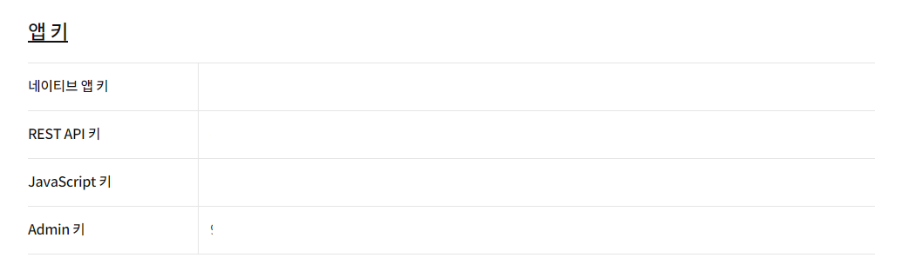
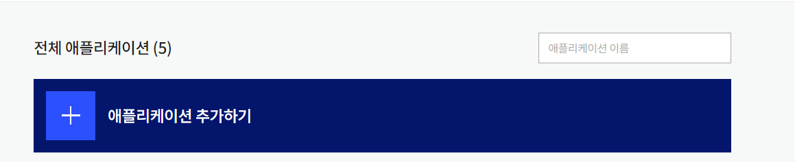

## 카카오 공유 API

mbti 사이트에서 가장 중요한 특징은 바이럴입니다. 현재 다양한 mbti 검사 사이트가 존재합니다. 해당 mbti 사이트의 특징은 동일합니다. 주어진 항목 중에 하나를 선택하고, 주어진 결과를 종합해서 예상되는 mbti 결과를 보여줍니다. 

이번 프로젝트 또한 다른 사이트와 유사합니다. 다만 선택지에 더 많은 자유를 주었고 LLM 모델을 활용해서 더 정확한 결과를 제공해준다는 점이 차이입니다. 하지만 형태는 같습니다. 해당 사이트가 유행을 하려면 사용자가 받은 결과물이 공유가 되고 바이럴이 되어야 합니다. 즉 공유하기 기능의 다양성이 매우 중요합니다. 

한국을 목표로 해서 만든 사이트이기에 무엇보다 카카오 app에서 공유하기 기능이 중요했습니다. 대부분 카카오 앱을 사용하고 있기 때문에, 카카오 인앱에서의 부드러운 동작, 카카오톡에서의 매력적인 공유가 이루어지도록 해야합니다. 이를 위해서 카카오 api를 활용했습니다. 

## 공유 API 사용하기

1. **카카오 개발자 등록하기 및 애플리케이션 등록하기**
    
    
    
2. **등록된 애플리케이션의 자바스크립트키 가지고 오기**
    
    
    
3. **카카오 api skd 사용을 위한 script 태그를 추가합니다**
    
    ```tsx
    <script
              defer
              src="https://developers.kakao.com/sdk/js/kakao.min.js"></script>
    ```
    
4. **카카오 layout 형성**
    
    이전에 받은 자바스크립트 키를 통해 Kakao sdk가 실행되지 않았다면 SDK 를 실행합니다.
    
    ```tsx
    'use client';
    import { useEffect } from 'react';
    
    export default function KaKaoLayout({
      children,
    }: {
      children: React.ReactNode;
    }) {
      useEffect(() => {
        if (window.Kakao) {
          const { Kakao } = window;
          if (!Kakao.isInitialized()) {
            Kakao.init(process.env.NEXT_PUBLIC_KAKAO_API_KEY);
          }
        }
      }, []);
    
      return <>{children}</>;
    }
    ```
    
5. **카카오 공유 버튼 구현**
    
    [Kakao Developers](https://developers.kakao.com/tool/demo/message/kakaolink?method=send&default_template=feed)
    
    데모 버젼을 확인할 수 있습니다.
    
    ```tsx
    'use client';
    
    import { usePathname } from 'next/navigation';
    import { Dispatch, SetStateAction } from 'react';
    import ShareBtn from '@/components/share/ShareBtn';
    import Kakao from '@/components/svg/Kakao';
    import { CONFIG } from '@/config';
    import { ResultInfo } from '@/types/types';
    
    export default function KakaoBtn(
      prop: ResultInfo & {
        setIsExpanded: Dispatch<SetStateAction<boolean>>;
        isExpended: boolean;
        token: string;
      },
    ) {
      const path = usePathname();
    
      const handleSendMessage = () => {
        const kakao = window.Kakao;
    
        prop.setIsExpanded(true);
        if (!kakao.isInitialized()) {
          kakao.init(process.env.NEXT_PUBLIC_KAKAO_API_KEY);
        }
        kakao.Share.sendDefault({
          objectType: 'feed',
          content: {
            title: `${CONFIG.title} | ${prop.name}`,
            description: `${prop.basicFeatures.join(' ')}`,
            imageUrl: prop.shareUrl,
            link: {
              mobileWebUrl: `${CONFIG.gabia}`,
              webUrl: `${CONFIG.gabia}`,
            },
          },
          buttons: [
            {
              title: '웹으로 보기',
              link: {
                mobileWebUrl: `${CONFIG.gabia}${path}?${CONFIG.param.query}?token=${prop.token}`,
                webUrl: `${CONFIG.gabia}${path}?${CONFIG.param.query}?token=${prop.token}`,
              },
            },
          ],
        });
      };
    
      return (
        <ShareBtn onClick={handleSendMessage} title="카카오">
          <Kakao width="30" height="30" />
        </ShareBtn>
      );
    }
    ```
    
    ### 주의점
    
    - 해당 링크에서 필요한 API 사용법을 확인할 수 있습니다.
    
    [Kakao Developers](https://developers.kakao.com/sdk/reference/js/release/Kakao.Share.html#.sendDefault)
    
    - 처음에 마주친 문제는 해당 버튼을 클릭했을 때, 사용자를 이동시켜야 하는 url을 작성했습니다. 하지만 정상적으로 동작하지 않고 항상 메인 페이지로 이동이 되었습니다. 해당 문제는 플랫폼에 등록한 url이 잘못 되었기 때문에 발생했습니다.
        
        url을 정상적으로 입력했을 때, 문제 없이 페이지 이동이 되는 점을 확인할 수 있었습니다.
        
    
    ```tsx
     buttons: [
            {
              title: '웹으로 보기',
              link: {
                mobileWebUrl: `${CONFIG.gabia}${path}?${CONFIG.param.query}?token=${prop.token}`,
                webUrl: `${CONFIG.gabia}${path}?${CONFIG.param.query}?token=${prop.token}`,
              },
            },
          ],
    ```