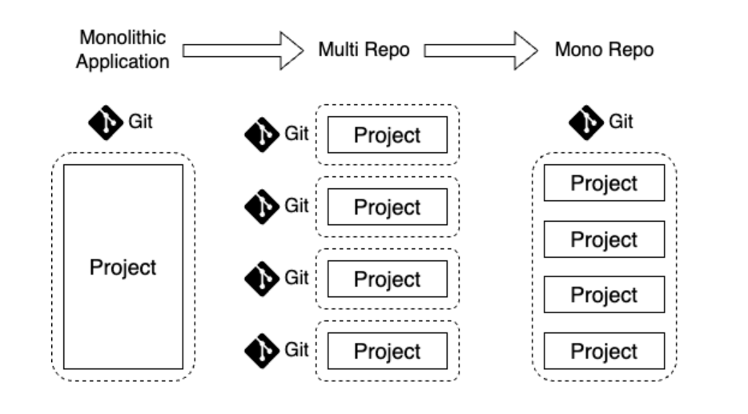
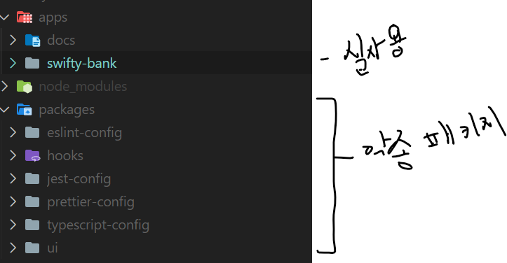

## 모노레포?

이번에 새로운 프로젝트에 참여하면서 프로젝트의 구조를 turborepo를 베이스로 한 monorepo 구조를 구축하게 되었습니다. 이에 따라서 간단하게 모노레포에 대해서 정리를 했습니다. 

**모노레포는 하나의 레포지토리에서 독립적인 여러 프로젝트를 관리하는 방법입니다.**
브라우저에서 제공하는 기술들이 복잡해지면서 그에 따라 프로젝트의 규모가 커집니다. 당연히 코드의 규모도 커지게 됩니다. 이때 현재 기존의 프로젝트는 Multi-Repo 형식으로 구성이 되어 있습니다. 

- Multi Repo
    

    멀티레포 구조는 폴리레포 구조라고도 부릅니다. 각 모듈을 고유한 저장소에 저장해서 독자적이 프로젝트로 관리하고, 필요한 경우에 따라서 모듈을 불러와서 사용하는 방식입니다. 따라서 각 프로젝트는 자율성이 높고 독립적인 개발, 린트, 테스트, 빌드가 존재합니다. 

    이러한 방식은 각 프로젝트 팀의 자율성을 보장합니다. 즉 각 프로젝트 별로 개발 사이클을 독립적으로 운영할 수 있습니다. 

    하지만 이러한 독립성은 또 다른 문제를 야기하기도 합니다. 
    - 프로젝트의 생성 : 새로운 프로젝트를 시작할 때마다 다시 처음부터 저장소, 개발 환경 구축, 배포의 과정을 거쳐야 합니다. 
    - 중복 코드 : 각 프로젝트가 독립적으로 운영되기 때문에, 유사한 기능의 코드가 중복되어 존재할 수 있습니다. 
    - 관리의 어려움 : 프로젝트를 모두 독립적으로 운영하기 떄문에 개별적인 관리자가 필요합니다.
    - 일관성 없는 개발자 경험 : 각 프로젝트 팀원 별로 린트 설정, 컨벤션이 다를 수 있습니다. 또한 사용하는 프레임워크, 라이브러리의 버전이 다를 수도 있습니다. 이는 각 프로젝트 별로 다시금 적응을 해야하는 문제를 야기합니다. 

- Monorepo
    모노레포 구조는 기존의 멀티레포에서 각각 별도의 저장소에서 관리하는 프로젝트를 하나의 레포에서 관리하게 됩니다. 이는 단순히 하나에 저장해서 관리한다는 것에서 국한되는 것이 아닙니다. 

    모노레포 안에서 관계가 있습니다. lint, test, typescript 같은 설정들을 모두 별도의 패키지화 하여 관리하고 이를 불러와서 사용할 수 있습니다. 또한 ui, hook, lib 등의 package를 통해서 필요한 공통컴포넌트, 커스텀 훅등을 자유롭게 불러와서 사용할 수 있습니다. 

    이러한 방식을 통해 더 쉽게 패키지 관리를 가능하게 하고, 기존의 멀티레포가 가진 장점도 사용할 수 있습니다. 이러한 모노레포의 장점은 다음과 같습니다. 

    - 더 쉬운 의존성 관리
    - 단일화된 관리 포인트
    - 일관된 개발자 경험 제공
    - 리펙토링 비용 감소

    그렇지만 단점도 있습니다. 저희는 turborepo를 통해서 매우 쉽게 환경구축을 했지만, 분명 단일 멀티 레포 한개 보다는 환경 구축에 더 많은 시간을 투자 해야 합니다. 

    또한 다양한 패키지에 쉽게 접근해서 사용할 수 있기 때문에, 각 코드가 수정 변경 되기 쉽습니다. 이는 code ownership에 위배 될 수 있습니다. 

    그래서 반드시 모노레포를 써야할 필요는 없을 것 같습니다. 특히 프로젝트 규모가 크지 않다면, 멀티 레포도 충분하지 않을까 합니다. 모든 것에는 트레이드오프가... 

### monorepo 구축 도구

### 프로젝트 monorepo 구조

저희는 turborepo를 통해 쉽게 monorepo를 구축하고 프로젝트를 진행하고 있는데, 다음과 같이 구조를 짜고 실행하고 있습니다. 

## 참고 

- https://d2.naver.com/helloworld/0923884
- https://engineering.linecorp.com/ko/blog/monorepo-with-turborepo
- https://medium.com/hcleedev/dev-monorepo-%EA%B0%9C%EB%85%90-%EC%95%8C%EC%95%84%EB%B3%B4%EA%B8%B0-33fd3ce2b767