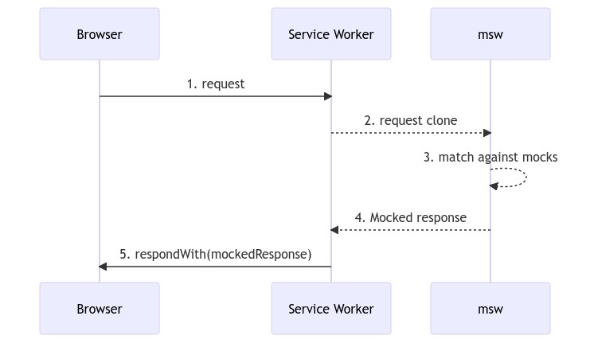

## 프런트앤드 개발의 API 의존성

[mbtmi](https://github.com/kd02109/mbtmi) 프로젝트를 진행하면서 어려웠던 점은 API 개발에 대한 의존성이었습니다. 페이지 화면 개발을 우선하였더라도, 만약 서버 쪽에서 api 개발이 진행되지 않고 있다면, 개발이 완료되기 까지, 기약 없이 기다려야 하는 경우가 있었습니다. 

더욱이 취업을 준비하는 저 이외에는 다들 학생이거나, 이미 취업을 하고 직장을 다니고 있는 친구들이어서 간단한 프로젝트임에도 불구하고 꽤 많은 시간을 소모해서 프로젝트를 완료했습니다. 이러한 상황에서 저 또한 서버의 api가 완성되기 전까지 잠시 프로젝트를 쉬어 가는 경우가 많았습니다. 

실제 작업은 **기획 → 서버 → 화면** 개발로 이루어지지 않는 경우가 많았습니다. **기획 → 서버&화면 → 기획 → 서버&화면** 등으로 개발이 진행되었습니다. 서버와 화면을 동시에 개발하기 때문에 api가 구축되지 않는 경우가 훨씬 많았습니다. 

이러한 문제를 어떻게 해결할 수 있을까? 찾아보는 과정에서 MSW(Mock Service Worker)에 대해서 알게 되었습니다. MSW는 서비스 워커를 사용해서 네트워크 호출을 가로채는 API 모킹 라이브러리입니다. 이를 통해 마치 서버와 소통하는 환경을 가짜로 만들어서 환경 구축을 미리 진행할 수 있다는 것을 알게 되었습니다. 

mock이라는 개념도 한번 접해보았기에 익숙했습니다. jest를 활용한 test 코드 작성 중에 jest.fn()을 활용한 mock 함수를 만들어서 실제 함수 기능을 가로채서 테스트코드를 작성한 경험이 있었습니다. 즉 MSW 또한 네트워크를 가로채서 가짜 응답 데이터를 요청해주는 라이브러리 입니다.

## ServiceWorker

msw 의 mocking은 네트워크 단에서 이루어집니다. 따라서 FE 코드를 실제 BE API와 네트워크 통신하는 것과 크게 다르지 않게 작성할 수 있습니다. 즉 가짜 API를 실제 API로 교체하는 작업이 쉽다는 것을 의미합니다. 

또한 REST API mocking, GraphQL API 모킹을 모두 지원한다는 점도 msw의 매력적인 부분입니다. 



## React에서 msw 적용하기

### 설치 및 서비스워커 생성

```
// 설치하기
npm install msw --save-dev
```

msw는 브라우저에서 서비스 워커를 통해서 작동하기 때문에 서비스 워커를 등록해야 합니다. msw의 CLI 도구를 통해 쉽게 해당 작업을 수행할 수 있습니다. `public/` 부분에는 프로그램의 정적 리소스를 두는 폴더를 지정해야 합니다. 대부분의 라이브러리, 프레임워크(react, Next.js)에서 정적 파일을 public에서 관리하기 때문에 별도의 명령어의 변경없이 실행할 수 있습니다.

```
// 서비스워커 생성
npx msw init public/ --save
```

저는 vite 환경에서 작성을 했습니다. 테스트를 위해 설치한 각 라이브러리 버전은 다음과 같습니다.

```json
{
	"dependencies": {
    "msw": "^2.0.13",
    "react": "^18.2.0",
    "react-dom": "^18.2.0",
  },
  "devDependencies": {
    "@types/react": "^18.2.15",
    "@types/react-dom": "^18.2.7",
    "@typescript-eslint/eslint-plugin": "^6.0.0",
    "@typescript-eslint/parser": "^6.7.0",
    "@vitejs/plugin-react-swc": "^3.3.2",
    "eslint": "^8.45.0",
    "eslint-config-prettier": "^9.0.0",
    "eslint-import-resolver-typescript": "^3.6.0",
    "eslint-plugin-import": "^2.28.1",
    "eslint-plugin-prettier": "^5.0.0",
    "eslint-plugin-react-hooks": "^4.6.0",
    "eslint-plugin-react-refresh": "^0.4.3",
    "husky": "^8.0.3",
    "lint-staged": "^14.0.1",
    "prettier": "^3.0.3",
    "typescript": "^5.0.2",
    "vite": "^4.4.5"
  },
}
```

### 핸들러 작성

```tsx
// mock/handler.ts
import { http, HttpResponse } from 'msw';
import type { PathParams } from 'msw';

export const handlers = [
  http.get('/resource', ({ request }) => {
    console.log(request);
    return HttpResponse.json<Menu>(Menu);
  }),

  http.post<PathParams, { food: string }>(
    '/make',
    async ({ request, params }) => {
      const body = await request.json();

      if (!body.food) return HttpResponse.json('FAIL', { status: 400 });
      if (Menu.includes(body.food))
        return HttpResponse.json('FAIL The Food is existed', { status: 400 });

      Menu.push(body.food);
      return HttpResponse.json(Menu, { status: 201 });
    },
  ),
];
```

Resolver는 위의 Handler에서 `({request, param, cookie}) => {...}` 형태의 코드를 일컬으며 **백엔드에서 API 개발시 작성되는 서비스로직 과 유사**합니다. 각 API경로로 들어왔을때 보내진 정보를 갖고 데이터를 가공하여 반환하는 역할을 합니다.

위와 같이 `handlers` 라는 배열 내부에 http 요청에 따라서 각 path와 내부 로직을 callback fn으로 지정해주면 됩니다. 이때 msw는 반환 값으로 내장 브라우저에서 제공하는 Fetch API의 Response 객체보다는 라이브러리에서 제공하는 `HttpResponse` 를 사용하는 것을 추천합니다. 

간단한 메뉴 주문을 확인하기 위한 테스트 api를 작성했습니다. 메뉴 주문을 조회하는 get 요청과 메뉴를 추가 주문하는 post 요청을 하나 씩 만들었습니다.  

### Worker 설정

**`main.tsx`** 에서 msw를 실행할 워커를 생성하고 구동합니다. msw를 활용한 mocking 작업은 클라이언트에서만 수행할 것이기 때문에 개발 단계에서만 실행되도록 설정했습니다. 

```tsx
// main.tsx
import { setupWorker } from 'msw/browser';
import ReactDOM from 'react-dom/client';
import App from '@/App';
import { handlers } from '@/mocks/handler';

const worker = setupWorker();

if (import.meta.env.MODE === 'development') {
  console.log(import.meta.env.MODE);
  worker.use(...handlers);
  worker.start({
    onUnhandledRequest: 'bypass',
  });
}

const root = ReactDOM.createRoot(document.getElementById('root')!);
root.render(<App />);
```

개발자 도구를 확인해 보면 msw가 정상적으로 수행되는 것을 확인할 수 있습니다. 


이제는 APP 단계에서 request 요청과 post 요청이 들어왔을 때, msw가 어떻게 동작을 수행하는지 확인하고자 합니다.

```tsx
import { useState, useRef, useEffect } from 'react';

export default function App() {
  const [menu, setMenu] = useState<string[]>([]);
  const ref = useRef<HTMLInputElement>(null);
	
// post 요청
  const handlePostTest = async () => {
    const food = ref.current?.value.trim();
    if (food) {
      const response = await fetch('/make', {
        method: 'POST',
        body: JSON.stringify({
          food: food,
        }),
      });
      if (response.ok) {
        const menu = await response.json();
        setMenu(menu);
        ref.current!.value = '';
      } else {
        const message = await response.json();
        alert(message);
      }
    } else {
      alert('주문할 음식을 적어주세요');
    }
  };
	
// get 요청
  useEffect(() => {
    (async () => {
      const response = await fetch('/resource/food?food=tasty');
      if (response.ok) {
        const menuList = await response.json();
        setMenu(menuList);
      }
    })();
  }, []);

  return (
    <div>
      <div>
        <input type="text" ref={ref} />
        <button onClick={handlePostTest}>메뉴 주문하기</button>
      </div>
      <div
        style={{ display: 'flex', flexDirection: 'column', fontWeight: '600' }}>
        <h1>주문한 메뉴</h1>
        {menu.map(food => (
          <span key={food}>{food}</span>
        ))}
      </div>
    </div>
  );
}
```

첫 페이지가 렌더링이 된후 useEffect를 통해 api 요청을 시도합니다. 이때 msw는 브라우저에서 서비스 워커를 활용해서 path가 일치한 요청을 가로챕니다. 이때 callback 함수에서 인자로 전달되는 객체의 값 `{params, cookies, request}` 의 값을 살펴보면 다음과 같습니다. 


`params` 에는 parameter 값, cookies에는 해당 네트워크에 있는 `cookie`, `request` 는 클라이언트에서 보낸 요청에 대한 상세정보가 담겨 있습니다. 

이러한 인자를 활용하면, API 명세서에 따른 다양한 옵션과 조건을 설정하고 활용할 수 있을 것 같습니다. 

## Next.js msw 활용하기

Next.js에서는 서버 환경과, 클라이언트 환경에서 모두 mocking이 이루어지도록 세팅해야 합니다. 일반적인 react와 달리 클라이언트에서 처리되는 api, 서버에서 처리되는 api를 모두 msw가 mocking 하도록 설정해야 하기 때문에 고려해야 할게 많아졌습니다. 

아직까지는 Next.js에서 msw에 대한 지원이 미미한 상태입니다. ([참고](https://github.com/mswjs/msw/issues/1644)) 따라서 Next.js 서버에서 구동되는 api 요청을 가로채기 위한 별도의 서버를 간단히 구성해야 합니다. 이를 위해서 express와 msw에서 제공하는 **[http-middleware](https://github.com/mswjs/http-middleware)**을 활용합니다.

또한 클라이언트 환경에서 mock을 실행하기 위해서는 기존의 react에서 클라이언트에서 보낸 api를 모킹하기 위한 작업도 진행을 해야 합니다. 

### 1. handler 작성

```tsx
// /mocks/handler.ts

import { http, HttpResponse } from 'msw';

const getTest = http.get('/test', () => {
  return HttpResponse.json({ test: 'Done' }, { status: 200, statusText: 'DONE' });
});

export const handlers = [getTest];
```

### 2. mock 실행함수 작성

클라이언트 환경에서 msw worker를 실행할 수 있도록 설정합니다. 

```tsx
// /mocks/index.ts
import { handlers } from '@/mocks/handler';

export async function initMocks() {
	// window 객체가 존재하는 브라우저 환경에서 worker 실행
  if (typeof window !== 'undefined') {
    const { setupWorker } = await import('msw/browser');
    const worker = setupWorker();
    worker.use(...handlers);
    await worker.start({ onUnhandledRequest: 'bypass' });
  }
}
```

worker를 실행하는 provider를 만들어서 layout.tsx에 적용합니다. 

```tsx
// MockingProvider.tsx
'use client';
import { useEffect } from 'react';

export default function MockingProvider({ children }: { children: React.ReactNode }) {
  useEffect(() => {
		// 개발 환경에서만 mock을 사용하도록 설정
    if (process.env.NEXT_PUBLIC_API_MOCKING === 'enabled') {
      (async () => {
        const { initMocks } = await import('@/mocks/index');
        await initMocks();
      })();
    }
  }, []);

  return <>{children}</>;
}
```

### 3. server mocking 만들기

express와 http-middleware를 활용해서 Next.js 서버에서 요청하는 api를 mocking 하도록 구성합니다.

```tsx
// mocks/http.ts

import { createMiddleware } from '@mswjs/http-middleware';
import express from 'express';
import cors from 'cors';
import { handlers } from '@/mocks/handler';

const app = express();

app.use(
  cors({
    origin: ['http://localhost:3000', 'http//:localhost:3001'],
    optionsSuccessStatus: 200,
    credentials: true,
  }),
);
app.use(express.json());
app.use(createMiddleware(...handlers));

app.listen(8080, () => {
  console.log('CREATE MOCK SERVER');
});
```

`package.json` 에서 mock 서버를 실행하는 명령어를 작성합니다. 

```json
{
	"scripts": {
    "dev": "next dev",
    "build": "next build",
    "start": "next start",
    "lint": "next lint",
    "mock": "npx tsx watch ./src/mocks/http.ts"
  }
}
```

> ❓**[tsx](https://www.npmjs.com/package/tsx)**
> 
> 
> tsx는 commonjs 및 모듈 패키지 유형 모두에서 TypeScript 및 ESM을 원활하게 실행하기 위한 CLI 명령(node 대신 사용 가능)입니다.
> 

이후 mock 서버를 실행하고, Next.js를 실행합니다. 클라이언트와 서버에서 모두 정상적으로 msw가 동작하는 것을 확인할 수 있습니다. 

- **Client**
    
    
    
- **Server**
    
    
    

## 참조

[Mocking responses](https://mswjs.io/docs/basics/mocking-responses)

[http](https://mswjs.io/docs/api/http)

[HttpResponse](https://mswjs.io/docs/api/http-response)

[Describing REST API](https://mswjs.io/docs/network-behavior/rest)

[(약간은 험난했던) Next.js 13에 MSW 도입기](https://jaypedia.tistory.com/382)

[https://github.com/mswjs/http-middleware](https://github.com/mswjs/http-middleware)

https://github.com/mswjs/msw/issues/1801