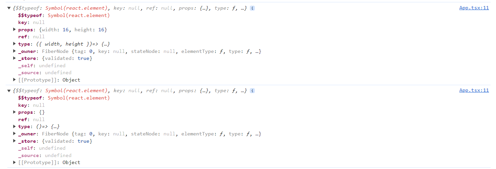
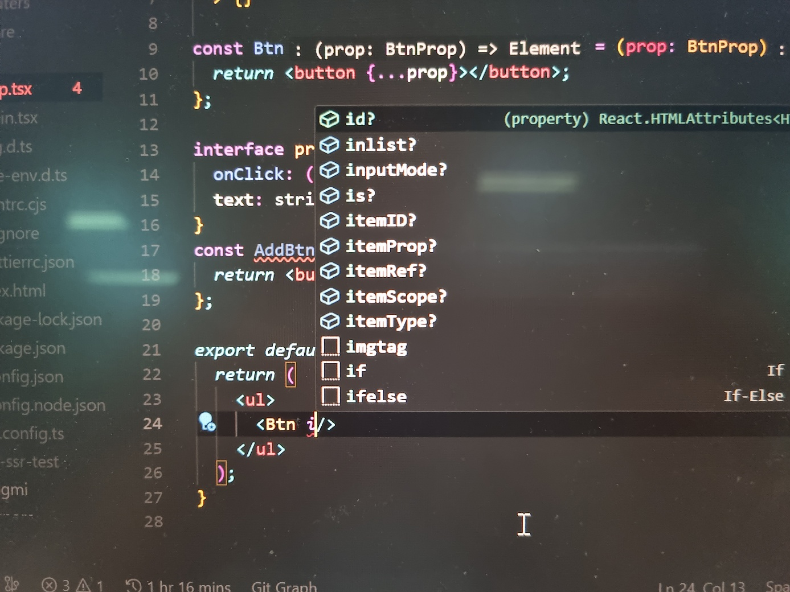

## 컴포넌트 타입
### class

React.Component와 React.PureComponent의 타입은 아래와 같이 정리되어 있습니다. 

```jsx
interface Component<P={}, S={}, SS=any> entends ComponentLifecycle<P,S,SS>{}

class Component<P,S>{
	/* ... 생략 */
}

class PureComponent<P={}, S={}, SS=any> extends Comopnent<P,S,SS>{}
```

각각 제네릭의 P는 prop, S는 state를 의미합니다. React.Component와 React.PureComponent의 차이는react의 생명주기 메서드중 하나인 **`shouldComponentUpdate`**를 처리하는 방식에 있습닌다.

`shouldComponentUpdate()`는 props 또는 state가 새로운 값으로 갱신 되어서 렌더링이 발생하기 직전에 호출됩니다.

- `React.Component`는 `shouldComponentUpdate`를 따로 설정해주지 않은 경우, 항상 true를 반환합니다. 즉, `setState`가 실행되면 state, props의 변경 여부를 신경 쓰지 않고 무조건적으로 컴포넌트를 업데이트 시킵니다.
- `React.PureComponent`에는, props랑 state를 얕은 비교를 통해 비교한 뒤 변경된 것이 있을 때는 true를 return 해서 리렌더링 하고, 변경된 것이 없을 때는 false를 반환하여, 리렌더링을 막습니다.

### 함수 컴포넌트

```tsx
type FC<P = {}> = FunctionComponent<P>;

interface FunctionComponent<P = {}> {
        (props: P, context?: any): ReactNode;
        propTypes?: WeakValidationMap<P> | undefined;
        contextTypes?: ValidationMap<any> | undefined;
        defaultProps?: Partial<P> | undefined;
        displayName?: string | undefined;
}

type VFC<P = {}> = VoidFunctionComponent<P>;

/**
 * @deprecated - Equivalent with `React.FunctionComponent`.
*/

interface VoidFunctionComponent<P = {}> {
    (props: P, context?: any): ReactNode;
    propTypes?: WeakValidationMap<P> | undefined;
    contextTypes?: ValidationMap<any> | undefined;
    defaultProps?: Partial<P> | undefined;
    displayName?: string | undefined;
}
```

React 18버전 이상에서는 VFC와 FC의 차이가 없습니다. 두 타입 모두 children을 따로 지정을 해주어야 합니다. React 16버전에서는 FC의 경우 children이 미리 정의 되어 있었으며, VFC의 경우 childern의 타입이 지정되어 있지 않았습니다. 

18 버전 이상에서는 `React.FC` 를 활용해서 함수 컴포넌트를 정의합니다. 

## Children Type

```tsx
type PropsWithChildren<P = unknown> = P & { children?: ReactNode | undefined };
```

기본적인 children type은 `{children: ReactNode | undefined}`입니다. ReactNode는 ReactElement 외에도 boolean, number 등 여러 타입을 포함하고 있습니다. 구체적인 타입을 타이핑하는 것에는 적합하지 않습니다. 

## Render 메서드와 함수 컴포넌트의 반환 타입 
React.ReactElement, JSX.Element, React.ReactNode

- **React.Element**
    
    ```tsx
    interface ReactElement<
      P = any,
      T extends string | JSXElementConstructor<any> =
        | string
        | JSXElementConstructor<any>,
    > {
      type: T;
      props: P;
      key: Key | null;
    }
    ```
    
    React.createElement를 호출하는 형태의 구문으로 반환하면, React.createElement의 반환 타입은 ReactElement입니다. 즉 ReactElement 타입은 리액트 컴포넌트를 객체 형태로 저장하기 위한 포맷입니다. 
    
- **JSX.Element**
    
    ```tsx
    declare global {
        namespace JSX {
            interface Element extends React.ReactElement<any, any> { }
    	}
    }
    ```
    
    리액트의 ReactElement를 확장하고 있는 타입입니다. 글로벌 네임스페이스에 정의되어 있어 외부 라이브러리에서 컴포넌트 타입을 재정의 할 수 있는 유연성을 제공합니다. 이러한 특성으로 컴포넌트 타입을 재정의하거나 변경하는 것이 용이합니다. 
    
- **ReactNode**
    
    ```tsx
    interface DO_NOT_USE_OR_YOU_WILL_BE_FIRED_EXPERIMENTAL_REACT_NODES {}
    type ReactNode =
      | ReactElement
      | string
      | number
      | Iterable<ReactNode>
      | ReactPortal
      | boolean
      | null
      | undefined
      | DO_NOT_USE_OR_YOU_WILL_BE_FIRED_EXPERIMENTAL_REACT_NODES[keyof DO_NOT_USE_OR_YOU_WILL_BE_FIRED_EXPERIMENTAL_REACT_NODES];
    ```
    
    ReactElement 외에도 boolean, number, string 등의 여러 타입을 포함하고 있습니다. 
    

이러한 세 타입의 포함 관계를 살펴보면 다음과 같습니다. 


### ReactElement, ReactNode, JSX.Element 활용하기

- **ReactElement**
    
    ReactElement는 creaateElement의 반환 값인 객체 타입을 지정합니다. 즉 JSX를 통해 작성한 반환 값을 가상 돔이 읽을 수 있는 creaateElement가 반환하는 객체 형식으로 트랜스파일링합니다. 
    
    이때 반환된 객체의 타입은 ReactElement입니다.
    
    ReactElement를 사용한다면 제네릭에 직접 해당 컴포넌트의 props 타입을 명시해야 합니다. 이를 통해 icon.props에 접근할 때, 어떤 props가 있는지 추론해 줍니다.
    
    ```tsx
    interface Prop {
      icon: React.ReactElement<Svg>;
    }
    
    interface Svg {
      width: number;
      height: number;
    }
    
    const Item = ({ icon }: Prop) => {
      console.log(icon);
    	// 타입스크립트에서 icon.props 내부 값을 추론할 수 있습니다.
      return <li>{icon}</li>;
    };
    
    const SVG = ({ width, height }: Svg) => {
      return (
        <svg
          width={`${width}`}
          height={`${height}`}
          viewBox="0 0 16 16"
          fill="currentColor"
          xmlns="http://www.w3.org/2000/svg">
          <g clipPath="url(#clip0_3_6)">
            <path
              d="... 생략"
              fill="black"
            />
          </g>
          <defs>
            <clipPath id="clip0_3_6">
              <rect width="16" height="16" fill="white" />
            </clipPath>
          </defs>
        </svg>
      );
    };
    
    const Moon = () => {
      return (
        <svg
          width="15"
          height="15"
          viewBox="0 0 15 15"
          fill="none"
          xmlns="http://www.w3.org/2000/svg">
          <g clipPath="url(#clip0_1_2)">
            <path
              d="생략"
              fill="#FFC700"
            />
          </g>
          <defs>
            <clipPath id="clip0_1_2">
              <rect width="15" height="15" fill="white" />
            </clipPath>
          </defs>
        </svg>
      );
    };
    export default function App() {
      return (
        <ul>
          <Item icon={<SVG width={16} height={16} />} />
          <Item icon={<Moon />} />
        </ul>
      );
    }
    ```
    

    
- **ReactNode**
    
    ReactNode 타입은 리액트의 render 함수가 반환할 수 있는 모든 형태를 담고 있습니다. 
    
    ReactNode는 리액트 컴포넌트가 가질 수 있는 모든 타입을 의미합니다. 즉 JSX 문법을 때로는 string, number, null, undefined같이 어떤 타입이든 children prop으로 지정하고 싶을 때 사용합니다. **ReactNode는 리액트 컴포넌트가 다양한 형태를 가질 수 있게 할 때 유용**합니다. 
    
- **JSX.Element**
    
    JSX.Element는 ReactElement의 제네릭으로 props와 타입 필드에 대해 any 타입을 가지도록 확장하고 있습니다.
    
    이러한 특징은 **리액트 엘리먼트를 prop으로 받을 경우에 유용하게 사용**할 수 있습니다. 내부 타입과 prop이 any이기 때문에 prop으로 넘겨받은 컴포넌트의 상세 데이터를 가지고 오기 쉽습니다.
    
    ```tsx
    interface Prop {
      icon: JSX.Element;
    }
    
    const Item = ({ icon }: Prop) => {
      return <li>{icon}</li>;
    };
    
    const SVG = ({ width, height }: { width: number; height: number }) => {
      return (
        <svg
          width={`${width}`}
          height={`${height}`}
          viewBox="0 0 16 16"
          fill="currentColor"
          xmlns="http://www.w3.org/2000/svg">
          <g clipPath="url(#clip0_3_6)">
            <path
              d="생략"
              fill="black"
            />
          </g>
          <defs>
            <clipPath id="clip0_3_6">
              <rect width="16" height="16" fill="white" />
            </clipPath>
          </defs>
        </svg>
      );
    };
    
    const Moon = () => {
      return (
        <svg
          width="15"
          height="15"
          viewBox="0 0 15 15"
          fill="none"
          xmlns="http://www.w3.org/2000/svg">
          <g clipPath="url(#clip0_1_2)">
            <path
              d="생략"
              fill="#FFC700"
            />
          </g>
          <defs>
            <clipPath id="clip0_1_2">
              <rect width="15" height="15" fill="white" />
            </clipPath>
          </defs>
        </svg>
      );
    };
    export default function App() {
      return (
        <ul>
          <Item icon={<SVG width={16} height={16} />} />
          <Item icon={<Moon />} />
        </ul>
      );
    }
    ```
    

## 리액트에서 기본 HTML 요소 활용하기

리액트의 장점은 재사용되는 부분을 컴포넌트로 분리해서 사용할 수 있다는 점입니다. 

이때 Button에 같은 디자인이 반복되는 경우 이를 컴포넌트로 분리해서 사용할 수 있습니다. 이러한 경우 대개 다음과 같이 컴포넌트와 타입을 지정해서 사용합니다. 

```tsx
interface props {
  onClick: () => void;
  text: string;
}
const AddBtn = ({ onClick, text }: props) => {
  return <button onClick={onClick}>{text}</button>;
};
```

하지만 기존의 HTML 요소에는 onClick 이외에 다양한 요소가 있습니다. 혹은 이와 같은 단순한 event 연결 뿐만 아니라, 클래스네임, id 등을 추가로 활용하고 싶을 수 있습니다. 이처럼 기존의 HTML 요소를 확장해서 사용하고 싶을 경우 `React.DetailedHTMLProps`를 활용합니다.

```tsx
type DetailedHTMLProps<E extends HTMLAttributes<T>, T> = ClassAttributes<T> & E;
```

 button 컴포넌트에 기존의 HTML 요소를 확장해서 사용하고 싶을 경우 다음과 같이 활용할 수 있습니다. 해당 컴포넌트를 활용할 경우 자동으로 button jsx에 할당된 prop을 활용할 수 있습니다. 

```tsx
import { DetailedHTMLProps, HTMLAttributes } from 'react';

interface BtnProp
  extends DetailedHTMLProps<
    HTMLAttributes<HTMLButtonElement>,
    HTMLButtonElement
  > {}

const Btn = (prop: BtnProp) => {
  return <button {...prop}></button>;
};

export default function App() {
  return (
    <ul>
      <Btn />
    </ul>
  );
}
```




### 자식 컴포넌트에 Ref를 전달하는 경우

DetailedHTMLProps를 활용할 경우 유의할 점이 ref입니다. 리액트에서 함수현 컴포넌트에 ref를 활용할경우 일반적으로 자식 컴포넌에 ref값을 전달 할 수 없습니다. ref값을 자식 컴포넌트에 전달이 필요한 경우 자식 컴포넌트에서 forwardRef를 활용합니다. 이때 **DetailedHTMLProps를 활용한다면, ref를 포함하는 타입을 전달합니다. 실제로는 동작하지 않는 ref를 받도록 타입이 지정되어 예기치 않은 에러가 발생**할 수 있습니다. 따라서 **ref를 전달하는 경우 HTML 요소 속성 중 ref를 제외한 `React.ComponentPropsWithoutRef<T extends ElementType>` 을 활용합니다.**

```tsx
interface Btn extends React.ComponentPropsWithoutRef<'button'> {}

/* 
  forwardRef의 첫 번째 제네릭은 ref의 타입을
  두 번째 제네릭은 props의 타입을 의미합니다.
 */
const Btn = forwardRef<HTMLButtonElement, Btn>((pro, ref) => {
  return <button ref={ref} {...prop}></button>;
});

export default function App() {
  const ref = React.useRef<HTMLButtonElement>(null);
  return (
    <ul>
      <Btn ref={ref} />
    </ul>
  );
}
```

## 참조
- 우아한 타입 스크립트
- 모던 리엑트 딥다이브