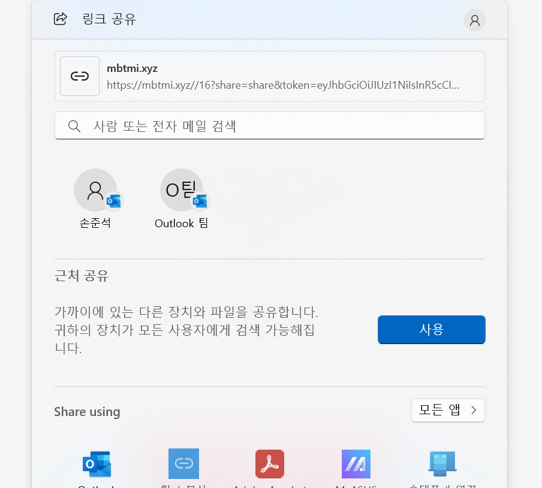
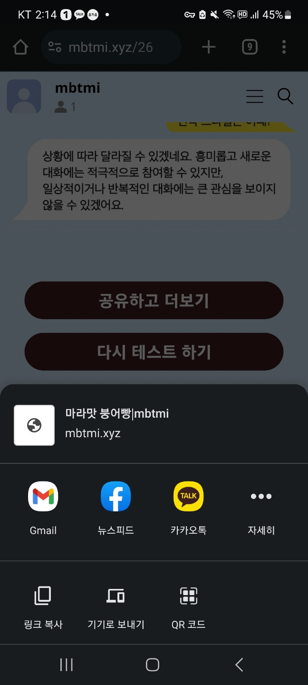
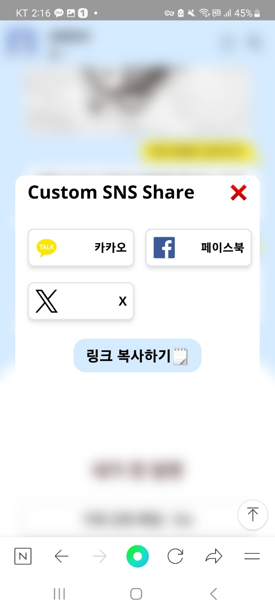
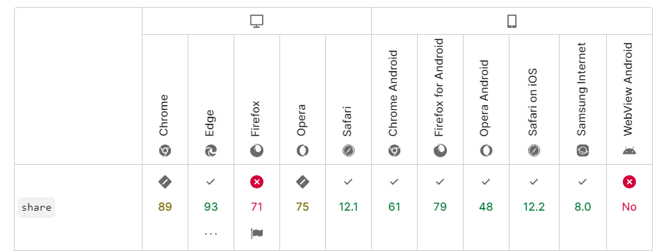

# shareAPI

태그: javascript

## 공유하기 기능 만들기


위와 같이 모든 채팅에 답을 하면 학습을 시킨 LLM 모델에서 예상 mbti를 클라이언트에 전달합니다. 클라이언트에서는 미리 작성된 결과지를 바탕으로 각각의 결과에 맞는 url로 이동시킵니다. 해당 결과 페이지에서 더 많은 상세 정보를 보기 위해서는 해당 url을 공유하고 나서야 페이지를 더 볼 수 있도록 해야 했습니다. 

여기서 마주한 문제점이 있었습니다. 해당 공유 기능을 만들기 위해서 생각했던 것은 각각의 공유 api를 사용하는 방법이었습니다. [카카오의 share api](https://developers.kakao.com/docs/latest/ko/message/js-link), 트위터 share 링크, 페이스북의 share 링크를 연결하는 방식을 고안했습니다. 공유하기 버튼을 클릭하고 실제로 어떤 사이트에 공유를 했다면, 상세 결과 페이지를 보여주도록 구상했습니다. 

트위터와 페이스북의 경우는 링크 공유를 활용하기 때문에, a 태그 attribute의 `target=”_blank”` 를 통해서 해당 버튼을 클릭했다면, 공유를 실제로 했는지 여부와 상관없이 상세 화면을 볼 수 있도록 했습니다. 카카오 share api의 경우 `callback` 기능을 제공하고 있었습니다. 하지만 서버에서 해당 로직을 처리하지 않고 있었기 때문에 `serverCallbackArgs` 가 아닌 단순 `callback` 기능을 통해 카카오 api 에서 공유를 했을 시 state를 변경하고 상세 페이지를 보이도록 했습니다. 

```tsx
useEffect(() => {
    if (window.Kakao) {
      const { Kakao } = window;
      if (!Kakao.isInitialized()) {
        Kakao.init(process.env.NEXT_PUBLIC_KAKAO_API_KEY);
      }

      Kakao.Link.createDefaultButton({
        // #kakao-link-btn id를 가진 요소에 공유 버튼을 생성하도록 함
        container: '#kakao-link-btn',
        objectType: 'feed',
        content: {
          title: `${CONFIG.title} | ${prop.name}`,
          description: `${prop.basicFeatures.join(' ')}`,
          imageUrl: 'https://source.unsplash.com/random/300×300',
          link: {
            mobileWebUrl: `${CONFIG.site}${pathName}`,
            webUrl: `${CONFIG.site}${pathName}`,
          },
        },
        callback: function () {
          prop.setIsExpanded(true);
        },
        buttons: [
          {
            title: '테스트 결과 보러가기',
            link: {
              webUrl: `${CONFIG.site}${pathName}`,
              mobileWebUrl: `${CONFIG.site}${pathName}`,
            },
          },
        ],
      });
    }
    // eslint-disable-next-line react-hooks/exhaustive-deps
  }, [pathName, prop.setIsExpanded, prop.name, prop.basicFeatures, prop]);
```

해당 방식을 적용했을 때, 데스크탑에서는 문제가 없었지만, 모바일 환경에서 문제가 발생했습니다. 모바일에서 카카오 공유하기를 실행하면, 카카오앱이 실행되기 때문에,  callback을 수행할 수 없었습니다. 결과적으로 아무리 공유하기를 눌러도 상세 페이지를 확인할 수 없었습니다. 해당 문제를 해결하기 위해 shareAPI를 적용했습니다. 

## Web Share API

[Navigator.share - Web API | MDN](https://developer.mozilla.org/ko/docs/Web/API/Navigator/share)

Web Share API는 사용자가 선택한 임의의 대상과 텍스트, 링크 및 기타 컨텐츠를 공유하기 위해 제안된 API입니다. 개발자는 **웹 어플리케이션 사용자에게 네이티브 환경과 동일한 공유 다이얼로그를 제공**할 수 있습니다.

### 윈도우 환경에서 shareAPI를 실행했을 때, 



### 안드로이드 환경에서 shar api 동작



### shareApi가 적용되지 않는 경우 커스텀 share 박스 사용



해당 특징 이외에 shareAPI가 매력적이었던 점은 비동기 적으로 동작하다는 것입니다. **shareAPI의 반환값은 사용자가 공유하기 액션을 완료하면 resolve 될 Promiase가 반환**이 됩니다. 이점을 활용해서 공유시 새로운 앱이 실행되거나, 해당 브라우저 화면을 벗어나도, 공유가 완료되면 후속 작업을 처리할 수 있었습니다. 

하지만 아직 shareAPI는 실험적인 기능입니다. mdn의 브라우저 호환성 표를 확인하면 아직 지원이 안되는 브라우저가 꽤나 있다는 것을 확인할 수 있었습니다.



실제로 테스트를 했을 때, 카카오 인앱 브라우저, 네이버 인앱 브라우저 등등 에서 해당 api를 지원하지 않는 다는 것을 확인할 수 있었습니다. 따라서 share api를 지원하지 않는 환경에서는 커스텀 api box를 만들어서 대응을 하도록 했습니다. 

이때 shareAPI를 지원하지 않는다면, 이전에 겪은 문제와 같은 문제(상세 화면을 볼 수 없는 상황)를 겪어야 했습니다. **해당 문제를 막기 위해 공유하기 버튼을 누르면 상세 화면을 반드시 볼수 있도록 state를 변하도록 했습니다**.

```tsx
const handleShareApi = () => {
			// 네비게이터 api가 존재하는지 확인 
    if (navigator.share) {
      navigator
        .share({
          title: `${prop.name}|${CONFIG.title}`,
          url: `${CONFIG.gabia}${path}?${CONFIG.param.query}&token=${prop.token}`,
        })
        .then(() => {
					// 공유가 성공했을때, 상세 페이지 보기
          prop.setIsExpanded(true);
        })
        .catch(error => {
          console.error(error);
        });
    } else {
			// 존재하지 않는 경우 커스터 api 사용
      setIsNotShareApi(true);
      prop.setIsExpanded(true);
    }
  };
```

## 사용

```tsx
window.navigator.share({
  title: "", // 공유될 제목, string
  text: "", // 공유될 설명, string
  url: "", // 공유될 URL, string
  files: [], // 공유할 파일 배열, File[]
});
```

```tsx
	// 타입스크립트에서는 3.9 버전 이후부터 지원이 됩니다. 
type ShareData = {
  title?: string;
  text?: string;
  url?: string;
  files?: File[];
};
```

> `url` 프로퍼티에 빈 스트링(`””`)을 넣으면 현재 URL이 자동으로 설정됩니다.
> 

title, text, url은 navigator.share api가 제공된다면, 언제든지 작성할 수 있습니다. 하지만 files의 경우 다릅니다. 이는 보안 상의 이유로 공유 할 수 있는 파일 타입이 제한되어 있기 때문에 `canShare()`  메서드로 해당 파일 목록이 `share()` 메서드로 호출 가능한지 파악을 해야 합니다. 

```tsx
const shareData = {
  files: filesArray, // 파일 배열
  title: '파일 공유하기',
};

if (navigator.canShare && navigator.canShare(shareData)) {
  navigator.share(shareData);
})
```

## Reference

[Web Share API로 공유 기능 쉽게 구현하기 - 재그지그의 개발 블로그](https://wormwlrm.github.io/2020/05/09/Web-Share-API.html)

[Navigator.share - Web API | MDN](https://developer.mozilla.org/ko/docs/Web/API/Navigator/share)

[Web Share API 사용하기](https://ui.toast.com/weekly-pick/ko_20190618)