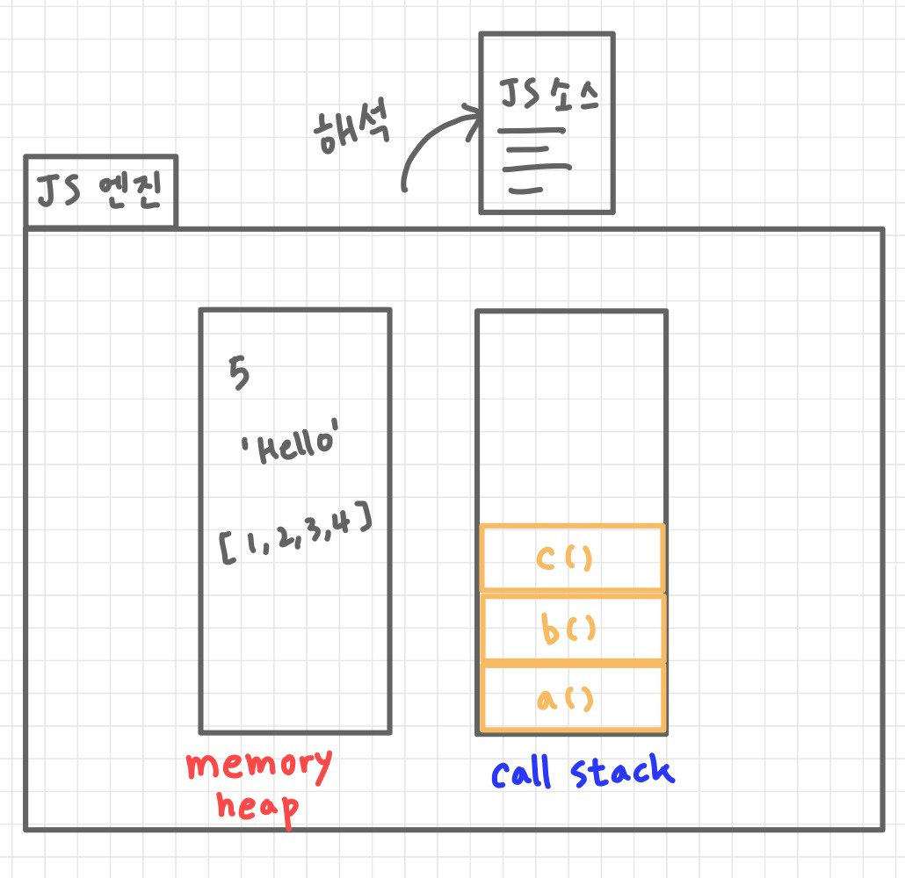
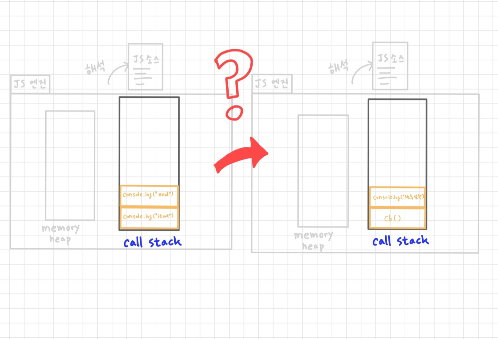
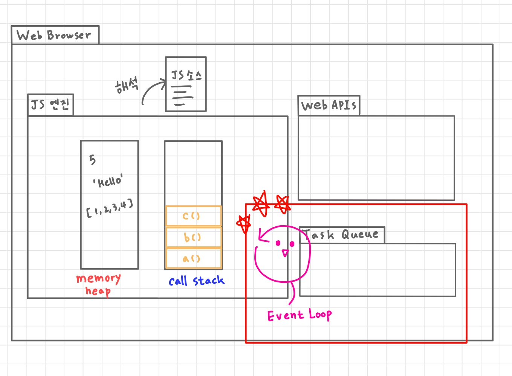
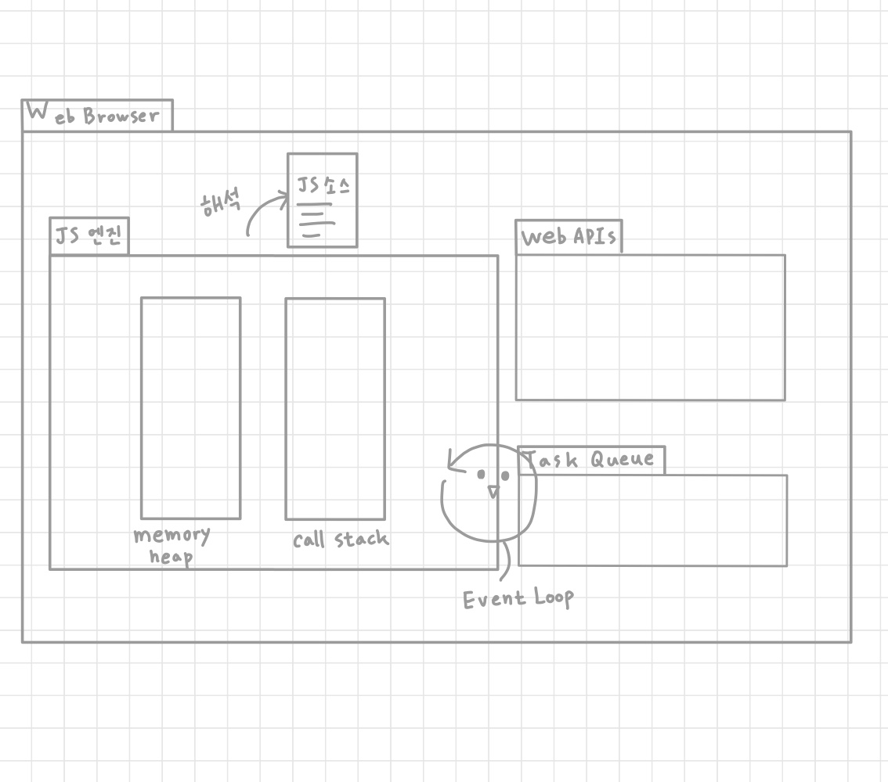

# setTimeout() 함수의 콜백은 정말 지정한 시간 후에 실행될까?

```jsx
setTimeout(function test(){
	console.log('3초 후 실행');
},3000)
```

### 목차

- 웹 브라우저의 내부 구조
- 자바스크립트 엔진 구조
- event loop, task queue 구조
- 내용 복습 및 요약

---

## 웹 브라우저의 구조

웹 브라우저의 기본이 되는 구조는 다음과 같습니다.


`User Interface`: 검색창, 뒤로가기 버튼, 새로고침 버튼, 북마크 등 브라우저와 유저가 상호작용할 수 있는 영역을 의미합니다.

`Browser Engine`: user interface와 Rendering Engine 사이의 동작을 조작합니다.

`Rendering Engine`: 사용자가 요청한 사이트를 웹 브라우저 화면에 그립니다.

`Networking`: user interface인 검색창에 url 또는 검색어를 입력하여 데이터를 요청하고 응답 받는 과정까지의 동작을 수행합니다.

`UI Backend`: 스타일링 되지 않고 화면에 표시되는 요소들을 그립니다.


`Data persistence`: 새로고침 했을 때 데이터가 사라지지 않도록 보관하는 영역입니다. 로컬 스토리지, 세션 스토리지, 쿠키 등이 존재합니다.

`Javascript Interpreter`: 자바스크립트 엔진이라고도 불립니다. 자바스크립트 소스를 해석하는 역할을 합니다.

## 자바스크립트 엔진(= Javascript interpreter)의 구조

자바스크립트 엔진 내부는 메모리 힙과 콜스택으로 구성됩니다. 자바스크립트 엔진이 자바스크립트 소스를 해석할 때, 메모리 힙에는 변수, 배열, 객체 같은 모든 값들이 저장됩니다. 콜스택에는 함수가 호출 되는 시점을 저장하는데, 이를 프레임이라고 부릅니다.



```jsx
function a(){
	c();
}
function b() {
	console.log('b');
	a();
}
function c() {
	console.log('c');
}

b();
```

```jsx
function recall(){
	recall();
}
recall();

//Error!
```

이번엔 web api를 호출하는 코드를 포함한 소스를 살펴보겠습니다. 

아래 소스의 예상 실행 결과는 

“start” ⇒ “end” ⇒ “3초 후 실행 결과임”은 자바스크립트로 소스를 작성해본 분들이라면 쉽게 유추할 수 있습니다.

```jsx

console.log('start');

setTimeout(function cb(){
	console.log('3초 후 실행');
},3000)

console.log('end');

```

이를 자바스크립트 엔진의 구조로 다시 살펴보겠습니다.

먼저 console.log(”start”) 함수가 호출 되어 콜스택에 저장된 후 콘솔창에 “start”가 출력됩니다. 

함수 실행이 끝났으므로 콜스택에서 제거 됩니다.

이후 결과 상 console.log(’end’) 함수가 호출 되어 콜스택에 저장된 후 콘솔창에 “end”가 출력됩니다.

함수 실행이 끝났으므로 콜스택에서 제거 됩니다.

**마지막으로 setTimeout() 함수가 언제 호출이 되어 3초가 지났는진 모르겠지만** 3초 후 cb 콜백 함수가 콜스택에 저장됩니다. 그 안에 있는 console.log(’3초 후 실행’)함수가 호출되어 콜스택에 저장되고 화면에 3초 후 실행 출력 후 콜스택에서 제거 후, cb 함수 역시 제거 됩니다.



## Event Loop & Task Queue

web api와 javascript 표준 문법으로 작성된 소스는 동작하는 방식이 다릅니다.



자바스크립트 런타임 환경인 web browser 내에는 **event loop**와 **task queue**라는 것이 추가로 존재합니다.

이때, web api가 호출 되고 이벤트가 발생하면 task queue에 콜백 함수가 저장됩니다.

task queue의 구조는 이름과 같이 queue 자료구조를 따릅니다. 따라서 가장 먼저 들어온 작업이 가장 먼저 처리됩니다. 

task queue에 있는 콜백함수는 자바스크립트 엔진의 콜스택이 전부 비어있을 때 실행됩니다.

그럼 다시 event loop와 task queue의 개념을 도입하여 생각해봅시다.

```jsx

console.log('start');

setTimeout(function cb(){
	console.log('3초 후 실행');
},3000)

console.log('end');

```


좀 더 자세한 예시를 살펴보겠습니다.

```jsx
addEventListener("click", function cb1(event){
	console.log("click");
});

console.log("Hello!");

addEventListener("keydown", function cb2(event){
	console.log("keydown");
});
```


마지막으로 발표의 주제였던 setTimeout() 함수의 콜백은 정말 지정한 시간 후에 실행될까?에 대한 결론을 내려보겠습니다.

```jsx
setTimeout(function test(){
	console.log('3초후 실행');
},3000)
```

- 시간이 많이 지연되어 콜스택이 완전히 비는 데까지 오래 걸린다면 setTimeout의 콜백 함수는 정확히 3초 후에 실행되지 않을 것입니다.
- 따라서 setTimeout의 2번째 인자인 ms값은 실행까지 걸리는 시간이 아닌, **최소** 지연 시간 입니다.

event loop와 task queue의 개념을 알고 계셨던 분이라면 복기의 시간을, 모르고 계셨던 분이라면 새로운 지식을 습득한 시간이 되었으면 좋겠습니다. 감사합니다.

참고 문서

1. [https://medium.com/sessionstack-blog/how-javascript-works-event-loop-and-the-rise-of-async-programming-5-ways-to-better-coding-with-2f077c4438b5](https://medium.com/sessionstack-blog/how-javascript-works-event-loop-and-the-rise-of-async-programming-5-ways-to-better-coding-with-2f077c4438b5)
2. [https://vimeo.com/96425312](https://vimeo.com/96425312)
3. [이벤트 루프](https://developer.mozilla.org/en-US/docs/Web/JavaScript/Event_loop)
4. [브라우저 구조](https://www.browserstack.com/guide/browser-rendering-engine)