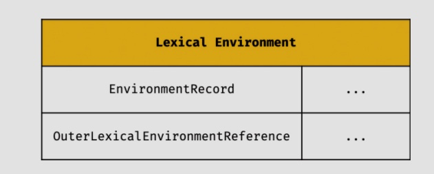
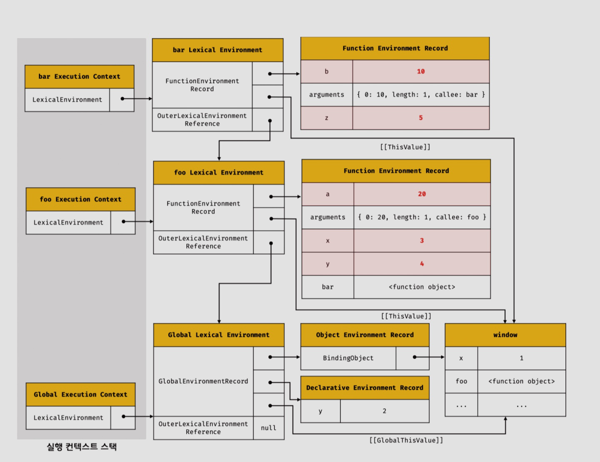
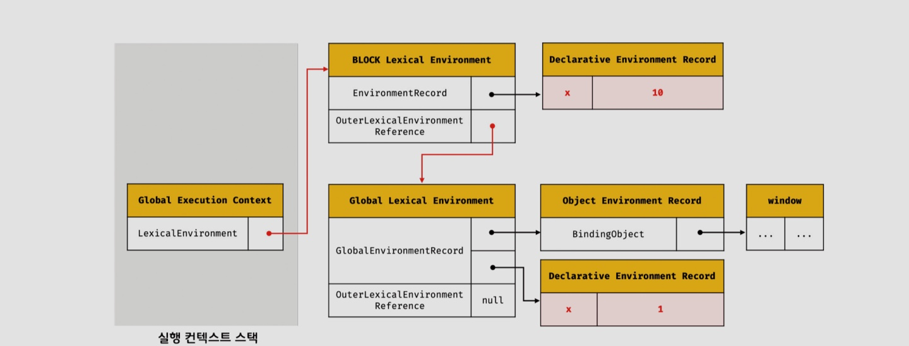
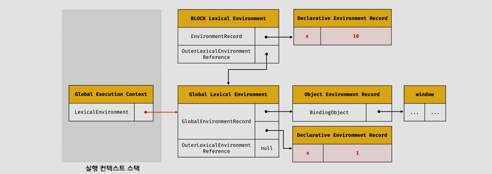

# 실행 컨텍스트 (execution context)

## 자바스크립트 소스 처리 과정

자바스크립트 엔진은 자바스크립트 소스를 소스 코드 평가와 소스 코드 실행으로 처리합니다.

1. 소스 코드 평가

<aside>
✅ 평가 될 수 있는 소스 코드 타입

- 전역 코드
- 함수 코드
- ~~eval 코드~~
- ~~모듈 코드~~
</aside>

- 실행 컨텍스트 생성
- 렉시컬 환경 생성

1. 소스 코드 실행
- 식별자 검색 (스코프 체인) 및 변수 값 바인딩
- 코드 실행 순서 관리

```jsx
const x = 1;

function foo () {
	const y = 2;

	function bar () {
		const z = 3;
		console.log(x + y + z);
	}
	bar();
}

foo();
```

## 실행 컨텍스트(Execution Context)와 렉시컬 환경(Lexical Environment)

실행 컨텍스트는 식별자(변수, 함수, 클래스 등의 이름)를 등록하고 관리하는 스코프와 코드 실행 순서 관리를 구현한 내부 메커니즘으로, 모든 코드는 실행 컨텍스트를 통해 실행되고 관리됩니다.

### 1. 실행 컨텍스트 스택(= call stack) ⇒ 코드 실행 순서 관리


### 2. 렉시컬 환경

렉시컬 환경은 식별자와 식별자에 바인딩된 값, 상위 스코프에 대한 참조를 기록하는 자료구조로 실행컨텍스트를 구성하는 컴포넌트 입니다.



환경 레코드 (EnvironmentRecord)

- 스코프에 포함된 식별자를 등록하고 등록된 식별자에 바인딩된 값을 관리하는 저장소입니다. 환경 레코드는 소스코드의 타입에 따라 관리하는 내용에 차이가 있습니다.

외부 렉시컬 환경에 대한 참조 (OuterLexicalEnvironmentReference)

- 외부 렉시컬 환경에 대한 참조는 상위 스코프를 가리킵니다. 이때 상위 스코프란 외부 렉시컬 환경, 즉 해당 실행 컨텍스트를 생성한 소스코드를 포함하는 상위 코드의 렉시컬 환경을 말합니다. 외부 렉시컬 환경에 대한 참조를 통해 단방향 링크드 리스트인 스코프 체인을 구현합니다.

## 실행 컨텍스트, 실행 컨텍스트 스택, 렉시컬 환경의 동작

1. 전역 객체 생성
    1. 전역 객체는 전역 코드가 평가되기 이전에 생성됩니다.
    2. window에 속한 객체
        1. console.log()
        2. 브라우저 환경이라면 web api
    
2. 전역 코드 평가
3. 전역 코드 실행
4. foo 함수 코드 평가
5. foo 함수 코드 실행
6. bar 함수 코드 평가
7. bar 함수 코드 실행
8. 순서대로 종료

```jsx
var x = 1;
const y = 2;

function foo (a) {
	var x = 3;
	const y = 4;
	
	function bar (b) {
		const z = 5;
		console.log(a + b + x + y + z);
	}
	bar(10);
}

foo(20)
```



### 실행 컨텍스트와 블록 레벨 스코프

```jsx
let x = 1;

if (true) {
	let x = 10;
	console.log(x); // 10
}

console.log(x) // 1
```





사진 출처: 모던 자바스크립트 deep dive: 자바스크립트의 기본 개념과 동작 원리